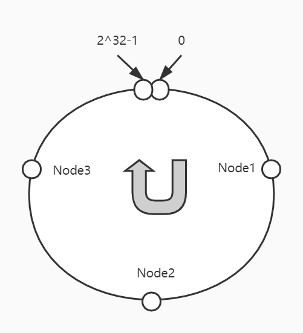
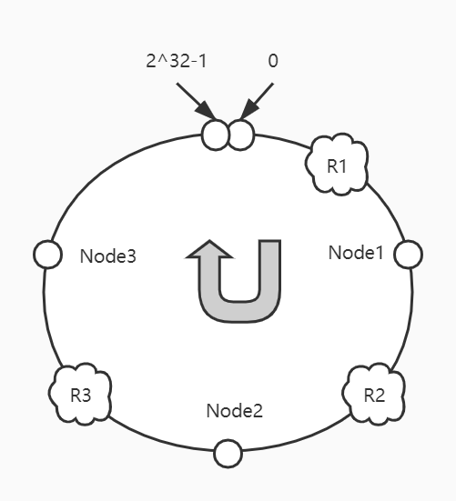
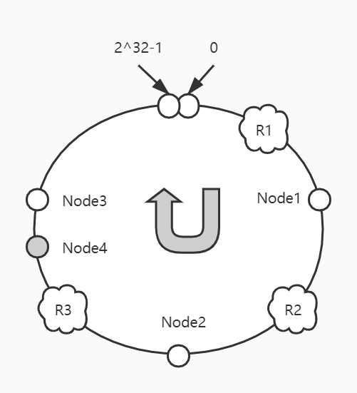
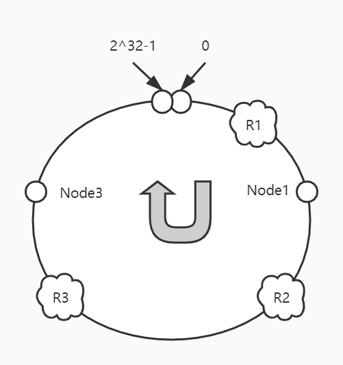
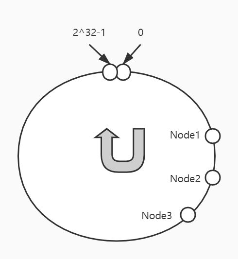
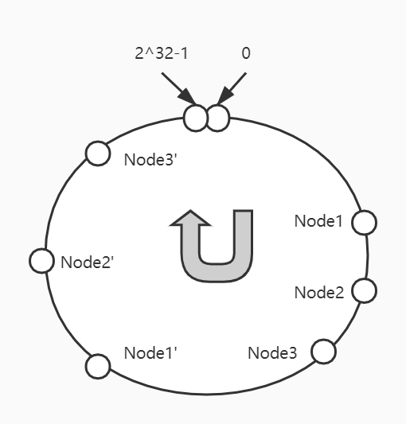

需要强调的是，Dubbo的Hash映射模型与大部分网上资料描述的**环形队列Hash映射模型**是存在一些区别的。于我而言，环形队列Hash映射模型，不足以让我对一致性Hash有足够彻底的了解。直到看懂了Dubbo的一致性Hash的实现，才觉得豁然开朗。


### 一、环形队列Hash映射模型

这种方案，其基础还是基于取模运算。对2^32取模，那么，Hash值的区间为[0, 2^32-1]。接下来要做的，就包括两部分：  

#### **a、映射服务**

将服务地址（ip+端口）按照一定规则构造出特定的识别码（如md5码），再用识别码对2^32取模，确定服务在Hash值区间对应的位置。假设有Node1、Node2、Node3三个服务，其映射关系如下：

 


#### **b、映射请求、定位服务**

在发起请求时，我们往往会带上参数，而这些参数，就可以被我们用来确定具体调用哪一个服务。假设有请求R1、R2、R3，对它们的参数也经过计算特定识别码、取余的一系列运算之后，有如下映射关系：

 

从图中，我们可以看到，R1请求映射在0-Node1中间，R2请求映射在Node1-Node2中间，R3请求映射在Node2-Node3中间。我们取**服务Hash值大于请求Hash值**的**第一个服务**作为实际的调用服务。也就是说，R1请求将调用Node1服务，R2请求将调用Node2服务，R3请求将调用Node3服务。


#### **c、新增服务节点**

假设新增服务Node4，映射在Node3之前，恰巧破坏了原来的一个映射关系：

 

这样，请求R3将会实际调用服务Node4，但请求R1、R2不受影响。


#### **d、删除服务节点**

假设服务Node2宕机，那么R2请求将会映射到Node3：

 

原本的R1、R3请求不受影响。


> 可以看出，当新增、删除服务时，受影响的请求是有限的。不至于像简单取模映射一般，服务发生变化时，需要调整全局的映射关系。


#### **e、平衡性与虚拟节点**

在我们上面的假设中，我们假设Node1、Node2、Node3三个服务在经过Hash映射后所分布的位置恰巧把环切成了均等的三分，请求的分布也基本是平衡的。但是实际上计算服务Hash值的时候，是很难这么巧的。也许一不小心就映射成了这个样子：

 

这样，就会导致大部分请求都会被映射到Node1上。因此，引出了虚拟节点。  

所谓虚拟节点，就是除了对服务本身地址进行Hash映射外，还通过在它地址上做些处理（比如Dubbo中，在ip+port的字符串后加上计数符1、2、3......，分别代表虚拟节点1、2、3），以达到同一服务映射多个节点的目的。通过引入虚拟节点，我们可以把上图中映射给Node1的请求进一步拆分：

 

如上图所示，若有请求落在Node3-Node1'区间，该请求应该是调用Node1'服务，但是因为Node1'是Node1的虚拟节点，所以实际调用的是Node1服务。通过引入虚拟节点，请求的分布就会比较平衡了。


### **二、Dubbo一致性Hash的使用与负载均衡策略的引入阶段**

#### **a、如何使用一致性Hash作为Dubbo的负载均衡策略？**

dubbo:service、dubbo:reference、dubbo:provider、dubbo:consumer、dubbo:method这几个配置项都可以配置Dubbo的负载均衡策略，其中一致性Hash的属性值是：**consistenthash**。

以dubbo:reference为例：

**XML配置：**

> <dubbo:reference loadbalance="consistenthash" /\>


**Properties配置：**

> dubbo.reference.loadbalance=consistenthash


**注解：**

> @Reference(loadbalance = "consistenthash")


#### **b、Dubbo负载均衡策略的引入阶段**

Dubbo实现的是客户端负载均衡。关于服务接口代理类的实现，这里不做详细描述，可以参考官网：

> 服务引入：http://dubbo.apache.org/zh-cn/docs/source_code_guide/refer-service.html。  

在接口代理类生成、并且装配好后，服务的调用基本是这样一个流程：proxy -> MockClusterInvoker -> 集群策略（如：FailoverClusterInvoker） -> 根据选定的负载均衡策略确定选定的远程调用对象Invoker。  

**负载均衡策略的初始化**是在AbstractClusterInvoker中的initLoadBalance方法中初始化的：

```java
protected LoadBalance initLoadBalance(List<Invoker<T>> invokers, Invocation invocation) {
    if (CollectionUtils.isNotEmpty(invokers)) {
        return ExtensionLoader.getExtensionLoader(LoadBalance.class).getExtension(invokers.get(0).getUrl()
                .getMethodParameter(RpcUtils.getMethodName(invocation), LOADBALANCE_KEY, DEFAULT_LOADBALANCE));
    } else {
        return ExtensionLoader.getExtensionLoader(LoadBalance.class).getExtension(DEFAULT_LOADBALANCE);
    }
}
```

这部分代码逻辑分为两部分：  

1、获取调用方法所配置的LOADBALANCE_KEY属性的值，LOADBALANCE_KEY这个常量的实际值为：loadbalance，即为我们的所配置的属性；  

2、利用SPI机制来初始化并加载该值所代表的负载均衡策略。


所有的负载均衡策略都会继承LoadBalance接口。在各种集群策略中，最终都会调用AbstractClusterInvoker的select方法，而AbstractClusterInvoker会在doSelect中，**调用LoadBalance的select方法，这里即开始了负载均衡策略的执行。**