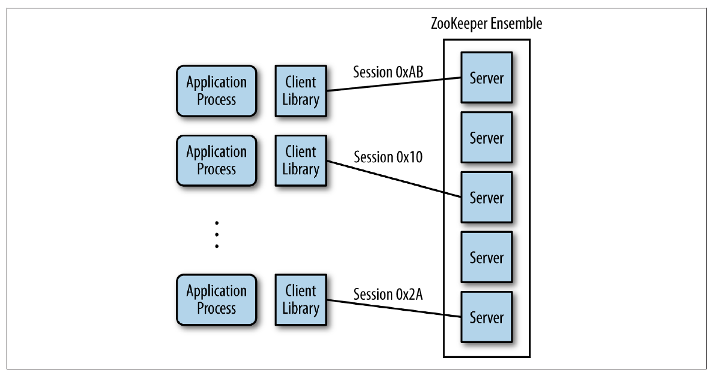

# 在 Dubbo 应用中使用 Zookeeper

## Zookeeper 介绍

### 基本概念

在现代的分布式应用中，往往会出现节点和节点之间的协调问题，其中就包括了：选主、集群管理、分布式锁、分布式配置管理、统一命名服务、状态同步等诉求。[Apache Zookeeper](https://zookeeper.apache.org)，正如它的名字所暗示的那样，*动物园管理员*，就是为了解决这些诉求的一个分布式协调服务框架。

为了保证高可用，ZooKeeper 本身也可以部署成集群模式，称之为 *ZooKeeper ensemble*。ZooKeeper 集群中始终确保其中的一台为 leader 的角色，并通过 *ZAB (Zookeeper Atomic Broadcast Protocol) [^1]* 协议确保所有节点上的信息的一致。客户端可以访问集群中的任何一台进行读写操作，而不用担心数据出现不一致的现象。


*Image Credit : ebook -Zookeeper-Distributed Process Coordination from O'Reilly*

Zookeeper 中的数据存储方式与传统的 UNIX 文件系统相似，节点按照树状结构来组织，其中，节点被称之为 *znodes (ZooKeeper data nodes)*


*Image Credit : ebook -Zookeeper-Distributed Process Coordination from O'Reilly*

### 基本用法

可以通过直接下载的方式 [^2]安装并运行 Zookeeper ，在 Mac 上也可以通过 Homebrew [^3]  `brew install zookeeper`  来安装，考虑到通用性，本文采用 docker 的方式来运行 Zookeeper。如果没有安装 docker，请先准备好 docker 环境 [^4]。

#### 1. 启动 Zookeeper

执行命令将 Zookeeper 运行在 docker 容器中 

```shell
docker run --rm --name zookeeper -p 2181:2181 zookeeper
```

#### 2. 进入 Zookeeper 容器 

```shell
docker exec -it zookeeper bash
```

在 `bin` 目录下有启动 Zookeeper 的命令 `zkServer` 以及管理控制台 `zkCli`

```shell
bash-4.4# ls -l bin
total 36
-rwxr-xr-x    1 zookeepe zookeepe       232 Mar 27 04:32 README.txt
-rwxr-xr-x    1 zookeepe zookeepe      1937 Mar 27 04:32 zkCleanup.sh
-rwxr-xr-x    1 zookeepe zookeepe      1056 Mar 27 04:32 zkCli.cmd
-rwxr-xr-x    1 zookeepe zookeepe      1534 Mar 27 04:32 zkCli.sh
-rwxr-xr-x    1 zookeepe zookeepe      1759 Mar 27 04:32 zkEnv.cmd
-rwxr-xr-x    1 zookeepe zookeepe      2696 Mar 27 04:32 zkEnv.sh
-rwxr-xr-x    1 zookeepe zookeepe      1089 Mar 27 04:32 zkServer.cmd
-rwxr-xr-x    1 zookeepe zookeepe      6773 Mar 27 04:32 zkServer.sh
```

#### 3. 通过 zkCli 进入 Zookeeper 管理界面

由于是通过 Docker 启动，Zookeeper 进程已经启动，并通过 2181 端口对外提供服务。

```shell
bash-4.4# ps
PID   USER     TIME  COMMAND
    1 zookeepe  0:02 /usr/lib/jvm/java-1.8-openjdk/jre/bin/java -Dzookeeper.log.dir=. -Dzookeeper.root
   32 root      0:00 bash
   42 root      0:00 ps
```

因此可以直接通过 `zkCli` 来访问 Zookeeper 的控制台来进行管理。

```shell
bash-4.4# bin/zkCli.sh -server 127.0.0.1:2181
Connecting to 127.0.0.1:2181
...
WATCHER::

WatchedEvent state:SyncConnected type:None path:null

[zk: 127.0.0.1:2181(CONNECTED) 0] help
ZooKeeper -server host:port cmd args
	stat path [watch]
	set path data [version]
	ls path [watch]
	delquota [-n|-b] path
	ls2 path [watch]
	setAcl path acl
	setquota -n|-b val path
	history
	redo cmdno
	printwatches on|off
	delete path [version]
	sync path
	listquota path
	rmr path
	get path [watch]
	create [-s] [-e] path data acl
	addauth scheme auth
	quit
	getAcl path
	close
	connect host:port
```

#### 4. zkCli 上的一些基本操作 

创建 `/hello-zone` 节点：

```shell
[zk: 127.0.0.1:2181(CONNECTED) 19] create /hello-zone 'world'
Created /hello-zone
```

列出 `/` 下的子节点，确认 `hello-zone` 被创建：

```shell
[zk: 127.0.0.1:2181(CONNECTED) 20] ls /
[zookeeper, hello-zone]
```

列出 `/hello-zone` 的子节点，确认为空：

```shell
[zk: 127.0.0.1:2181(CONNECTED) 21] ls /hello-zone
[]
```

获取存储在 `/hello-zone` 节点上的数据：

```shell
[zk: 127.0.0.1:2181(CONNECTED) 22] get /hello-zone
world
```


## 在 Dubbo 中使用 Zookeeper

Dubbo 使用 Zookeeper 用于服务的注册发现和配置管理，在 Zookeeper 中数据的组织由下图所示：


首先，所有 Dubbo 相关的数据都组织在 `/duboo` 的根节点下。

二级目录是服务名，如 `com.foo.BarService`。

三级目录有两个子节点，分别是 `providers` 和 `consumers`，表示该服务的提供者和消费者。

四级目录记录了与该服务相关的每一个应用实例的 URL 信息，在 `providers` 下的表示该服务的所有提供者，而在 `consumers` 下的表示该服务的所有消费者。举例说明，`com.foo.BarService` 的服务提供者在启动时将自己的 URL 信息注册到 `/dubbo/com.foo.BarService/providers` 下；同样的，服务消费者将自己的信息注册到相应的 `consumers` 下，同时，服务消费者会订阅其所对应的 `providers` 节点，以便能够感知到服务提供方地址列表的变化。

### 准备示例代码

本文的代码可以在 https://github.com/dubbo/dubbo-samples/tree/master/dubbo-samples-zookeeper 中找到。

#### 1. 接口定义

定义一个简单的 `GreetingService` 接口，里面只有一个简单的方法 `sayHello` 向调用者问好。

```java
public interface GreetingService {
    String sayHello(String name);
}
```

#### 2. 服务端：服务实现

实现 `GreetingService` 接口，并通过 `@Service` 来标注其为 Dubbo 的一个服务。

```java
@Service
public class AnnotatedGreetingService implements GreetingService {
    public String sayHello(String name) {
        return "hello, " + name;
    }
}
```

#### 3. 服务端：组装

定义 ProviderConfiguration 来组装 Dubbo 服务。

```java
@Configuration
@EnableDubbo(scanBasePackages = "com.alibaba.dubbo.samples.impl")
@PropertySource("classpath:/spring/dubbo-provider.properties")
static class ProviderConfiguration {}
```

dubbo-provider.properties 是在 Spring 应用中外置配置的方式，内容如下：

```properties
dubbo.application.name=demo-provider
dubbo.registry.address=zookeeper://$DOCKER_HOST:2181
dubbo.protocol.name=dubbo
dubbo.protocol.port=20880
```

由于 Zookeeper 运行在 Docker 容器中，需要注意的是：

* 本文假定 Dubbo 应用运行在宿主机上，也就是 Docker 容器外，需要将 Zookeeper 的地址替换成环境变量 *${DOCKER_HOST}* 所指定的 IP 地址，相关信息请查阅 Docker 官方文档
* 如果 Dubbo 应用也是 Docker 化的应用，只需要用 Zookeeper 的容器名，在本文中容器名是 **zookeeper**
* 当然，如果不用容器方式启动 Zookeeper，只需要简单的将这里的 *$DOCKER_HOST* 换成 **localhost** 即可

#### 4. 服务端：启动服务

在 `main` 方法中通过启动一个 Spring Context 来对外提供 Dubbo 服务。

```java
public class ProviderBootstrap {
    public static void main(String[] args) throws Exception {
        AnnotationConfigApplicationContext context = new AnnotationConfigApplicationContext(ProviderConfiguration.class);
        context.start();
        System.in.read();
    }
}
```

启动服务端的 `main` 方法，将会看到下面的输出，代表服务端启动成功，并在注册中心（ZookeeperRegistry）上注册了 `GreetingService` 这个服务：

```sh
[03/08/18 10:50:33:033 CST] main  INFO zookeeper.ZookeeperRegistry:  [DUBBO] Register: dubbo://192.168.99.1:20880/com.alibaba.dubbo.samples.api.GreetingService?anyhost=true&application=demo-provider&dubbo=2.6.2&generic=false&interface=com.alibaba.dubbo.samples.api.GreetingService&methods=sayHello&pid=12938&side=provider&timestamp=1533264631849, dubbo version: 2.6.2, current host: 192.168.99.1
```

通过 Zookeeper 管理终端观察服务提供方的注册信息：

```sh
$ docker exec -it zookeeper bash
bash-4.4# bin/zkCli.sh -server localhost:218
Connecting to localhost:2181
...
Welcome to ZooKeeper!
JLine support is enabled
...
[zk: localhost:2181(CONNECTED) 0] ls /dubbo/com.alibaba.dubbo.samples.api.GreetingService/providers
[dubbo%3A%2F%2F192.168.99.1%3A20880%2Fcom.alibaba.dubbo.samples.api.GreetingService%3Fanyhost%3Dtrue%26application%3Ddemo-provider%26dubbo%3D2.6.2%26generic%3Dfalse%26interface%3Dcom.alibaba.dubbo.samples.api.GreetingService%26methods%3DsayHello%26pid%3D12938%26side%3Dprovider%26timestamp%3D1533264631849]
```

可以看到刚刚启动的 Dubbo 的服务在 `providers` 节点下注册了自己的 URL 地址：*dubbo://192.168.99.1:20880/com.alibaba.dubbo.samples.api.GreetingService?anyhost=true&application=demo-provider&dubbo=2.6.2&generic=false&interface=com.alibaba.dubbo.samples.api.GreetingService&methods=sayHello&pid=12938&side=provider&timestamp=1533264631849*

#### 5. 客户端：引用服务

通过 `@Reference` 来在客户端声明服务的引用，运行时将会通过该引用发起全程调用，而服务的目标地址将会从 Zookeeper 的 `provider` 节点下查询。

```java
@Component("annotatedConsumer")
public class GreetingServiceConsumer {
    @Reference
    private GreetingService greetingService;
    
    public String doSayHello(String name) {
        return greetingService.sayHello(name);
    }
}
```

#### 6. 客户端：组装

定义 ConsumerConfiguration 来组装 Dubbo 服务。

```java
@Configuration
@EnableDubbo(scanBasePackages = "com.alibaba.dubbo.samples.action")
@PropertySource("classpath:/spring/dubbo-consumer.properties")
@ComponentScan(value = {"com.alibaba.dubbo.samples.action"})
static class ConsumerConfiguration {}
```

dubbo-consumer.properties 是在 Spring 应用中外置配置的方式，内容如下：

```properties
dubbo.application.name=demo-consumer
dubbo.registry.address=zookeeper://$DOCKER_HOST:2181
dubbo.consumer.timeout=3000
```

与 **3. 服务端：组装** 相同，需要根据自己的运行环境来修改 *dubbo.registry.address* 中定义的 *$DOCKER_HOST*。请参阅步骤 3 的说明部分。

#### 7. 客户端：发起远程调用

运行 `main` 向已经启动的服务提供方发起一次远程调用。Dubbo 会先向 Zookeeper 订阅服务地址，然后从返回的地址列表中选取一个，向对端发起调用：

```java
public class ConsumerBootstrap {
    public static void main(String[] args) {
public class ConsumerBootstrap {

    public static void main(String[] args) throws IOException {
        AnnotationConfigApplicationContext context = new AnnotationConfigApplicationContext(ConsumerConfiguration.class);
        context.start();
        GreetingServiceConsumer greetingServiceConsumer = context.getBean(GreetingServiceConsumer.class);
        String hello = greetingServiceConsumer.doSayHello("zookeeper");
        System.out.println("result: " + hello);
        System.in.read();
    }
}
```

运行结果如下：

```shell
[03/08/18 01:42:31:031 CST] main  INFO zookeeper.ZookeeperRegistry:  [DUBBO] Register: consumer://192.168.99.1/com.alibaba.dubbo.samples.api.GreetingService?application=demo-consumer&category=consumers&check=false&default.timeout=3000&dubbo=2.6.2&interface=com.alibaba.dubbo.samples.api.GreetingService&methods=sayHello&pid=82406&side=consumer&timestamp=1533274951195, dubbo version: 2.6.2, current host: 192.168.99.1 #1
[03/08/18 01:42:31:031 CST] main  INFO zookeeper.ZookeeperRegistry:  [DUBBO] Subscribe: consumer://192.168.99.1/com.alibaba.dubbo.samples.api.GreetingService?application=demo-consumer&category=providers,configurators,routers&default.timeout=3000&dubbo=2.6.2&interface=com.alibaba.dubbo.samples.api.GreetingService&methods=sayHello&pid=82406&side=consumer&timestamp=1533274951195, dubbo version: 2.6.2, current host: 192.168.99.1 #2
...
result: hello, zookeeper
```

说明：

1. **Register**: consumer://192.168.99.1/...&**category=consumers**&：消费者向 Zookeeper 注册自己的信息，并放在 `consumers` 节点下
2. **Subscribe**: consumer://192.168.99.1/...&**category=providers,configurators,routers**&：消费者同时向 Zookeeper 订阅了 `providers`、`configurators`、`routers` 节点，其中 `configurations` 与 Dubbo 配置相关，`routers` 与路由规则相关，值得注意的是 `providers` 节点的订阅，当有新的服务提供方加入后，由于订阅的关系，新的地址列表会推送给订阅方，服务的消费者也因此动态感知到了地址列表的变化。

通过 Zookeeper 管理终端观察服务提供方的注册信息：

```sh
$ docker exec -it zookeeper bash
bash-4.4# bin/zkCli.sh -server localhost:218
Connecting to localhost:2181
...
Welcome to ZooKeeper!
JLine support is enabled
...
[zk: localhost:2181(CONNECTED) 4] ls /dubbo/com.alibaba.dubbo.samples.api.GreetingService/consumers
[consumer%3A%2F%2F192.168.99.1%2Fcom.alibaba.dubbo.samples.api.GreetingService%3Fapplication%3Ddemo-consumer%26category%3Dconsumers%26check%3Dfalse%26default.timeout%3D3000%26dubbo%3D2.6.2%26interface%3Dcom.alibaba.dubbo.samples.api.GreetingService%26methods%3DsayHello%26pid%3D82406%26side%3Dconsumer%26timestamp%3D1533274951195]
```

可以看到 Dubbo 的服务消费者在 `consumers` 节点下注册了自己的 URL 地址：*consumer://192.168.99.1/com.alibaba.dubbo.samples.api.GreetingService?application=demo-consumer&category=providers,configurators,routers&default.timeout=3000&dubbo=2.6.2&interface=com.alibaba.dubbo.samples.api.GreetingService&methods=sayHello&pid=82406&side=consumer&timestamp=1533274951195* 

## 总结

本文侧重介绍了如何在 Dubbo 应用中使用 Zookeeper 做为注册中心，当然，本文也提到了 Zookeeper 在 Dubbo 的应用场景下还承担了配置中心和服务治理的职责。本文中的 Zookeeper 是单节点、Standalone 的模式，在生产环境中为了高可用的诉求，往往会组件 Zookeeper 集群，也就是 *Zookeeper ensemble* 模式。

通过本文的学习，读者可以掌握到：

* Zookeeper 的基本概念和基本用法
* Zookeeper 在 Dubbo 应用中的作用
* 通过实战了解 Zookeeper 与 Dubbo 的交互
* Dubbo 在 Zookeeper 中服务注册、消费信息的存储方式


[^1]: https://www.ixiacom.com/company/blog/apache-zab—zookeeper-atomic-broadcast-protocol
[^2]: https://www.apache.org/dyn/closer.cgi/zookeeper/
[^3]: https://brew.sh
[^4]: https://www.docker.com/community-edition

