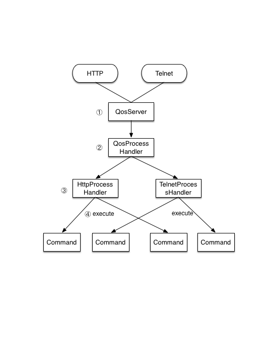

# 通过QoS对服务进行动态控制


QoS，全称为`Quality of Service`, 是常见于网络设备中的一个术语 ，例如在路由器中，可以通过Qos动态的调整和控制某些端口的权重，从优先的保障运行在这些端口上的服务质量。

在Dubbo中，QoS这个概念被用于动态的对服务进行查询和控制。例如对获取当前提供和消费的所有服务，以及对服务进行动态的上下线，即从注册中心上进行注册和反注册操作。

### QoS工作机制

从Dubbo 2.5.8开始，默认引入了Qos功能，默认处于启动状态。所有的QoS功能被抽象成一个个的命令，通过执行这些命令，Qos会返回响应的结果。

>  Qos功能基于Netty4实现，在Dubbo 2.6.x之前的版本中，默认依赖的是Netty3，因此需要显示的添加Netty4的依赖，才能确保Netty4正常工作。如果使用http://start.dubbo.io自动生成的Dubbo应用，则无需添加额外的配置，因为已经默认加上了Netty4的依赖。

Qos的工作机制如下图所示：

 


1. 启动并监听一个端口，默认端口是22222
2. 识别目标请求的协议是Http或者是Telnet，根据协议不同动态添加对应的处理器
3. 针对不同的协议进行解码，解析出需要执行的命令
4. 执行命令并返回结果

### QoS命令

QoS目前支持的命令包括：

* help: 帮助命令，列出
* ls: 列出当前所有的正在提供的服务，以及消费的服务
* online: 动态将某个或全部服务向注册中心进行注册
* offline: 动态将某个或全部服务从注册中心摘除（反注册）
* quit: 退出当前telnet会话

下面，我们具体来操作一下如何通过用QoS对服务进行动态控制。

#### 通过Telnet方式访问QoS

假设我们的Dubbo服务端已经启动，我们通过Telnet方式进行连接：

```
$ telnet localhost 22222
Trying 127.0.0.1...
Connected to localhost.
Escape character is '^]'.
  ?????????  ???    ??  ???????????  ???????????   ????????
  ???   ???? ???    ???   ???    ???   ???    ??? ???    ???
  ???    ??? ???    ???   ???    ???   ???    ??? ???    ???
  ???    ??? ???    ???  ??????????   ??????????  ???    ???
  ???    ??? ???    ??? ???????????  ???????????  ???    ???
  ???    ??? ???    ???   ???    ???   ???    ??? ???    ???
  ???   ???? ???    ???   ???    ???   ???    ??? ???    ???
  ?????????  ?????????  ???????????  ???????????   ????????


dubbo>
```

连接成功后，会出现`dubbo>`提示符，此时输入`help`命令

```
dubbo>help
+---------+----------------------------------------------------------------------------------+
|    help | help command                                                                     |
+---------+----------------------------------------------------------------------------------+
|      ls | ls service                                                                       |
+---------+----------------------------------------------------------------------------------+
| offline | offline dubbo                                                                    |
+---------+----------------------------------------------------------------------------------+
|  online | online dubbo                                                                     |
+---------+----------------------------------------------------------------------------------+
|    quit | quit telnet console                                                              |
+---------+----------------------------------------------------------------------------------+

dubbo>
```

会列出当前所有可用的命令，及相应的说明。

也可以对单个命令进行help操作，可以看到该命令对应的示例

```
dubbo>help online
+--------------+----------------------------------------------------------------------------------+
| COMMAND NAME | online                                                                           |
+--------------+----------------------------------------------------------------------------------+
|      EXAMPLE | online dubbo                                                                     |
|              | online xx.xx.xxx.service                                                         |
+--------------+----------------------------------------------------------------------------------+
```

通过`ls` 查看当前的服务状态

```
dubbo>ls
As Provider side:
+------------------------------------------+---+
|           Provider Service Name          |PUB|
+------------------------------------------+---+
|org.apache.dubbo.demo.provider.DemoService| Y |
+------------------------------------------+---+
As Consumer side:
+---------------------+---+
|Consumer Service Name|NUM|
+---------------------+---+
```

可以看到，在服务端可以看到一个服务`org.apache.dubbo.demo.provider.DemoService`，第二列里面的`PUB=Y`代表改服务已经发布到注册中心，可供消费端进行调用。

假设我们需要动态的对该服务进行下线操作，可以通过`offline`命令来完成

```
dubbo>offline org.apache.dubbo.demo.provider.DemoService
OK
```

可以看到命令返回了OK，我们再通过ls看下当前的状态：

```
dubbo>ls
As Provider side:
+------------------------------------------+---+
|           Provider Service Name          |PUB|
+------------------------------------------+---+
|org.apache.dubbo.demo.provider.DemoService| N |
+------------------------------------------+---+
As Consumer side:
+---------------------+---+
|Consumer Service Name|NUM|
+---------------------+---+
```

可以看到`org.apache.dubbo.demo.provider.DemoService`的`PUB`已经被设置成了`N`。

通过`quit`命令退出当前的telnet会话：

```
dubbo>quit
BYE!
Connection closed by foreign host.
```


#### 通过HTTP方式访问QOS

在上面的例子中，我们已经对`org.apache.dubbo.demo.provider.DemoService`进行了下线操作，下面，我们通过对Http方式对上面的服务进行注册操作：

```
$ curl -i http://localhost:22222/online?service=org.apache.dubbo.demo.provider.DemoService
HTTP/1.1 200 OK
Content-Type: text/plain
Content-Length: 2

OK% 
```

>  注意online操作对应的参数，需要以`key=value`的形式提供，但实际上key会被忽略

看到操作返回了OK，下面通过ls命令查看下当前的状态

```
$ curl -i http://localhost:22222/ls
HTTP/1.1 200 OK
Content-Type: text/plain
Content-Length: 365

As Provider side:
+------------------------------------------+---+
|           Provider Service Name          |PUB|
+------------------------------------------+---+
|org.apache.dubbo.demo.provider.DemoService| Y |
+------------------------------------------+---+
As Consumer side:
+---------------------+---+
|Consumer Service Name|NUM|
+---------------------+---+
```

可以看到服务的`PUB`状态已经变成了`Y`。


### QoS相关参数说明

QoS提供了一些启动参数，来对启动进行配置，他们主要包括：

| 参数               | 说明              | 默认值 |
| ------------------ | ----------------- | ------ |
| qosEnable          | 是否启动QoS       | true   |
| qosPort            | 启动QoS绑定的端口 | 22222  |
| qosAcceptForeignIp | 是否允许远程访问  | false  |

> 注意，从2.6.4/2.7.0开始，qosAcceptForeignIp默认配置改为false，如果qosAcceptForeignIp设置为true，有可能带来安全风险，请仔细评估后再打开。

QoS参数可以通过如下方式进行配置

* 系统属性
* dubbo.properties
* XML方式
* Spring-boot自动装配方式

其中，上述方式的优先顺序为系统属性 > dubbo.properties > XML/Spring-boot自动装配方式。

#### 使用系统属性方式进行配置

```
-Ddubbo.application.qos.enable=true
-Ddubbo.application.qos.port=33333
-Ddubbo.application.qos.accept.foreign.ip=false
```

#### 使用dubbo.properties文件进行配置

在项目的`src/main/resources`目录下添加dubbo.properties文件，内容如下:
```
dubbo.application.qos.enable=true
dubbo.application.qos.port=33333
dubbo.application.qos.accept.foreign.ip=false
```

#### 使用XML方法进行配置

如果要通过XML配置响应的QoS相关的参数，可以进行如下配置：

```xml
<?xml version="1.0" encoding="UTF-8"?>
<beans xmlns="http://www.springframework.org/schema/beans"
       xmlns:xsi="http://www.w3.org/2001/XMLSchema-instance"
       xmlns:dubbo="http://dubbo.apache.org/schema/dubbo"
       xsi:schemaLocation="http://www.springframework.org/schema/beans
       http://www.springframework.org/schema/beans/spring-beans.xsd
       http://dubbo.apache.org/schema/dubbo http://dubbo.apache.org/schema/dubbo/dubbo.xsd">
  <dubbo:application name="demo-provider">
    <dubbo:parameter key="qos.enable" value="true"/>
    <dubbo:parameter key="qos.accept.foreign.ip" value="false"/>
    <dubbo:parameter key="qos.port" value="33333"/>
  </dubbo:application>
  <dubbo:registry address="multicast://224.5.6.7:1234"/>
  <dubbo:protocol name="dubbo" port="20880"/>
  <dubbo:service interface="org.apache.dubbo.demo.provider.DemoService" ref="demoService"/>
  <bean id="demoService" class="org.apache.dubbo.demo.provider.DemoServiceImpl"/>
</beans>
```

#### 使用spring-boot自动装配方式配置

如果是spring-boot的应用，可以在`application.properties`或者`application.yml`上配置:

```
dubbo.application.qosEnable=true
dubbo.application.qosPort=33333
dubbo.application.qosAcceptForeignIp=false
```
