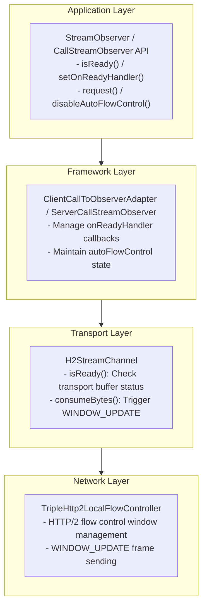
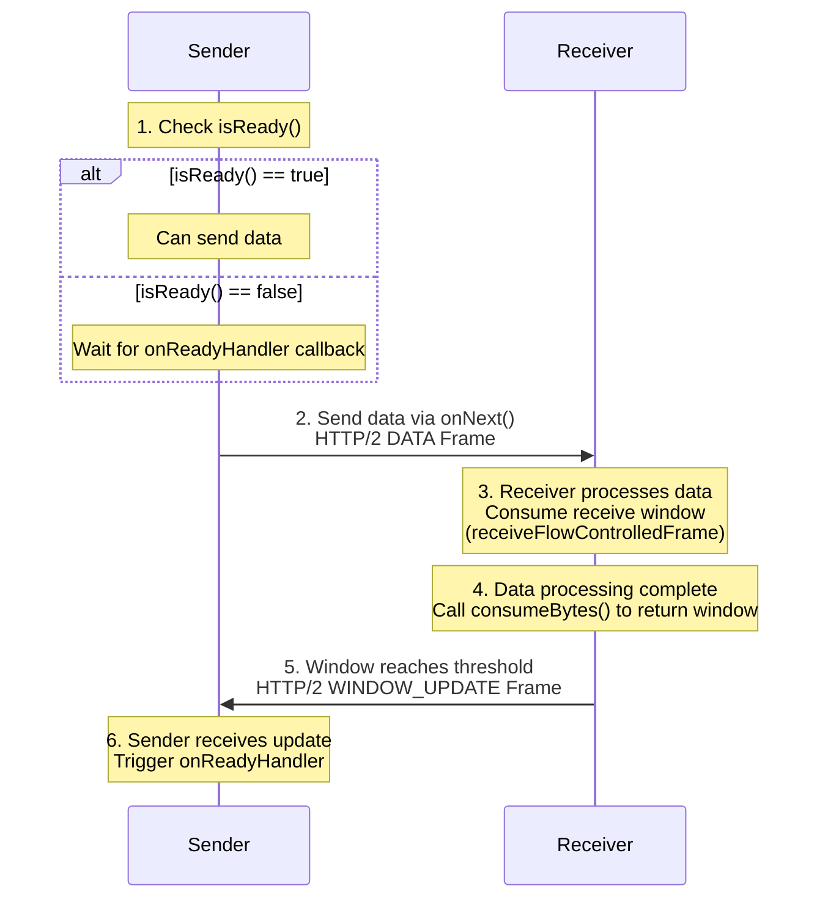
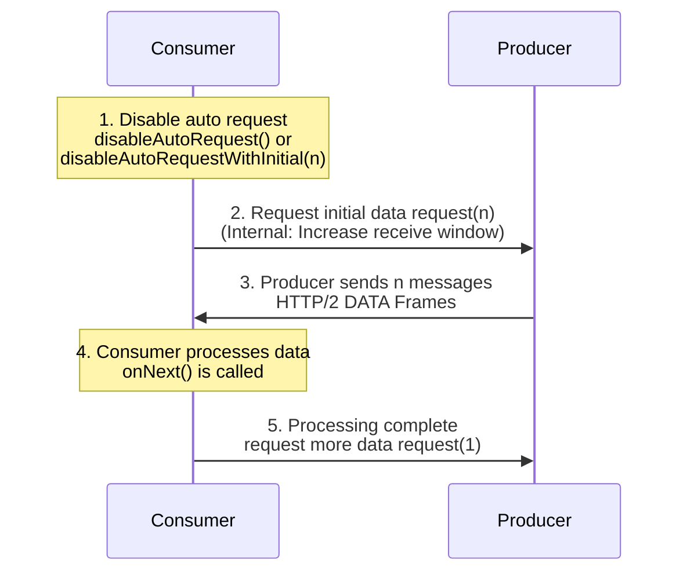

---
aliases:
  - /en/docs3-v2/java-sdk/reference-manual/protocol/triple/backpressure/
description: "This article introduces the backpressure mechanism of Triple protocol, including core concepts, technical principles, and usage"
linkTitle: triple-backpressure
title: Triple Protocol Backpressure
type: docs
weight: 6
---

## Overview

Backpressure is a core mechanism in streaming communication that coordinates the rate difference between data producers and consumers. When the consumer's processing speed cannot keep up with the producer's sending speed, the backpressure mechanism notifies the producer to slow down, thereby preventing memory overflow and system crashes.

Triple protocol is built on HTTP/2 and naturally supports streaming communication. In Dubbo 3.3.7, Triple protocol added complete backpressure support with gRPC-compatible APIs, enabling developers to precisely control data sending and receiving rates in streaming calls.

## Core Concepts

### Backpressure Types

Triple protocol supports two types of backpressure control:

| Backpressure Type | Description | Control Direction |
| --- | --- | --- |
| **Send-Side Backpressure** | Controls the data sending rate to prevent the sender from sending too fast and overflowing the receiver's buffer | Outbound flow control |
| **Receive-Side Backpressure** | Controls the data receiving rate, allowing the receiver to request data according to its processing capacity | Inbound flow control |

### Core APIs

Dubbo provides a set of gRPC-compatible backpressure APIs located in the `org.apache.dubbo.common.stream` package:

| API | Description |
| --- | --- |
| `CallStreamObserver<T>` | Base interface for backpressure control, providing `isReady()`, `setOnReadyHandler()` methods |
| `ClientCallStreamObserver<ReqT>` | Client-side backpressure control interface, extends `CallStreamObserver`, adds `disableAutoRequestWithInitial()` |
| `ServerCallStreamObserver<RespT>` | Server-side backpressure control interface, extends `CallStreamObserver`, adds `disableAutoRequest()` |
| `ClientResponseObserver<ReqT, RespT>` | Client response observer, configures backpressure via `beforeStart()` callback |

### API Classification

Backpressure APIs are categorized into High-Level and Low-Level APIs:

**High-Level API (Send-Side Backpressure)**
- `isReady()` - Check if the stream is ready to accept more data
- `setOnReadyHandler(Runnable)` - Set a callback for when the stream becomes writable

**Low-Level API (Receive-Side Backpressure)**
- `disableAutoFlowControl()` / `disableAutoInboundFlowControl()` - Disable automatic flow control
- `disableAutoRequestWithInitial(int)` - Client-specific, disable auto request and set initial request count
- `disableAutoRequest()` - Server-specific, disable auto request
- `request(int)` - Manually request a specific number of messages

## Technical Principles

### Architecture Overview

Triple backpressure mechanism is implemented based on HTTP/2 flow control capabilities, involving the following layers:



### Network Layer Data Flow

#### Send-Side Backpressure Flow



#### Receive-Side Backpressure Flow



### HTTP/2 Flow Controller

Triple uses a custom `TripleHttp2LocalFlowController` to implement HTTP/2 flow control:

```java
/**
 * Custom HTTP/2 local flow controller
 * 
 * Mechanism:
 * 1. Disable Netty's automatic WINDOW_UPDATE (Http2StreamChannelOption.AUTO_STREAM_FLOW_CONTROL = false)
 * 2. When data is received, window size decreases via receiveFlowControlledFrame
 * 3. After application processes data, call consumeBytes to return bytes
 * 4. When returned bytes reach threshold (default 50%), send WINDOW_UPDATE
 */
public class TripleHttp2LocalFlowController extends DefaultHttp2LocalFlowController {
    public TripleHttp2LocalFlowController(Http2Connection connection, float windowUpdateRatio) {
        super(connection, windowUpdateRatio, true);
    }
}
```

**Flow Control Call Chain:**

- **Server**: `StreamingDecoder.bytesRead()` → `FragmentListener.bytesRead()` → `H2StreamChannel.consumeBytes()` → `WINDOW_UPDATE`
- **Client**: `TriDecoder.Listener.bytesRead()` → `AbstractTripleClientStream.consumeBytes()` → `WINDOW_UPDATE`

## Usage

### Prerequisites

Ensure you are using Dubbo 3.3.7 or higher and have configured Triple protocol:

```yaml
dubbo:
  protocol:
    name: tri
    port: 50052
```

### Service Interface Definition

```java
public interface BackpressureService {
    // Server streaming - for testing client receive backpressure
    void serverStream(StreamRequest request, StreamObserver<DataChunk> responseObserver);

    // Client streaming - for testing server receive backpressure
    StreamObserver<DataChunk> clientStream(StreamObserver<StreamResponse> responseObserver);

    // Bidirectional streaming - for testing bidirectional backpressure
    StreamObserver<DataChunk> biStream(StreamObserver<DataChunk> responseObserver);
}
```

### High-Level API Usage

High-Level APIs are primarily used for **send-side backpressure control** via `isReady()` and `setOnReadyHandler()`.

#### Server-Side Send Backpressure

In server streaming scenarios, the server as the data sender needs to control the sending rate based on the client's receiving capacity:

```java
@Override
public void serverStream(StreamRequest request, StreamObserver<DataChunk> responseObserver) {
    int totalCount = request.getCount();
    int chunkSize = request.getChunkSize();
    
    // Cast to ServerCallStreamObserver to use backpressure API
    if (responseObserver instanceof ServerCallStreamObserver) {
        ServerCallStreamObserver<DataChunk> serverObserver = 
                (ServerCallStreamObserver<DataChunk>) responseObserver;
        
        final AtomicInteger sentCount = new AtomicInteger(0);
        final AtomicBoolean completed = new AtomicBoolean(false);
        final byte[] data = new byte[chunkSize];

        // Set onReadyHandler - called when stream becomes writable
        serverObserver.setOnReadyHandler(() -> {
            // Continue sending data while stream is ready
            while (serverObserver.isReady() && sentCount.get() < totalCount && !completed.get()) {
                int seq = sentCount.getAndIncrement();
                DataChunk chunk = new DataChunk(seq, data, System.currentTimeMillis());
                serverObserver.onNext(chunk);
            }
            
            // Close stream after all data is sent
            if (sentCount.get() >= totalCount && !completed.getAndSet(true)) {
                serverObserver.onCompleted();
            }
        });

        // Initial send (if stream is ready)
        while (serverObserver.isReady() && sentCount.get() < totalCount) {
            int seq = sentCount.getAndIncrement();
            serverObserver.onNext(new DataChunk(seq, data, System.currentTimeMillis()));
        }
        
        // Complete immediately if all data sent in initial phase
        if (sentCount.get() >= totalCount && !completed.getAndSet(true)) {
            serverObserver.onCompleted();
        }
    }
}
```

#### Client-Side Send Backpressure

In client streaming scenarios, the client as the data sender configures backpressure via `ClientResponseObserver`'s `beforeStart()` callback:

```java
public void testClientStreamWithOnReadyHandler() throws InterruptedException {
    final int sendCount = 50;
    final CountDownLatch latch = new CountDownLatch(1);
    final AtomicInteger sent = new AtomicInteger(0);
    final AtomicBoolean sendCompleted = new AtomicBoolean(false);
    final byte[] data = new byte[1024];

    // Use ClientResponseObserver to configure backpressure before stream starts
    ClientResponseObserver<DataChunk, StreamResponse> responseObserver =
            new ClientResponseObserver<DataChunk, StreamResponse>() {
        
        @Override
        public void beforeStart(ClientCallStreamObserver<DataChunk> requestStream) {
            // Disable auto flow control for manual send control
            requestStream.disableAutoFlowControl();

            // Set onReadyHandler - callback when stream becomes ready
            requestStream.setOnReadyHandler(() -> {
                while (requestStream.isReady() && sent.get() < sendCount && !sendCompleted.get()) {
                    int seq = sent.getAndIncrement();
                    requestStream.onNext(new DataChunk(seq, data, System.currentTimeMillis()));
                }

                if (sent.get() >= sendCount && !sendCompleted.getAndSet(true)) {
                    requestStream.onCompleted();
                }
            });
        }

        @Override
        public void onNext(StreamResponse response) {
            System.out.println("Server received: " + response.getTotalChunks() + " chunks");
        }

        @Override
        public void onError(Throwable throwable) {
            latch.countDown();
        }

        @Override
        public void onCompleted() {
            latch.countDown();
        }
    };

    // Start stream - beforeStart() is called internally
    StreamObserver<DataChunk> requestObserver = service.clientStream(responseObserver);

    latch.await(60, TimeUnit.SECONDS);
}
```

### Low-Level API Usage

Low-Level APIs are primarily used for **receive-side backpressure control**, allowing the receiver to actively request data according to its processing capacity.

#### Client-Side Receive Backpressure

In server streaming scenarios, the client can control the rate of receiving data from the server:

```java
public void testServerStreamWithManualRequest() throws InterruptedException {
    final int requestCount = 30;
    final int initialRequest = 5;
    final CountDownLatch latch = new CountDownLatch(1);
    final AtomicInteger receivedCount = new AtomicInteger(0);

    StreamRequest request = new StreamRequest(requestCount, 1024);

    // Use ClientResponseObserver to configure receive backpressure
    ClientResponseObserver<StreamRequest, DataChunk> responseObserver =
            new ClientResponseObserver<StreamRequest, DataChunk>() {
        
        // Store requestStream reference to call request() in onNext
        private ClientCallStreamObserver<StreamRequest> requestStream;

        @Override
        public void beforeStart(ClientCallStreamObserver<StreamRequest> requestStream) {
            this.requestStream = requestStream;
            // Disable auto request and set initial request count
            // This is a Dubbo-specific convenience API combining gRPC's disableAutoRequest() + request()
            requestStream.disableAutoRequestWithInitial(initialRequest);
        }

        @Override
        public void onNext(DataChunk chunk) {
            int count = receivedCount.incrementAndGet();
            
            // After processing data, request the next message
            // This is key to controlling receive rate
            if (requestStream != null) {
                requestStream.request(1);
            }
        }

        @Override
        public void onError(Throwable throwable) {
            latch.countDown();
        }

        @Override
        public void onCompleted() {
            latch.countDown();
        }
    };

    // Start stream
    service.serverStream(request, responseObserver);

    latch.await(60, TimeUnit.SECONDS);
}
```

#### Server-Side Receive Backpressure

In client streaming scenarios, the server can control the rate of receiving data from the client:

```java
@Override
public StreamObserver<DataChunk> clientStream(StreamObserver<StreamResponse> responseObserver) {
    final AtomicInteger chunkCount = new AtomicInteger(0);
    final AtomicLong totalBytes = new AtomicLong(0);

    // Cast to ServerCallStreamObserver to use receive backpressure API
    if (responseObserver instanceof ServerCallStreamObserver) {
        ServerCallStreamObserver<StreamResponse> serverObserver =
                (ServerCallStreamObserver<StreamResponse>) responseObserver;

        // Disable auto request - server will manually control receive rate
        serverObserver.disableAutoRequest();

        // Request initial batch of messages
        final int initialRequest = 5;
        serverObserver.request(initialRequest);

        return new StreamObserver<DataChunk>() {
            @Override
            public void onNext(DataChunk chunk) {
                int count = chunkCount.incrementAndGet();
                if (chunk.getData() != null) {
                    totalBytes.addAndGet(chunk.getData().length);
                }

                // After processing each message, request the next one
                // This is key to server-side receive backpressure control
                serverObserver.request(1);
            }

            @Override
            public void onError(Throwable throwable) {
                // Error handling
            }

            @Override
            public void onCompleted() {
                StreamResponse response = new StreamResponse(
                    chunkCount.get(), totalBytes.get(), duration);
                responseObserver.onNext(response);
                responseObserver.onCompleted();
            }
        };
    }
    
    // Fallback: basic implementation without backpressure control
    return createBasicStreamObserver(responseObserver, chunkCount, totalBytes);
}
```

### Complete Bidirectional Backpressure Control

In bidirectional streaming scenarios, both send and receive backpressure can be used simultaneously:

```java
@Override
public StreamObserver<DataChunk> biStream(StreamObserver<DataChunk> responseObserver) {
    final AtomicInteger receivedCount = new AtomicInteger(0);
    final AtomicInteger sentCount = new AtomicInteger(0);

    if (responseObserver instanceof ServerCallStreamObserver) {
        ServerCallStreamObserver<DataChunk> serverObserver =
                (ServerCallStreamObserver<DataChunk>) responseObserver;

        // Buffer for data that couldn't be sent immediately due to backpressure
        ConcurrentLinkedQueue<DataChunk> pendingChunks = new ConcurrentLinkedQueue<>();
        final AtomicBoolean streamCompleted = new AtomicBoolean(false);

        // === Send Backpressure Control ===
        serverObserver.setOnReadyHandler(() -> {
            // When stream becomes writable, send buffered data
            while (serverObserver.isReady() && !pendingChunks.isEmpty()) {
                DataChunk chunk = pendingChunks.poll();
                if (chunk != null) {
                    serverObserver.onNext(chunk);
                    sentCount.incrementAndGet();
                }
            }

            // Close stream if all data sent and stream is completed
            if (streamCompleted.get() && pendingChunks.isEmpty()) {
                serverObserver.onCompleted();
            }
        });

        // === Receive Backpressure Control ===
        serverObserver.disableAutoRequest();
        serverObserver.request(5);  // Initially request 5 messages

        return new StreamObserver<DataChunk>() {
            @Override
            public void onNext(DataChunk chunk) {
                receivedCount.incrementAndGet();

                // Prepare response data
                DataChunk response = new DataChunk(
                        chunk.getSequenceNumber(),
                        chunk.getData(),
                        System.currentTimeMillis()
                );

                // Try to send immediately, buffer if stream is not ready
                if (serverObserver.isReady()) {
                    serverObserver.onNext(response);
                    sentCount.incrementAndGet();
                } else {
                    pendingChunks.offer(response);
                }

                // Request next message (receive backpressure control)
                serverObserver.request(1);
            }

            @Override
            public void onError(Throwable throwable) {
                // Error handling
            }

            @Override
            public void onCompleted() {
                streamCompleted.set(true);
                if (pendingChunks.isEmpty()) {
                    serverObserver.onCompleted();
                }
                // Otherwise wait for onReadyHandler to send remaining data
            }
        };
    }

    // Fallback handling
    return createBasicBiStreamObserver(responseObserver, receivedCount, sentCount);
}
```

## API Reference

### CallStreamObserver

```java
public interface CallStreamObserver<T> extends StreamObserver<T> {
    /**
     * Check if the stream is ready to accept more messages
     * If returns false, caller should avoid calling onNext()
     */
    boolean isReady();

    /**
     * Set a callback for when the stream becomes writable
     * Callback is forwarded to business thread pool, does not block event loop
     */
    void setOnReadyHandler(Runnable onReadyHandler);

    /**
     * Request a specific number of messages
     * Thread-safe, can be called from multiple threads
     */
    void request(int count);

    /**
     * Disable automatic flow control, switch to manual mode
     */
    void disableAutoFlowControl();

    /**
     * Compatibility alias method for gRPC
     */
    default void disableAutoInboundFlowControl() {
        disableAutoFlowControl();
    }
}
```

### ClientCallStreamObserver

```java
public interface ClientCallStreamObserver<ReqT> extends CallStreamObserver<ReqT> {
    /**
     * Disable automatic inbound flow control and set initial request count
     * Must be called within beforeStart(), otherwise has no effect
     *
     * @param request Initial request count, 0 means no messages delivered until request() is called
     */
    void disableAutoRequestWithInitial(int request);
}
```

### ServerCallStreamObserver

```java
public interface ServerCallStreamObserver<RespT> extends CallStreamObserver<RespT> {
    /**
     * Disable automatic request (equivalent to disableAutoFlowControl)
     */
    default void disableAutoRequest() {
        disableAutoFlowControl();
    }
}
```

### ClientResponseObserver

```java
public interface ClientResponseObserver<ReqT, RespT> extends StreamObserver<RespT> {
    /**
     * Called before stream starts, used to configure flow control settings
     *
     * Allowed operations:
     * - setOnReadyHandler() - Set send backpressure callback
     * - disableAutoRequestWithInitial() - Configure receive backpressure
     * - disableAutoFlowControl() - Disable automatic flow control
     *
     * Note: Do not call onNext() or onCompleted() in this callback
     */
    void beforeStart(ClientCallStreamObserver<ReqT> requestStream);
}
```

## Best Practices

### 1. Choose the Right Backpressure Strategy

| Scenario | Recommended Strategy |
| --- | --- |
| Server sending large amounts of data | Server uses `setOnReadyHandler()` + `isReady()` |
| Client sending large amounts of data | Client uses `ClientResponseObserver.beforeStart()` to configure |
| Client needs to control receive rate | Client uses `disableAutoRequestWithInitial()` + `request()` |
| Server needs to control receive rate | Server uses `disableAutoRequest()` + `request()` |

### 2. Efficient Use of onReadyHandler

`onReadyHandler` is forwarded to the business thread pool and does not block the event loop. However, for better throughput, it's recommended to complete data sending as quickly as possible within the callback:

```java
// ✅ Recommended: Continue sending data in onReadyHandler until stream is no longer ready
serverObserver.setOnReadyHandler(() -> {
    while (serverObserver.isReady() && hasMoreData()) {
        serverObserver.onNext(getNextData());
    }
    // Callback automatically returns when stream is no longer ready
    // Will be triggered again when stream becomes ready
});
```

### 3. Handle Stream Completion Correctly

Ensure `onCompleted()` is called after all data is sent:

```java
// Use AtomicBoolean to avoid duplicate onCompleted() calls
final AtomicBoolean completed = new AtomicBoolean(false);

serverObserver.setOnReadyHandler(() -> {
    while (serverObserver.isReady() && sentCount.get() < totalCount) {
        // Send data...
    }
    
    if (sentCount.get() >= totalCount && !completed.getAndSet(true)) {
        serverObserver.onCompleted();
    }
});
```

### 4. Use ClientResponseObserver to Configure Backpressure

Always configure backpressure via `beforeStart()` to ensure configuration is complete before stream starts:

```java
// ✅ Recommended: Configure in beforeStart()
ClientResponseObserver<Request, Response> observer = 
    new ClientResponseObserver<Request, Response>() {
        @Override
        public void beforeStart(ClientCallStreamObserver<Request> requestStream) {
            requestStream.disableAutoFlowControl();
            requestStream.setOnReadyHandler(() -> { /* ... */ });
        }
        // ...
    };

// ❌ Not recommended: Configuring after stream starts (may not take effect)
StreamObserver<Request> requestObserver = service.clientStream(responseObserver);
((ClientCallStreamObserver) requestObserver).disableAutoFlowControl();  // May be too late
```

## Sample Code

For complete sample code, please refer to [dubbo-samples-triple-backpressure](https://github.com/apache/dubbo-samples/tree/master/2-advanced/dubbo-samples-triple-backpressure).

Run the sample:

```bash
# Get sample code
git clone --depth=1 https://github.com/apache/dubbo-samples.git
cd dubbo-samples/2-advanced/dubbo-samples-triple-backpressure

# Run tests
mvn test
```
