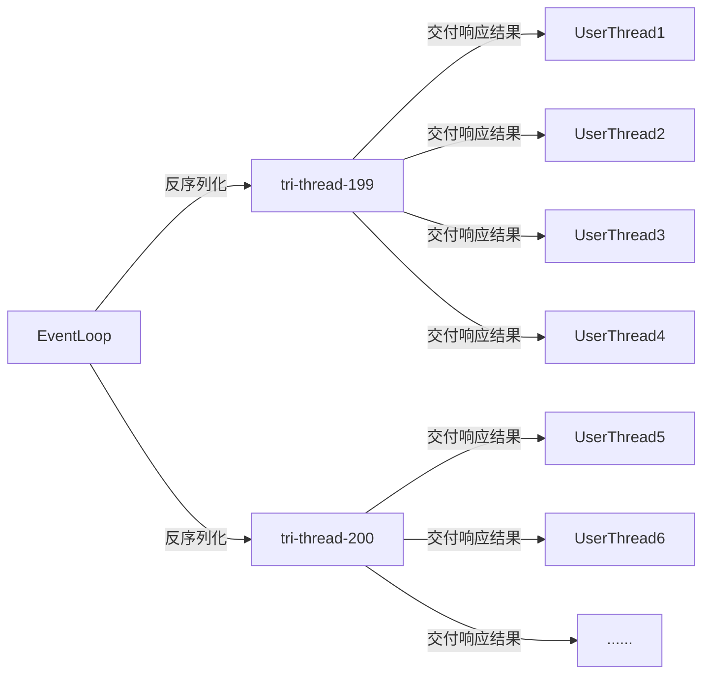
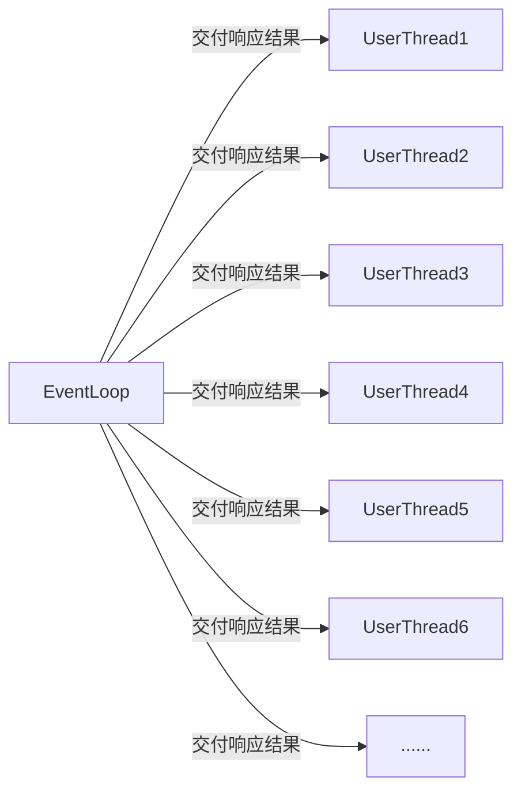

## 前言

Dubbo3 Triple 协议是参考 gRPC、gRPC-Web、Dubbo2 等协议特点设计而来，它吸取各自协议特点，完全兼容 gRPC、Streaming 通信、且无缝支持 HTTP/1 和浏览器。

当你在 Dubbo 框架中使用 Triple 协议，然后你就可以直接使用 Dubbo 客户端、gRPC 客户端、curl、浏览器等访问你发布的服务，不需要任何额外组件与配置。
除易用性以外，Dubbo3 Triple 在性能调优方面做了大量工作，本文将侧重对 Triple 协议背后的高性能秘密进行深入讲解，涉及一些有价值的性能调优工具、技巧及代码实现；在下一篇文章中，我们将具体展开 Triple 协议在易用性方面的一些具体使用场景。

## 为什么要优化Triple协议的性能？

自 2021 年开始 Dubbo3 就已经作为下一代服务框架逐步开始取代阿里内部广泛使用的 HSF 框架，截止目前，阿里以淘宝、天猫等电商为代表的绝大多数核心应用已经成功升级到 Dubbo3。作为过去两年支撑阿里双十一万亿级服务调用的关键框架，Triple 通信协议的性能直接影响整个系统的运行效率。

## 前置知识
### 1. Triple

Triple 协议是参考 gRPC 与 gRPC-Web 两个协议设计而来，它吸取了两个协议各自的特性和优点，将它们整合在一起，成为一个完全兼容 gRPC 且支持 Streaming 通信的协议，同时 Triple 还支持 HTTP/1、HTTP/2。

Triple 协议的设计目标如下：

Triple 设计为对人类友好、开发调试友好的一款基于 HTTP 的协议，尤其是对 unary 类型的 RPC 请求。
完全兼容基于 HTTP/2 的 gRPC 协议，因此 Dubbo Triple 协议实现可以 100% 与 gRPC 体系互调互通。

当你在 Dubbo 框架中使用 Triple 协议，然后你就可以直接使用 Dubbo 客户端、gRPC 客户端、curl、浏览器等访问你发布的服务。

以下是使用 curl 客户端访问 Dubbo 服务端一个 Triple 协议服务的示例：

```shell
curl \
  --header "Content-Type: application/json"\
  --data '{"sentence": "Hello Dubbo."}'\
https://host:port/org.apache.dubbo.sample.GreetService/sayHello
```

在具体实现上，Dubbo Triple 支持 Protobuf Buffer 但并不绑定，比如 Dubbo Java 支持以 Java Interface 定义 Triple 服务，这对于关注特定语言易用性的开发者将更容易上手。另外，Dubbo 当前已经提供了 Java、Go、Rust 等语言实现，目前正在推进 Node.js 等语言的协议实现，我们计划通过多语言和 Triple 协议打通移动端、浏览器、后端微服务体系。

在 Triple 的实现中核心的组件有以下几个：

`TripleInvoker`是Triple协议的核心组件之一，用于请求调用Triple协议的服务端。其中核心方法为`doInvoke`，该方法会根据请求类型如UNARY、BiStream等，发起不一样类型的请求。如UNARY在SYNC下即同步阻塞调用，一个请求对应一个响应。BiStream则是双向通讯，客户端可以持续发送请求，而服务端同样也可以持续推送消息，他们之间通过回调StreamObserver组件的方法实现交互。

`TripleClientStream`是Triple协议的核心组件之一，该组件与HTTP/2中的Stream概念与之对应，每次发起一个新的请求均会创建一个新的TripleClientStream，同理与之对应的`HTTP/2的Stream`也是不相同的。TripleClientStream提供核心的方法有sendHeader用来发送头部帧`Header Frame`，以及sendMessage用来发送数据帧`Data Frame`。

`WriteQueue`是Triple协议中用于写出消息的缓冲队列，其核心逻辑就是将各种操作命令QueueCommand添加到内部维护的队列中，并尝试将这些`QueueCommand`对应的任务提交到Netty的EventLoop线程中`单线程`、`有序`的执行。

`QueueCommand`是专门用于提交到WriteQueue的任务抽象类，不同的Command对应了不同的执行逻辑。

`TripleServerStream`是Triple协议中服务端的Stream抽象，该组件与HTTP/2中的Stream概念与之对应，客户端每通过一个新的Stream发起请求，服务端便会创建一个与之对应的TripleServerStream，以便处理客户端发来的请求信息。

### 2. HTTP/2

HTTP/2是一种新一代的HTTP协议，是HTTP/1.1的替代品，HTTP/2相较于HTTP/1.1的最大改进在于减少了资源的消耗提高了性能。HTTP/1.1中，浏览器只能在一个TCP连接中发送一个请求。如果浏览器需要加载多个资源，那么浏览器就需要建立多个TCP连接。这种方式会导致一些问题，例如TCP连接的建立和断开会增加网络延迟，而且浏览器可能会在同一时间内发送多个请求导致网络拥塞。

相反，HTTP/2允许浏览器在一个TCP连接中同时发送多个请求，多个请求对应`多个Stream流`，多个流之间相互独立，并以`并行`的方式流转。而在每个流中，这些请求会被拆分成`多个Frame帧`，这些帧在同一个流中以`串行`的方式流转，严格的保证了`帧的有序性`。因此客户端可以并行发送多个请求，而服务器也可以并行发送多个响应，这有助于减少网络连接数，以及网络延迟和提高性能。

HTTP/2还支持服务器推送，这意味着服务器可以在浏览器请求之前预加载资源。例如，如果服务器知道浏览器将要请求一个特定的资源，那么服务器可以在浏览器请求之前将该资源推送到浏览器。这有助于提高性能，因为浏览器不需要等待资源的请求和响应。

HTTP/2还支持头部压缩，这意味着HTTP头部中的重复信息可以被压缩。这有助于减少网络带宽的使用。

### 3. Netty

Netty是一个高性能异步事件驱动的网络框架，主要用于快速开发可维护的高性能协议服务器和客户端。它的主要特点是易于使用、灵活性强、性能高、可扩展性好。Netty使用NIO作为基础，可以轻松地实现异步、非阻塞的网络编程，支持TCP、UDP、HTTP、SMTP、WebSocket、SSL等多种协议。
Netty的核心组件包括Channel、EventLoop、ChannelHandler和ChannelPipeline。

`Channel`是一个传输数据的双向通道，可以用来处理网络I/O操作。Netty的Channel实现了Java NIO的Channel接口，并在此基础上添加了一些功能，例如支持异步关闭、绑定多个本地地址、绑定多个事件处理器等。

`EventLoop`是Netty的核心组件之一，它负责处理所有I/O事件和任务。一个EventLoop可以管理多个Channel，每个Channel都有一个对应的EventLoop。EventLoop使用`单线程模型`来处理事件，避免了线程之间的竞争和锁的使用，从而提高了性能。

`ChannelHandler`是连接到ChannelPipeline的处理器，它可以处理入站和出站的数据，例如编码、解码、加密、解密等。一个Channel可以有`多个ChannelHandler`，ChannelPipeline会`按照添加的顺序`依次调用它们来处理数据。

`ChannelPipeline`是Netty的另一个核心组件，它是一组按顺序连接的ChannelHandler，用于处理入站和出站的数据。每个Channel都有自己`独占的ChannelPipeline`，当数据进入或离开Channel时，会经过所有的ChannelHandler，由它们来完成处理逻辑。

## 工具准备

为了对代码进行调优，我们需要借助一些工具来找到Triple协议性能瓶颈的位置，例如阻塞、热点方法。而本次调优用到的工具主要有`VisualVM`以及`JFR`。

### Visual VM

Visual VM是一个可以监视本地和远程的Java虚拟机的性能和内存使用情况的图形化工具。它是一个开源项目，可以用于识别和解决Java应用程序的性能问题。

Visual VM可以显示Java虚拟机的运行状况，包括`CPU使用率`、`线程数`、`内存使用`情况、`垃圾回收`等。它还可以显示每个线程的CPU使用情况和`堆栈跟踪`，以便识别瓶颈。

Visual VM还可以分析堆转储文件，以识别内存泄漏和其他内存使用问题。它可以查看对象的大小、引用和类型，以及对象之间的关系。

Visual VM还可以在运行时监视应用程序的性能，包括方法调用次数、耗时、异常等。它还可以生成CPU和内存使用情况的快照，以便进一步分析和优化。

### JFR

JFR全称为Java Flight Recorder，是JDK提供的性能分析工具。JFR是一种轻量级的、低开销的事件记录器，它可以用来记录各种事件，包括线程的`生命周期`、`垃圾回收`、`类加载`、`锁竞争`等等。JFR的数据可以用来分析应用程序的性能瓶颈，以及识别`内存泄漏`等问题。与其他性能分析工具相比，JFR的特点在于它的开销非常低，可以一直开启记录，而不会对应用程序本身的性能产生影响。

JFR的使用非常简单，只需要在启动JVM时添加启动参数`-XX:+UnlockCommercialFeatures -XX:+FlightRecorder`，就可以开启JFR的记录功能。当JVM运行时，JFR会自动记录各种事件，并将它们保存到一个文件中。记录结束后，我们可以使用工具`JDK Mission Control`来分析这些数据。例如，我们可以查看CPU的使用率、内存的使用情况、线程的数量、锁竞争情况等等。JFR还提供了一些高级的功能，例如`事件过滤`、`自定义事件`、`事件堆栈`跟踪等等。

在本次性能调优中，我们重点关注Java中能明显影响性能的事件：Monitor Blocked、Monitor Wait、Thread Park、Thread Sleep。

- `Monitor Blocked`事件由synchronized块触发，表示有线程进入了同步代码块
- `Monitor Wait`事件由Object.wait触发，表示有代码调用了该方法
- `Thread Park`事件由LockSupport.park触发，表示有线程被挂起
- `Thread Sleep`事件由Thread.sleep()触发，表示代码中存在手动调用该方法的情况

## 调优思路

### 1. 非阻塞

高性能的关键点之一是编码时必须是非阻塞的，代码中如果出现了`sleep`、`await`等类似方法的调用，将会阻塞线程并直接影响到程序的性能，所以在代码中应尽可能避免使用阻塞式的API，而是使用非阻塞的API。

### 2. 异步

在调优思路中，异步是其中一个关键点。在代码中，我们可以使用异步的编程方式，例如使用Java8中的`CompletableFuture`等。这样做的好处在于可以避免线程的阻塞，从而提高程序的性能。

### 3. 分治

在调优过程中，分治也是一个很重要的思路。例如可以将一个大的任务分解成若干个小任务，然后使用多线程并行的方式来处理这些任务。这样做的好处在于可以提高程序的并行度，从而充分利用多核CPU的性能，达到优化性能的目的。

### 4. 批量

在调优思路中，批量也是一个很重要的思路。例如可以将多个小的请求合并成一个大的请求，然后一次性发送给服务器，这样可以减少网络请求的次数，从而降低网络延迟和提高性能。另外，在处理大量数据时，也可以使用批量处理的方式，例如一次性将一批数据读入内存，然后进行处理，这样可以减少IO操作的次数，从而提高程序的性能。

## **高性能的基石——非阻塞**

### 1.1 不合理的syncUninterruptibly

通过直接检查代码，我们发现了一处明显明显会阻塞当前线程的方法`syncUninterruptibly`。而使用DEBUG的方式可以很轻松的得知该代码会在`用户线程`中进行，其中源码如下所示。

```java
private WriteQueue createWriteQueue(Channel parent) {
  final Http2StreamChannelBootstrap bootstrap = new Http2StreamChannelBootstrap(parent);
  final Future<Http2StreamChannel> future = bootstrap.open().syncUninterruptibly();
  if (!future.isSuccess()) {
    throw new IllegalStateException("Create remote stream failed. channel:" + parent);
  }
  final Http2StreamChannel channel = future.getNow();
  channel.pipeline()
    .addLast(new TripleCommandOutBoundHandler())
    .addLast(new TripleHttp2ClientResponseHandler(createTransportListener()));
  channel.closeFuture()
    .addListener(f -> transportException(f.cause()));
  return new WriteQueue(channel);
}
```

此处代码逻辑如下

- 通过TCP Channel构造出Http2StreamChannelBootstrap
- 通过调用Http2StreamChannelBootstrap的open方法得到Future<Http2StreamChannel>
- 通过调用`syncUninterruptibly`阻塞方法等待Http2StreamChannel构建完成
- 得到Http2StreamChannel后再构造其对应的ChannelPipeline

而在`前置知识`中我们提到了Netty中大部分的任务都是在EventLoop线程中以`单线程`的方式执行的，同样的当用户线程调用open时将会把创建HTTP2 Stream Channel的任务提交到EventLoop中，并在调用`syncUninterruptibly`方法时阻塞用户线程直到任务完成。

而提交后的任务只是提交到一个任务队列中并非立即执行，因为此时的EventLoop可能还在执行Socket读写任务或其他任务，那么提交后很可能因为其他任务占用的时间较多，从而导致迟迟没有执行创建Http2StreamChannel这个任务，那么阻塞用户线程的时间就会变大。

而从一个请求的整体的流程分析来看，Stream  Channel还没创建完成用户线程就被阻塞了，在真正发起请求后还需要再次进行阻塞等待响应，一次UNARY请求中就出现了两次明显的阻塞行为，这将会极大的制约了Triple协议的性能，那么我们可以大胆假设：`此处的阻塞是不必要的`。为了证实我们的推断，我们可以使用`VisualVM`对其进行采样，分析热点中阻塞创建Stream Channel的耗时。以下是Triple Consumer Side的采样结果。


从图中我们可以看到`HttpStreamChannelBootstrap$1.run`创建StreamChannel方法在整个EventLoop的耗时里有着不小的占比，展开后可以看到这些耗时基本上消耗在了`notifyAll`上，即唤醒用户线程。

### 1.2 优化方案

至此我们已经了解到了性能的阻碍点之一是创建StreamChannel，那么优化方案便是将创建`StreamChannel异步化，`以便消除`syncUninterruptibly`方法的调用。改造后的代码如下所示，将创建StreamChannel的任务抽象成了`CreateStreamQueueCommand`并提交到了WriteQueue中，后续发起请求的`sendHeader`、`sendMessage`也是将其提交到WriteQueue中，这样便可以轻松保证在创建Stream后才会执行发送请求的任务。

```java
private TripleStreamChannelFuture initHttp2StreamChannel(Channel parent) {
    TripleStreamChannelFuture streamChannelFuture = new TripleStreamChannelFuture(parent);
    Http2StreamChannelBootstrap bootstrap = new Http2StreamChannelBootstrap(parent);
    bootstrap.handler(new ChannelInboundHandlerAdapter() {
            @Override
            public void handlerAdded(ChannelHandlerContext ctx) throws Exception {
                Channel channel = ctx.channel();
                channel.pipeline().addLast(new TripleCommandOutBoundHandler());
                channel.pipeline().addLast(new TripleHttp2ClientResponseHandler(createTransportListener()));
                channel.closeFuture().addListener(f -> transportException(f.cause()));
            }
        });
    CreateStreamQueueCommand cmd = CreateStreamQueueCommand.create(bootstrap, streamChannelFuture);
    this.writeQueue.enqueue(cmd);
    return streamChannelFuture;
}
```

其中`CreateStreamQueueCommand`的核心逻辑如下，通过保证在EventLoop中执行以消除不合理的阻塞方法调用

```java
public class CreateStreamQueueCommand extends QueuedCommand {
		......
    @Override
    public void run(Channel channel) {
        //此处的逻辑可以保证在EventLoop下执行，所以open后可以直接获取结果而不需要阻塞
        Future<Http2StreamChannel> future = bootstrap.open();
        if (future.isSuccess()) {
            streamChannelFuture.complete(future.getNow());
        } else {
            streamChannelFuture.completeExceptionally(future.cause());
        }
    }
}
```

### 2.1 不恰当的synchronized锁竞争

此时简单的看源码已经不能发现明显的性能瓶颈了，接下来我们需要借助`Visual VM`工具来找到性能瓶颈。

打开工具后我们可以选中需要采集的进程，这里我们采集的是Triple Consumer的进程，并选中选项卡中的`Sampler`，点击`CPU`开始采样CPU的耗时热点方法。以下是我们采样CPU热点方法的结果，我们展开了耗时最为明显的EventLoop线程的调用堆栈。


经过层层展开，我们可以从图中发现一个非常的不合理耗时方法——`ensureWriteOpen`，这个方法名看上去不就是一个判断Socket是否可写的方法吗，为什么耗时的占比会这么大？我们带着疑问打开了JDK8中`sun.nio.ch.SocketChannelImpl`的`isConnected`方法，其代码如下。

```java
public boolean isConnected() {
  synchronized (stateLock) {
    return (state == ST_CONNECTED);
  }
}
```

可以看到这个方法中没有任何逻辑，但是有着关键字眼`synchronized`，所以我们可以断定：EventLoop线程出现了大量的同步锁竞争！那么我们下一步思路便是找到在同一时刻竞争该锁的方法。我们的方法也比较简单粗暴，那就是通过DEBUG条件断点的方式找出该方法。如下图所示我们给`isConnected`这个方法里打上条件断点，进入断点的条件是：`当前线程不是EventLoop线程`。


断点打上后我们启动并发起请求，可以很清晰的看到我们的方法调用堆栈中出现了`TripleInvoker.isAvailable`的方法调用，最终会调用到`sun.nio.ch.SocketChannelImpl`的`isConnected`，从而出现了EventLoop线程的锁竞争耗时的现象。


### 2.2 优化方案

通过以上的分析，我们接下来的修改思路就很清晰了，那就是修改`isAvailable`的判断逻辑，自身维护一个boolean值表示是否可以用，以便消除锁竞争，提升Triple协议的性能。

## **不可忽视的开销——线程上下文切换**

我们继续观察VisualVM采样的快照，查看整体线程的耗时情况，如下图：


从图中我们可以提取到以下信息：

- 耗时最大的线程为`NettyClientWorker-2-1`
- 压测期间有大量非消费者线程即`tri-protocol-214783647-thread-xxx`
- 消费者线程的整体`耗时较高`且`线程数多`
- 用户线程的`耗时非常低`

我们任意展开其中一个`消费者线程后`也能看到消费者线程主要是做反序列化以及交付反序列化结果(`DeadlineFuture.received`)，如下图所示：


从以上信息来看似乎并不能看到瓶颈点，接下来我们尝试使用JFR（Java Flight Recorder）监控进程信息。下图是JFR的日志分析。


### 1. Monitor Blocked事件

其中我们可以先查看JFR的简要分析，点击`Java Blocking`查看可能存在的阻塞点，该事件表示有线程进入了`synchronized`代码块,其中结果如下图所示。


可以看到这里有一个总阻塞耗时达39秒的Class，点击后可以看到图中Thread一栏，被阻塞的线程全都是benchmark发请求的线程。再往下看火焰图Flame View中展示的方法堆栈，可以分析出这只是在等待响应结果，该阻塞是必要的，该阻塞点可以忽略。

接着点击左侧菜单的Event Browser查看JFR收集到的事件日志，并过滤出名为java的事件类型列表，我们首先查看`Java Monitor Blocked`事件，结果如下图所示。


可以看到被阻塞的线程全都是benchmark发起请求的线程，阻塞的点也只是等待响应，可以排除该事件。

### 2. Monitor Wait事件

继续查看`Java Monitor Wait`事件，Monitor Wait表示有代码调用了`Object.wait`方法，结果如下图所示。


从上图我们可以得到这些信息：benchmark请求线程均被阻塞，平均等待耗时约为87ms，阻塞对象均是同一个DefaultPromise，阻塞的切入方法为`Connection.isAvailable`。接着我们查看该方法的源码，其源码如下所示。很显然，这个阻塞的耗时只是首次建立连接的耗时，对整体性能不会有太大的影响。所以这里的`Java Monitor Wait`事件也可以排除。

```java
public boolean isAvailable() {
  if (isClosed()) {
    return false;
  }
  Channel channel = getChannel();
  if (channel != null && channel.isActive()) {
    return true;
  }
  if (init.compareAndSet(false, true)) {
    connect();
  }

  this.createConnectingPromise();
  //87ms左右的耗时来自这里
  this.connectingPromise.awaitUninterruptibly(this.connectTimeout, TimeUnit.MILLISECONDS);
  // destroy connectingPromise after used
  synchronized (this) {
    this.connectingPromise = null;
  }

  channel = getChannel();
  return channel != null && channel.isActive();
}
```

### 3. Thread Sleep事件

接下来我们再查看`Java Thread Sleep`事件，该事件表示代码中存在手动调用`Thread.sleep`，检查是否存在阻塞工作线程的行为。从下图可以看到，很显然并没有阻塞消费者线程或benchmark请求线程，这个主动调用sleep的线程主要用于请求超时场景，对整体性能没有影响，同样也可以排除`Java Thread Sleep`事件。


### 4. Thread Park事件

最后我们再查看`Java Thread Park`事件，park事件表示线程被挂起。下图是park事件列表。


可以看到park事件有`1877`个，并且大多都是消费者线程池里的线程，从火焰图中的方法堆栈可以得知这些线程都在等待任务，并且没有取到任务的持续时间偏长。由此可以说明一个问题：消费者线程池中大部分线程都是没有执行任务的，消费者线程池的`利用率非常低`。

而要提高线程池的利用率则可以减少消费者线程池的线程数，但是在dubbo中消费者线程池并不能直接减少，我们尝试在UNARY场景下将消费者线程池包装成SerializingExecutor，该Executor可以使得提交的任务被串行化执行，变相将线程池大小缩小。我们再查看缩减后的结果如下。

```
benchmark
修改前：
ClientPb.listUser thrpt    3  17.865 ± 1.506 ops/ms
修改后：
ClientPb.listUser thrpt    3  20.282 ± 8.716  ops/ms
```


从以上结果中可以看到已经减少了大量的消费者线程，线程利用率大幅度提高，并且`Java Thread Park`事件也是大幅度减少，性能却提高了约`13%`。

由此可见多线程切换对程序性能影响较大，但也带来了另一个问题，我们通过`SerializingExecutor`将大部分的逻辑集中到了少量的消费者线程上是否合理？带着这个疑问我们展开其中一条消费者线程的调用堆栈进行分析。通过展开方法调用堆栈可以看到`deserialize`的字样(如下图所示)。


很显然我们虽然提高了性能，但却把不同请求的响应体反序列化行为都集中在了少量的消费者线程上处理，会导致反序列化被”`串行`”执行了，当反序列化大报文时耗时会明显上涨。

所以能不能想办法把反序列化的逻辑再次派发到多个线程上并行处理呢？带着这个疑问我们首先梳理出当前的`线程交互模型`，如下图所示。



根据以上的线程交互图，以及UNARY SYNC“一个请求对应一个响应”的特点，我们可以大胆推断——`ConsumerThread不是必要的`！我们可以直接将所有非I/O类型的任务都交给用户线程执行，可以有效利用多线程资源`并行处理`，并且也能大幅度减少不必要的线程上下文的切换。所以此处最佳的线程交互模型应如下图所示。



### 5. 优化方案

梳理出该线程交互模型后，我们的改动思路就比较简单了。根据`TripleClientStream`的源码得知，每当接收到响应后，I/O线程均会把任务提交到与TripleClientStream绑定的Callback Executor中，该Callback Executor默认即消费者线程池，那么我们只需要替换为`ThreadlessExecutor`即可。其改动如下：

```java
//当前请求必须是同步阻塞调用才会使用ThreadlessExecutor作为callback executor
Executor callbackExecutor = isSync(methodDescriptor, invocation) ? new ThreadlessExecutor() : streamExecutor;
ClientCall call = new TripleClientCall(connectionClient, callbackExecutor,
            getUrl().getOrDefaultFrameworkModel(), writeQueue);
```

## **减少I/O的利器——批量**

我们前面介绍到triple协议是一个基于HTTP/2协议实现的，并且完全兼容gRPC，由此可见gRPC是一个不错的参照对象。于是我们将triple与gRPC做对比，环境一致仅协议不同，最终结果发现triple与gRPC的性能有一定的差距，那么差异点在哪里呢？带着这个问题，我们对这两者继续压测，同时尝试使用`tcpdump`对两者进行抓包，其结果如下。

### triple


### gRPC


从以上的结果我们可以看到gRPC与triple的抓包差异非常大，gRPC中一个时间点发送了一大批不同Stream的数据，而triple则是非常规矩的请求“一来一回”。所以我们可以大胆猜测gRPC的代码实现中一定会有批量发送的行为，一组数据包被当作一个整体进行发送，大幅度的减少了I/O次数。为了验证我们的猜想，我们需要对gRPC的源码深入了解。最终发现gRPC中批量的实现位于`WriteQueue`中，其核心源码片段如下：

```java
private void flush() {
  PerfMark.startTask("WriteQueue.periodicFlush");
  try {
    QueuedCommand cmd;
    int i = 0;
    boolean flushedOnce = false;
    while ((cmd = queue.poll()) != null) {
      cmd.run(channel);
      if (++i == DEQUE_CHUNK_SIZE) {
        i = 0;
        // Flush each chunk so we are releasing buffers periodically. In theory this loop
        // might never end as new events are continuously added to the queue, if we never
        // flushed in that case we would be guaranteed to OOM.
        PerfMark.startTask("WriteQueue.flush0");
        try {
          channel.flush();
        } finally {
          PerfMark.stopTask("WriteQueue.flush0");
        }
        flushedOnce = true;
      }
    }
    // Must flush at least once, even if there were no writes.
    if (i != 0 || !flushedOnce) {
      PerfMark.startTask("WriteQueue.flush1");
      try {
        channel.flush();
      } finally {
        PerfMark.stopTask("WriteQueue.flush1");
      }
    }
  } finally {
    PerfMark.stopTask("WriteQueue.periodicFlush");
    // Mark the write as done, if the queue is non-empty after marking trigger a new write.
    scheduled.set(false);
    if (!queue.isEmpty()) {
      scheduleFlush();
    }
  }
}
```

可以看到gRPC的做法是将一个个数据包抽象为QueueCommand，用户线程发起请求时并非真的直接写出，而是先提交到WriteQueue中，并手动调度EventLoop执行任务，EventLoop需要执行的逻辑便是从QueueCommand的队列中取出并执行，当写入数据达到DEQUE_CHUNK_SIZE(默认128)时，才会调用一次`channel.flush`，将缓冲区的内容刷写到对端。当队列的Command都消费完毕后，还会按需执行一次兜底的flush防止消息丢失。以上便是gRPC的批量写入逻辑。

同样的，我们检查了triple模块的源码发现也有一个名为WriteQueue的类，其目的同样是批量写入消息，减少I/O次数。但从tcpdump的结果来看，该类的逻辑似乎并没有达到预期，消息仍旧是一个个按序发送并没有批量。

我们可以将断点打在triple的WriteQueue构造器中，检查triple的WriteQueue为什么没有达到批量写的预期。如下图所示。


可以看到WriteQueue会在TripleClientStream构造器中实例化，而TripleClientStream则是与HTTP/2中的Stream对应，每次发起一个新的请求都需要构建一个新的Stream，也就意味着每个Stream都使用了不同的WriteQueue实例，多个Stream提交Command时并没有提交到一块去，使得不同的Stream发起请求在结束时都会直接flush，导致I/O过高，严重的影响了triple协议的性能。

分析出原因后，优化改动就比较清晰了，那便是将WriteQueue作为连接级共享，而不是一个连接下不同的Stream各自持有一个WriteQueue 实例。当WriteQueue连接级别单例后，可以充分利用其持有的ConcurrentLinkedQueue队列作为缓冲，实现一次flush即可将多个不同Stream的数据刷写到对端，大幅度triple协议的性能。

## 调优成果

最后我们来看一下triple本次优化后成果吧。可以看到小报文场景下性能提高明显，最高提升率达`45%`！而遗憾的是较大报文的场景提升率有限，同时较大报文场景也是triple协议未来的优化目标之一。


## 总结

性能解密之外，在下一篇文章中我们将会带来 Triple 易用性、互联互通等方面的设计与使用案例，将主要围绕以下两点展开，敬请期待。

在 Dubbo 框架中使用 Triple 协议，可以直接使用 Dubbo 客户端、gRPC 客户端、curl、浏览器等访问你发布的服务，不需要任何额外组件与配置。

Dubbo 当前已经提供了 Java、Go、Rust 等语言实现，目前正在推进 Node.js 等语言的协议实现，我们计划通过多语言和 Triple 协议打通移动端、浏览器、后端微服务体系。