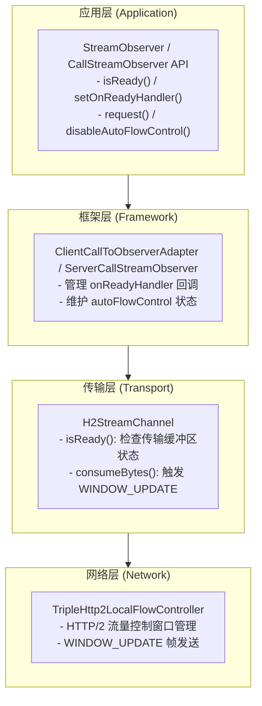
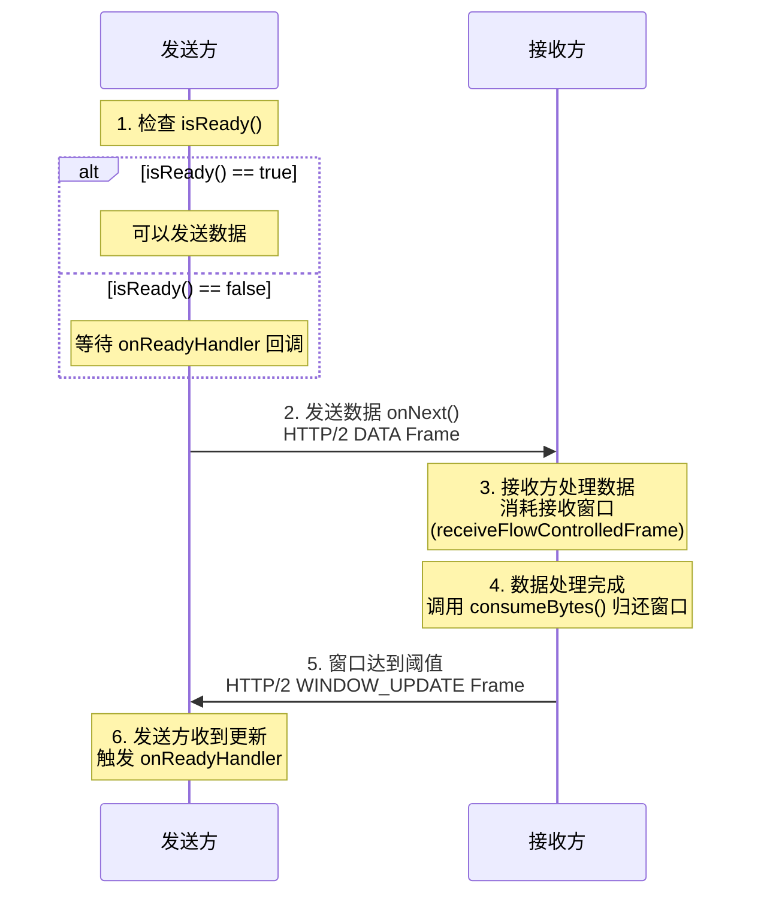
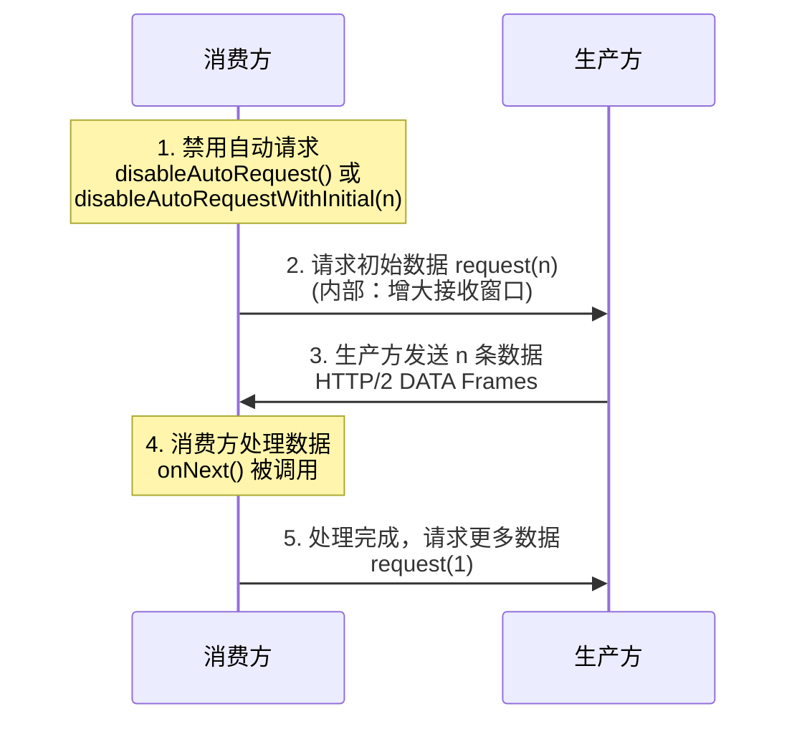

---
aliases:
  - /zh-cn/docs3-v2/java-sdk/reference-manual/protocol/triple/backpressure/
description: "本文介绍 Triple 协议的背压机制，包括核心概念、技术原理和使用方式"
linkTitle: Triple 协议背压机制
title: Triple 协议背压机制
type: docs
weight: 6
---

## 概述

背压（Backpressure）是流式通信中的核心机制，用于协调数据生产者和消费者之间的速率差异。当消费者处理数据的速度跟不上生产者发送数据的速度时，背压机制能够通知生产者放慢发送速度，从而防止内存溢出和系统崩溃。

Triple 协议基于 HTTP/2 构建，天然支持流式通信。在 Dubbo 3.3.7 版本中，Triple 协议新增了完整的背压支持，提供了与 gRPC 兼容的 API，使开发者能够精细控制流式调用中的数据发送和接收速率。

## 核心概念

### 背压类型

Triple 协议支持两种类型的背压控制：

| 背压类型 | 描述 | 控制方向 |
| --- | --- | --- |
| **发送端背压（Send-Side Backpressure）** | 控制数据发送速率，避免发送方发送过快导致接收方缓冲区溢出 | 出站流量控制 |
| **接收端背压（Receive-Side Backpressure）** | 控制数据接收速率，让接收方按自己的处理能力请求数据 | 入站流量控制 |

### 核心 API

Dubbo 提供了一套与 gRPC 兼容的背压 API，位于 `org.apache.dubbo.common.stream` 包下：

| API | 描述 |
| --- | --- |
| `CallStreamObserver<T>` | 背压控制的基础接口，提供 `isReady()`、`setOnReadyHandler()` 等方法 |
| `ClientCallStreamObserver<ReqT>` | 客户端背压控制接口，继承自 `CallStreamObserver`，增加 `disableAutoRequestWithInitial()` 方法 |
| `ServerCallStreamObserver<RespT>` | 服务端背压控制接口，继承自 `CallStreamObserver`，增加 `disableAutoRequest()` 方法 |
| `ClientResponseObserver<ReqT, RespT>` | 客户端响应观察者，通过 `beforeStart()` 回调配置背压 |

### API 分类

背压 API 按使用场景分为高级 API 和低级 API：

**高级 API（发送端背压）**
- `isReady()` - 检查流是否准备好接收更多数据
- `setOnReadyHandler(Runnable)` - 设置流变为可写状态时的回调

**低级 API（接收端背压）**
- `disableAutoFlowControl()` / `disableAutoInboundFlowControl()` - 禁用自动流量控制
- `disableAutoRequestWithInitial(int)` - 客户端专用，禁用自动请求并设置初始请求数量
- `disableAutoRequest()` - 服务端专用，禁用自动请求
- `request(int)` - 手动请求指定数量的消息

## 技术原理

### 架构概述

Triple 背压机制基于 HTTP/2 的流量控制能力实现，涉及以下几个层次：



### 网络层数据流转

#### 发送端背压流程



#### 接收端背压流程



### HTTP/2 流量控制器

Triple 使用自定义的 `TripleHttp2LocalFlowController` 实现 HTTP/2 流量控制：

```java
/**
 * 自定义 HTTP/2 本地流量控制器
 * 
 * 工作机制：
 * 1. 禁用 Netty 自动 WINDOW_UPDATE（Http2StreamChannelOption.AUTO_STREAM_FLOW_CONTROL = false）
 * 2. 数据接收时通过 receiveFlowControlledFrame 减少窗口大小
 * 3. 应用处理完数据后调用 consumeBytes 归还字节
 * 4. 当归还字节达到阈值（默认 50%）时发送 WINDOW_UPDATE
 */
public class TripleHttp2LocalFlowController extends DefaultHttp2LocalFlowController {
    public TripleHttp2LocalFlowController(Http2Connection connection, float windowUpdateRatio) {
        super(connection, windowUpdateRatio, true);
    }
}
```

**流量控制调用链：**

- **服务端**：`StreamingDecoder.bytesRead()` → `FragmentListener.bytesRead()` → `H2StreamChannel.consumeBytes()` → `WINDOW_UPDATE`
- **客户端**：`TriDecoder.Listener.bytesRead()` → `AbstractTripleClientStream.consumeBytes()` → `WINDOW_UPDATE`

## 使用方式

### 前置条件

确保使用 Dubbo 3.3.7 或更高版本，并配置 Triple 协议：

```yaml
dubbo:
  protocol:
    name: tri
    port: 50052
```

### 服务接口定义

```java
public interface BackpressureService {
    // 服务端流 - 用于测试客户端接收背压
    void serverStream(StreamRequest request, StreamObserver<DataChunk> responseObserver);

    // 客户端流 - 用于测试服务端接收背压
    StreamObserver<DataChunk> clientStream(StreamObserver<StreamResponse> responseObserver);

    // 双向流 - 用于测试双向背压
    StreamObserver<DataChunk> biStream(StreamObserver<DataChunk> responseObserver);
}
```

### 高级 API 使用方式

高级 API 主要用于**发送端背压控制**，通过 `isReady()` 和 `setOnReadyHandler()` 实现。

#### 服务端发送背压（Server-Side Send Backpressure）

服务端流场景下，服务端作为数据发送方，需要根据客户端的接收能力控制发送速率：

```java
@Override
public void serverStream(StreamRequest request, StreamObserver<DataChunk> responseObserver) {
    int totalCount = request.getCount();
    int chunkSize = request.getChunkSize();
    
    // 转换为 ServerCallStreamObserver 以使用背压 API
    if (responseObserver instanceof ServerCallStreamObserver) {
        ServerCallStreamObserver<DataChunk> serverObserver = 
                (ServerCallStreamObserver<DataChunk>) responseObserver;
        
        final AtomicInteger sentCount = new AtomicInteger(0);
        final AtomicBoolean completed = new AtomicBoolean(false);
        final byte[] data = new byte[chunkSize];

        // 设置 onReadyHandler - 当流变为可写状态时被调用
        serverObserver.setOnReadyHandler(() -> {
            // 在流准备好时持续发送数据
            while (serverObserver.isReady() && sentCount.get() < totalCount && !completed.get()) {
                int seq = sentCount.getAndIncrement();
                DataChunk chunk = new DataChunk(seq, data, System.currentTimeMillis());
                serverObserver.onNext(chunk);
            }
            
            // 所有数据发送完成后关闭流
            if (sentCount.get() >= totalCount && !completed.getAndSet(true)) {
                serverObserver.onCompleted();
            }
        });

        // 初始发送（如果流已准备好）
        while (serverObserver.isReady() && sentCount.get() < totalCount) {
            int seq = sentCount.getAndIncrement();
            serverObserver.onNext(new DataChunk(seq, data, System.currentTimeMillis()));
        }
        
        // 如果初始阶段已发送完所有数据，直接完成
        if (sentCount.get() >= totalCount && !completed.getAndSet(true)) {
            serverObserver.onCompleted();
        }
    }
}
```

#### 客户端发送背压（Client-Side Send Backpressure）

客户端流场景下，客户端作为数据发送方，通过 `ClientResponseObserver` 的 `beforeStart()` 回调配置背压：

```java
public void testClientStreamWithOnReadyHandler() throws InterruptedException {
    final int sendCount = 50;
    final CountDownLatch latch = new CountDownLatch(1);
    final AtomicInteger sent = new AtomicInteger(0);
    final AtomicBoolean sendCompleted = new AtomicBoolean(false);
    final byte[] data = new byte[1024];

    // 使用 ClientResponseObserver 在流启动前配置背压
    ClientResponseObserver<DataChunk, StreamResponse> responseObserver =
            new ClientResponseObserver<DataChunk, StreamResponse>() {
        
        @Override
        public void beforeStart(ClientCallStreamObserver<DataChunk> requestStream) {
            // 禁用自动流量控制以手动控制发送
            requestStream.disableAutoFlowControl();

            // 设置 onReadyHandler - 流准备好时的回调
            requestStream.setOnReadyHandler(() -> {
                while (requestStream.isReady() && sent.get() < sendCount && !sendCompleted.get()) {
                    int seq = sent.getAndIncrement();
                    requestStream.onNext(new DataChunk(seq, data, System.currentTimeMillis()));
                }

                if (sent.get() >= sendCount && !sendCompleted.getAndSet(true)) {
                    requestStream.onCompleted();
                }
            });
        }

        @Override
        public void onNext(StreamResponse response) {
            System.out.println("Server received: " + response.getTotalChunks() + " chunks");
        }

        @Override
        public void onError(Throwable throwable) {
            latch.countDown();
        }

        @Override
        public void onCompleted() {
            latch.countDown();
        }
    };

    // 启动流 - beforeStart() 会在内部被调用
    StreamObserver<DataChunk> requestObserver = service.clientStream(responseObserver);

    latch.await(60, TimeUnit.SECONDS);
}
```

### 低级 API 使用方式

低级 API 主要用于**接收端背压控制**，让接收方按自己的处理能力主动请求数据。

#### 客户端接收背压（Client-Side Receive Backpressure）

服务端流场景下，客户端可以控制从服务端接收数据的速率：

```java
public void testServerStreamWithManualRequest() throws InterruptedException {
    final int requestCount = 30;
    final int initialRequest = 5;
    final CountDownLatch latch = new CountDownLatch(1);
    final AtomicInteger receivedCount = new AtomicInteger(0);

    StreamRequest request = new StreamRequest(requestCount, 1024);

    // 使用 ClientResponseObserver 配置接收背压
    ClientResponseObserver<StreamRequest, DataChunk> responseObserver =
            new ClientResponseObserver<StreamRequest, DataChunk>() {
        
        // 保存 requestStream 引用以便在 onNext 中调用 request()
        private ClientCallStreamObserver<StreamRequest> requestStream;

        @Override
        public void beforeStart(ClientCallStreamObserver<StreamRequest> requestStream) {
            this.requestStream = requestStream;
            // 禁用自动请求并设置初始请求数量
            // 这是 Dubbo 特有的便捷 API，合并了 gRPC 的 disableAutoRequest() + request()
            requestStream.disableAutoRequestWithInitial(initialRequest);
        }

        @Override
        public void onNext(DataChunk chunk) {
            int count = receivedCount.incrementAndGet();
            
            // 处理数据后，请求下一条数据
            // 这是控制接收速率的关键
            if (requestStream != null) {
                requestStream.request(1);
            }
        }

        @Override
        public void onError(Throwable throwable) {
            latch.countDown();
        }

        @Override
        public void onCompleted() {
            latch.countDown();
        }
    };

    // 启动流
    service.serverStream(request, responseObserver);

    latch.await(60, TimeUnit.SECONDS);
}
```

#### 服务端接收背压（Server-Side Receive Backpressure）

客户端流场景下，服务端可以控制从客户端接收数据的速率：

```java
@Override
public StreamObserver<DataChunk> clientStream(StreamObserver<StreamResponse> responseObserver) {
    final AtomicInteger chunkCount = new AtomicInteger(0);
    final AtomicLong totalBytes = new AtomicLong(0);

    // 转换为 ServerCallStreamObserver 以使用接收背压 API
    if (responseObserver instanceof ServerCallStreamObserver) {
        ServerCallStreamObserver<StreamResponse> serverObserver =
                (ServerCallStreamObserver<StreamResponse>) responseObserver;

        // 禁用自动请求 - 服务端将手动控制接收速率
        serverObserver.disableAutoRequest();

        // 请求初始批次的消息
        final int initialRequest = 5;
        serverObserver.request(initialRequest);

        return new StreamObserver<DataChunk>() {
            @Override
            public void onNext(DataChunk chunk) {
                int count = chunkCount.incrementAndGet();
                if (chunk.getData() != null) {
                    totalBytes.addAndGet(chunk.getData().length);
                }

                // 处理完每条消息后，请求下一条
                // 这是服务端接收背压控制的关键
                serverObserver.request(1);
            }

            @Override
            public void onError(Throwable throwable) {
                // 错误处理
            }

            @Override
            public void onCompleted() {
                StreamResponse response = new StreamResponse(
                    chunkCount.get(), totalBytes.get(), duration);
                responseObserver.onNext(response);
                responseObserver.onCompleted();
            }
        };
    }
    
    // 降级处理：无背压控制的基础实现
    return createBasicStreamObserver(responseObserver, chunkCount, totalBytes);
}
```

### 双向流完整背压控制

双向流场景下，可以同时使用发送和接收背压：

```java
@Override
public StreamObserver<DataChunk> biStream(StreamObserver<DataChunk> responseObserver) {
    final AtomicInteger receivedCount = new AtomicInteger(0);
    final AtomicInteger sentCount = new AtomicInteger(0);

    if (responseObserver instanceof ServerCallStreamObserver) {
        ServerCallStreamObserver<DataChunk> serverObserver =
                (ServerCallStreamObserver<DataChunk>) responseObserver;

        // 用于缓存因背压而无法立即发送的数据
        ConcurrentLinkedQueue<DataChunk> pendingChunks = new ConcurrentLinkedQueue<>();
        final AtomicBoolean streamCompleted = new AtomicBoolean(false);

        // === 发送背压控制 ===
        serverObserver.setOnReadyHandler(() -> {
            // 当流变为可写状态时，发送缓存的数据
            while (serverObserver.isReady() && !pendingChunks.isEmpty()) {
                DataChunk chunk = pendingChunks.poll();
                if (chunk != null) {
                    serverObserver.onNext(chunk);
                    sentCount.incrementAndGet();
                }
            }

            // 如果所有数据都已发送且流已完成，关闭流
            if (streamCompleted.get() && pendingChunks.isEmpty()) {
                serverObserver.onCompleted();
            }
        });

        // === 接收背压控制 ===
        serverObserver.disableAutoRequest();
        serverObserver.request(5);  // 初始请求 5 条消息

        return new StreamObserver<DataChunk>() {
            @Override
            public void onNext(DataChunk chunk) {
                receivedCount.incrementAndGet();

                // 准备响应数据
                DataChunk response = new DataChunk(
                        chunk.getSequenceNumber(),
                        chunk.getData(),
                        System.currentTimeMillis()
                );

                // 尝试立即发送，如果流未准备好则缓存
                if (serverObserver.isReady()) {
                    serverObserver.onNext(response);
                    sentCount.incrementAndGet();
                } else {
                    pendingChunks.offer(response);
                }

                // 请求下一条消息（接收背压控制）
                serverObserver.request(1);
            }

            @Override
            public void onError(Throwable throwable) {
                // 错误处理
            }

            @Override
            public void onCompleted() {
                streamCompleted.set(true);
                if (pendingChunks.isEmpty()) {
                    serverObserver.onCompleted();
                }
                // 否则等待 onReadyHandler 发送完剩余数据后完成
            }
        };
    }

    // 降级处理
    return createBasicBiStreamObserver(responseObserver, receivedCount, sentCount);
}
```

## API 参考

### CallStreamObserver

```java
public interface CallStreamObserver<T> extends StreamObserver<T> {
    /**
     * 检查流是否准备好接收更多消息
     * 如果返回 false，调用者应避免调用 onNext()
     */
    boolean isReady();

    /**
     * 设置流变为可写状态时的回调
     * 回调会被转发到业务线程池中执行，不会阻塞事件循环
     */
    void setOnReadyHandler(Runnable onReadyHandler);

    /**
     * 请求指定数量的消息
     * 线程安全，可从多个线程调用
     */
    void request(int count);

    /**
     * 禁用自动流量控制，切换到手动模式
     */
    void disableAutoFlowControl();

    /**
     * 兼容 gRPC 的别名方法
     */
    default void disableAutoInboundFlowControl() {
        disableAutoFlowControl();
    }
}
```

### ClientCallStreamObserver

```java
public interface ClientCallStreamObserver<ReqT> extends CallStreamObserver<ReqT> {
    /**
     * 禁用自动入站流量控制并设置初始请求数量
     * 必须在 beforeStart() 中调用，否则无效
     *
     * @param request 初始请求数量，0 表示不自动请求任何消息
     */
    void disableAutoRequestWithInitial(int request);
}
```

### ServerCallStreamObserver

```java
public interface ServerCallStreamObserver<RespT> extends CallStreamObserver<RespT> {
    /**
     * 禁用自动请求（等同于 disableAutoFlowControl）
     */
    default void disableAutoRequest() {
        disableAutoFlowControl();
    }
}
```

### ClientResponseObserver

```java
public interface ClientResponseObserver<ReqT, RespT> extends StreamObserver<RespT> {
    /**
     * 在流启动前被调用，用于配置流控制设置
     *
     * 允许的操作：
     * - setOnReadyHandler() - 设置发送背压回调
     * - disableAutoRequestWithInitial() - 配置接收背压
     * - disableAutoFlowControl() - 禁用自动流量控制
     *
     * 注意：不要在此回调中调用 onNext() 或 onCompleted()
     */
    void beforeStart(ClientCallStreamObserver<ReqT> requestStream);
}
```

## 最佳实践

### 1. 选择合适的背压策略

| 场景 | 推荐策略 |
| --- | --- |
| 服务端发送大量数据 | 服务端使用 `setOnReadyHandler()` + `isReady()` |
| 客户端发送大量数据 | 客户端使用 `ClientResponseObserver.beforeStart()` 配置 |
| 客户端需要控制接收速率 | 客户端使用 `disableAutoRequestWithInitial()` + `request()` |
| 服务端需要控制接收速率 | 服务端使用 `disableAutoRequest()` + `request()` |

### 2. 高效利用 onReadyHandler

`onReadyHandler` 会被转发到业务线程池中执行，不会阻塞事件循环。但为了提高吞吐量，建议在回调中尽快完成数据发送：

```java
// ✅ 推荐：在 onReadyHandler 中持续发送数据直到流不再就绪
serverObserver.setOnReadyHandler(() -> {
    while (serverObserver.isReady() && hasMoreData()) {
        serverObserver.onNext(getNextData());
    }
    // 流不再就绪时回调会自动返回，下次就绪时会再次触发
});
```

### 3. 正确处理流完成

确保在所有数据发送完成后调用 `onCompleted()`：

```java
// 使用 AtomicBoolean 避免重复调用 onCompleted()
final AtomicBoolean completed = new AtomicBoolean(false);

serverObserver.setOnReadyHandler(() -> {
    while (serverObserver.isReady() && sentCount.get() < totalCount) {
        // 发送数据...
    }
    
    if (sentCount.get() >= totalCount && !completed.getAndSet(true)) {
        serverObserver.onCompleted();
    }
});
```

### 4. 使用 ClientResponseObserver 配置背压

始终通过 `beforeStart()` 配置背压，确保在流启动前完成配置：

```java
// ✅ 推荐：在 beforeStart() 中配置
ClientResponseObserver<Request, Response> observer = 
    new ClientResponseObserver<Request, Response>() {
        @Override
        public void beforeStart(ClientCallStreamObserver<Request> requestStream) {
            requestStream.disableAutoFlowControl();
            requestStream.setOnReadyHandler(() -> { /* ... */ });
        }
        // ...
    };

// ❌ 不推荐：流启动后再配置（可能不生效）
StreamObserver<Request> requestObserver = service.clientStream(responseObserver);
((ClientCallStreamObserver) requestObserver).disableAutoFlowControl();  // 可能太晚
```

## 示例代码

完整的示例代码请参考 [dubbo-samples-triple-backpressure](https://github.com/apache/dubbo-samples/tree/master/2-advanced/dubbo-samples-triple-backpressure)。

运行示例：

```bash
# 获取示例代码
git clone --depth=1 https://github.com/apache/dubbo-samples.git
cd dubbo-samples/2-advanced/dubbo-samples-triple-backpressure

# 运行测试
mvn test
```
