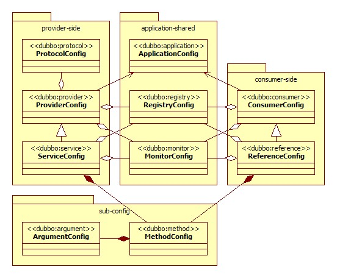

# XML Configuration

About the XML configuration items, see：[XML References](../references/xml/introduction.md). If you prefer use API directly instead of using Spring, see [API Configuration](./api.md). Want a example of how to use configuration, see [Quick Start](../quick-start.md)。


## provider.xml demo

``` xml
<?xml version="1.0" encoding="UTF-8"?>
<beans xmlns="http://www.springframework.org/schema/beans"
    xmlns:xsi="http://www.w3.org/2001/XMLSchema-instance"
    xmlns:dubbo="http://dubbo.apache.org/schema/dubbo"
    xsi:schemaLocation="http://www.springframework.org/schema/beans http://www.springframework.org/schema/beans/spring-beans-4.3.xsd http://dubbo.apache.org/schema/dubbo http://dubbo.apache.org/schema/dubbo/dubbo.xsd">  
    <dubbo:application name="hello-world-app"  />  
    <dubbo:registry address="multicast://224.5.6.7:1234" />  
    <dubbo:protocol name="dubbo" port="20880" />  
    <dubbo:service interface="com.alibaba.dubbo.demo.DemoService" ref="demoServiceLocal" />  
    <dubbo:reference id="demoServiceRemote" interface="com.alibaba.dubbo.demo.DemoService" />  
</beans>
```

All tags support custom parameters, so we can meet the special config requirements at different extension points, such as:

```xml
<dubbo:protocol name="jms">
    <dubbo:parameter key="queue" value="your_queue" />
</dubbo:protocol>
```

Or: 

``` xml
<beans xmlns="http://www.springframework.org/schema/beans"
    xmlns:xsi="http://www.w3.org/2001/XMLSchema-instance"
    xmlns:dubbo="http://dubbo.apache.org/schema/dubbo"
    xmlns:p="http://www.springframework.org/schema/p"
    xsi:schemaLocation="http://www.springframework.org/schema/beans http://www.springframework.org/schema/beans/spring-beans-4.3.xsd http://dubbo.apache.org/schema/dubbo http://dubbo.apache.org/schema/dubbo/dubbo.xsd">  
    <dubbo:protocol name="jms" p:queue="your_queue" />  
</beans>
```

## The relations between configuration tags
  


tag  | purpose | introduction
------------- | ------------- | -------------
`<dubbo:service/>` | Service Export  | Used to export service, define service metadata, export service with mutiple protocols, register service to multiple registries
`<dubbo:reference/>`  | Service Reference  | Used to create a remote proxy, subscribe to multiple registries
`<dubbo:protocol/>`  | Protocol Config  | Configure the protocol for services on provider side, the consumer side follows.
`<dubbo:application/>`  | Application Config  | Applies to both provider and consumer.
`<dubbo:module/>`  | Module Config  | Optional.
`<dubbo:registry/>`  | Registry Center | Registry info: address, protocol, etc.
`<dubbo:monitor/>`  | Monitor Center  | Monitor info: address, address, etc. Optional.
`<dubbo:provider/>`  | Default Config for Providers  | Default Config for ServiceConfigs. Optional.
`<dubbo:consumer/>`  | Default Config for Consumers  | Default Config for ReferenceConfigs. Optional.
`<dubbo:method/>`  | Method level Config  | Method level Config for ServiceConfig and ReferenceConfig.
`<dubbo:argument/>`  | Argument Config  | Used to specify the method parameter configuration.


## Overrides and Priorities

Take timeout as an example, here is the priorities, from high to low (retries, loadbalance, actives also applies  the same rule): 

* method level，interface level，default/global level。
* at the same leveel, consumer has higher priority than provider

Configurations on the provider side are passed to the consumer side through registry in the form of URL.


It is recommended that the provider set a timeout for every service, because the provider knows exactly how long a method needs to be executed. If a consumer cites multiple services at the same time, it doesn't need to care about the timeout settings of each service.

Theoretically, almost all configuration items supported in ReferenceConfig can be configured with a default value using ConsumerConfig, ServiceConfig, ProviderConfig.

1: Requires spring `3.2.16+`, see announcement for details：`xmlns:p="http://www.springframework.org/schema/p"`  
2: The reference bean obeys lazy init by default, only if it is refered by other beans or other instance try to get its instance using `getBean()` method  will the reference be initialized. If you need eager init, config this way: `<dubbo:reference ... init="true" />`
