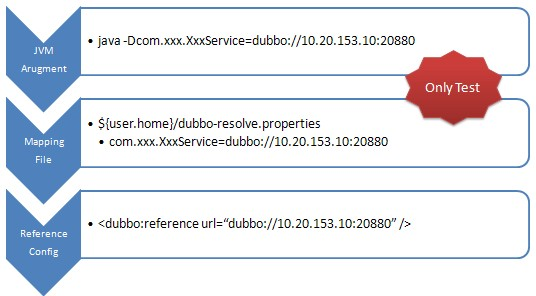

# Explicit target

In the development and testing environment, it is often necessary to bypass the registry and test only designated service providers. In this case, point-to-point direct connection may be required, and the service provider will ignore the list of provider registration providers. The interface A configure Point-to-point, does not affect the B interface to obtain a list from the registry.



## Configure with XML

If it is online demand needs the point-to-point feature,You can configure the specified provider url at `<dubbo:reference>`.it will bypass the registry, multiple addresses separated by semicolons, the following configuration:

```xml
<dubbo:reference id="xxxService" interface="com.alibaba.xxx.XxxService" url="dubbo://localhost:20890" />
```

## Configure with the `-D` argument

Add the -D parameter mapping service address to the JVM startup parameters：

```sh
java -Dcom.alibaba.xxx.XxxService=dubbo://localhost:20890
```

## Configure with the `.properties` file

If you have more services, you can also use file mapping to specify the mapping file path with `-Ddubbo.resolve.file`. This configuration takes precedence over the configuration in` <dubbo: reference> `, for example:

```sh
java -Ddubbo.resolve.file=xxx.properties
```

Then add the configuration in the mapping file `xxx.properties`, where key is the service name and value is the service provider URL:

```properties
com.alibaba.xxx.XxxService=dubbo://localhost:20890
```

**NOTE** To avoid complicating the online environment, do not use this feature online and should only be used during the testing phase
