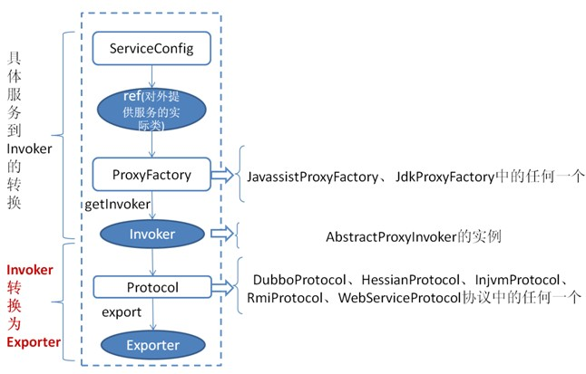
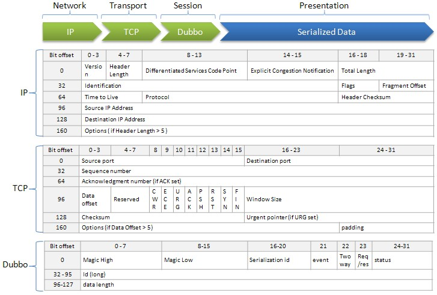

# Implementation details

## Initialization details

### Service parsing

Based on `META-INF/spring.handlers` config in dubbo.jar, Spring calls `DubboNamespaceHandler` when meeting dubbo namespace.

All Dubbo tags are parsed by `DubboBeanDefinitionParser`, based on one to one attribute mapping, the XML label is parsed as a Bean object.

Transfer Bean object to URL, and transfer all attributes of Bean to URL parameters when `ServiceConfig.export()` or `ReferenceConfig.get()` initialization.

Then pase URL to [Protocol extension point](./impls/protocol.md), based on [Extension point adaptive mechanism](./SPI.md) of extension point, processing service exposure or reference for different protocols according to URL protocol header.

### Service Exposure

#### 1. Only expose service port:

Direct exposing to provider when have not Registry, [^1], the URL format which parsing by `ServiceConfig`:
`dubbo://service-host/com.foo.FooService?version=1.0.0`.

Based on extension point adaptive mechanism, call `export()` method of `DubboProtocol` and open server port by identifying `dubbo://` protocol header of URL.

#### 2. Expose to Registry:

Expose provider address to Registry [^2], the URL format which parsing by `ServiceConfig`: `registry://registry-host/com.alibaba.dubbo.registry.RegistryService?export=URL.encode("dubbo://service-host/com.foo.FooService?version=1.0.0")`，

Based on extension point adaptive mechanism, call `export()` method of `RegistryProtocol` by identifying  `registry://` protocol header, register the provider URL parameter of `export` to Registry.

Resend to `Protocol` extension point to do exposure: `dubbo://service-host/com.foo.FooService?version=1.0.0`, then based on extension point adaptive mechanism, call `export()` method of `DubboProtocol` and open server port by identifying `dubbo://` protocol header of provider URL.

### Service Reference

#### 1. Direct connect service

Direct connect provider when have not Registry [^3], the URL format which parsing by `ReferenceConfig`: `dubbo://service-host/com.foo.FooService?version=1.0.0`.

Based on extension point adaptive mechanism, call `refer()` method of `DubboProtocol` by identifying `dubbo://` protocol header of URL, and return provider reference.

#### 2. Service Registry discovery

Discover provider address by Registry [^4], the URL format which parsing by `ReferenceConfig`:
`registry://registry-host/com.alibaba.dubbo.registry.RegistryService?refer=URL.encode("consumer://consumer-host/com.foo.FooService?version=1.0.0")`.

Based on extension point adaptive mechanism, call `refer()` method of `RegistryProtocol` by identifying `registry://` protocol header of URL, then based on the condition of parameter of `refer` to search provider URL, for example: `dubbo://service-host/com.foo.FooService?version=1.0.0`.

Then based on extension point adaptive mechanism, call `refer()` method of `DubboProtocol` to get provider reference by identifying `dubbo://` protocol header of provider URL.

Then `RegistryProtocol` disguise various provider references to single provider by `Cluster` extension point and return.

### Service Filter

Based on extension point adaptive mechanism, all `Protocol` extension points are auto wrapped `Wrapper` class.

Based on `ProtocolFilterWrapper` class, make all `Filter` as chain, call the real reference at the end of the chain.

Based on `ProtocolListenerWrapper` class, make all `InvokerListener` and `ExporterListener` as list, perform call back before and after exposure and reference.

All additional functions would be implementated by `Filter`, including Monitor.

## RPC details

### The detail process of exposing service by service provider



The above image shows the main process of exposing service by service provider:

First `ServiceConfig` class get the actual class `ref` that provides service(e.g. 如：HelloWorldImpl), then generating a `AbstractProxyInvoker` instance by the `getInvoker` method of `ProxyFactory` class, to this step, complete the transformation of specific service to `Invoker`, next is the process of converting `Invoker` to `Exporter`.

The key of Dubbo processing service exposure is the process of converting `Invoker` to `Exporter`, the red part in the above image. Here we introduce the implementation of the two typical protocols, Dubbo and RMI:

#### Dubbo implementation

The transformation from `Invoker` of Dubbo protocol to `Exporter` takes place in the `export` method of `DubboProtocol` class, it mainly opens the socket to listen service and receive all kinds of requests sent by the client, and the communication details are implementated by Dubbo itself.

#### RMI implementation

The transformation from `Invoker` of RMI protocol to `Exporter` takes place in the `export` method of `RmiProtocol` class, the RMI service is implementated by Spring, Dubbo or JDK, and the communication details are implementated by JDK, which saves a lot of work.

### The detail process of serving service for service consumer


The above image is the main process of service consumption:

First, the `init` method of `ReferenceConfig` class calls the `refer` method of `Protocol` to generate `Invoker` instance(such as the red part in the above image), which is the key of service consumption. Then the `Invoker` is converted to the interface required by the client (such as: HelloWorld).

For each protocol such as RMI/Dubbo/Web service, the details they call `refer` method generate `Invoker` instance are similar to the previous section.

### Invoker everywhere

Because of `Invoker` is a very important concept in the Dubbo domain model, many of the design ideas are close to it. This makes `Invoker` permeate the entire implementation code, and it's really easy to mix up for people who have just started Dubbo.

Let's use a simple image below to describe the 2 important `Invoker`: service provider `Invoker` and service consumer `Invoker`:


To better explain the above image, we provide the below code examples of service consumption and providers:

Service consumer code:

```java
public class DemoClientAction {
 
    private DemoService demoService;
 
    public void setDemoService(DemoService demoService) {
        this.demoService = demoService;
    }
 
    public void start() {
        String hello = demoService.sayHello("world" + i);
    }
}
```

The `DemoService` in above code is the proxy of service consumer in above image, user can call `Invoker` [^5] which implementate the real RPC by the proxy.

Service provider code:

```java
public class DemoServiceImpl implements DemoService {
 
    public String sayHello(String name) throws RemoteException {
        return "Hello " + name;
    }
}
```

The above class would be encapsulated to be a `AbstractProxyInvoker` instance, and create a new `Exporter` instance, then find corresponding `Exporter` instance and call its corresponding `AbstractProxyInvoker` instance when network communication layer recieve request, so that real call service provider code. There are some other `Invoker` classes, but the above 2 are the most important.

## Remote communication details 

### Protocol header agreement



### Thread dispatch model


* Dispather: `all`, `direct`, `message`, `execution`, `connection`
* ThreadPool: `fixed`, `cached`


[^1]: is `<dubbo:service regisrty="N/A" />` or `<dubbo:registry address="N/A" />`

[^2]: is `<dubbo:registry address="zookeeper://10.20.153.10:2181" />`

[^3]: is `<dubbo:reference url="dubbo://service-host/com.foo.FooService?version=1.0.0" />`

[^4]: is `<dubbo:registry address="zookeeper://10.20.153.10:2181" />`

[^5]: is one of `DubboInvoker`, `HessianRpcInvoker`, `InjvmInvoker`, `RmiInvoker`, `WebServiceInvoker`
