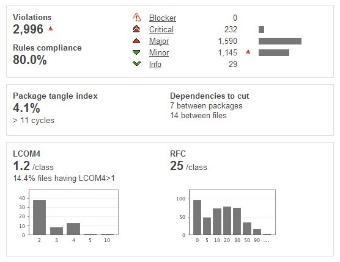

# Test coverage report 

* v2.0   Codecov report , Statistics since  2017-12-29
  The test coverage is :  , we can get the report in https://codecov.io/gh/apache/incubator-dubbo
* v1.0   Based on version `2.0.12`，Statistics on 2012-02-03

