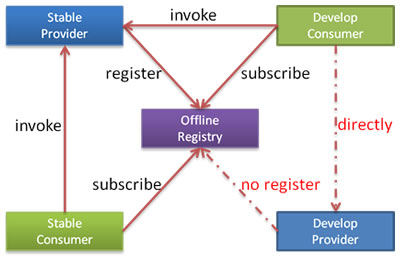

# Subscribe only

To facilitate the development of tests, it is common to have a registry of all services available in develop environment.And the registration of a service provider under development may affect consumers' inability to run.

You can let service provider developers only subscribe to services only (services developed may rely on other services) ,don't register services under development and testing services under development with directly connection.



User configuration:

```xml
<dubbo:registry address="10.20.153.10:9090" register="false" />
```

or

```xml
<dubbo:registry address="10.20.153.10:9090?register=false" />
```