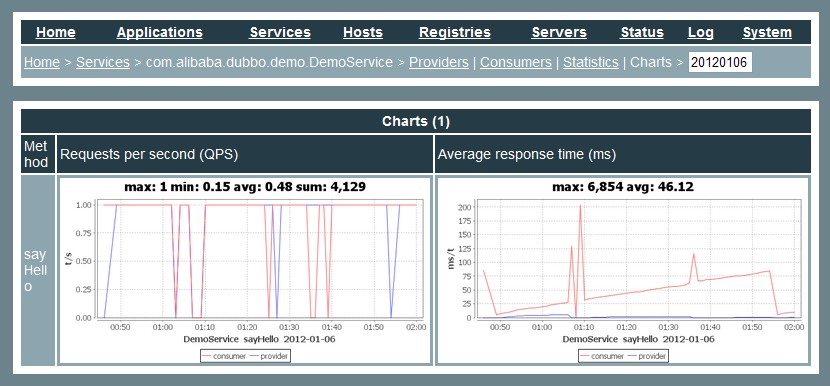

# Simple 监控中心安装

## 安装步骤

安装:

```sh
git clone https://github.com/apache/incubator-dubbo-ops
cd incubator-dubbo-ops && mvn package
cd dubbo-monitor-simple/target && tar xvf dubbo-monitor-simple-2.0.0-assembly.tar.gz
cd dubbo-monitor-simple-2.0.0
```

配置:

```sh
vi conf/dubbo.properties
```

启动:

```sh
./assembly.bin/start.sh
```

停止:

```sh
./assembly.bin/stop.sh
```

重启:

```sh
./assembly.bin/restart.sh
```

调试:

```sh
./assembly.bin/start.sh debug
```

系统状态:

```sh
./assembly.bin/dump.sh
```

总控入口:

```sh
./assembly.bin/server.sh start
./assembly.bin/server.sh stop
./assembly.bin/server.sh restart
./assembly.bin/server.sh debug
./assembly.bin/server.sh dump
```

标准输出:

```sh
tail -f logs/stdout.log
```

命令行 [^1]:

```sh
telnet 127.0.0.1 7070
help
```

或者:

```sh
echo status | nc -i 1 127.0.0.1 7070
```

访问:

```
http://127.0.0.1:8080
```



## 注意事项
Simple Monitor 挂掉不会影响到 Consumer 和 Provider 之间的调用，所以用于生产环境不会有风险。

Simple Monitor 采用磁盘存储统计信息，请注意安装机器的磁盘限制，如果要集群，建议用mount共享磁盘。

charts 目录必须放在 `jetty.directory` 下，否则页面上访问不了。

[^1]: 请参考 [Telnet 命令参考手册](http://dubbo.apache.org/books/dubbo-user-book/references/telnet.html)

