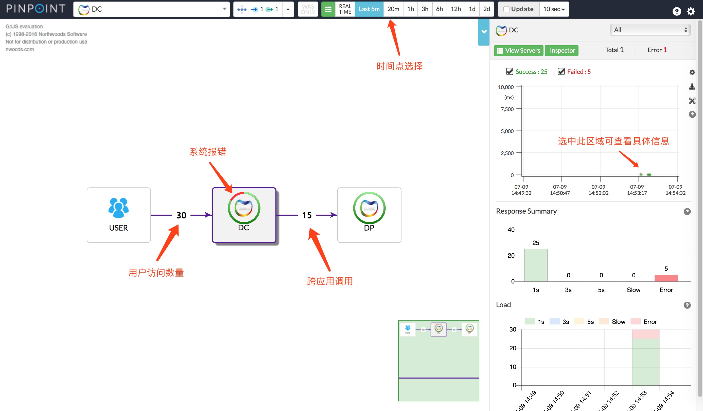
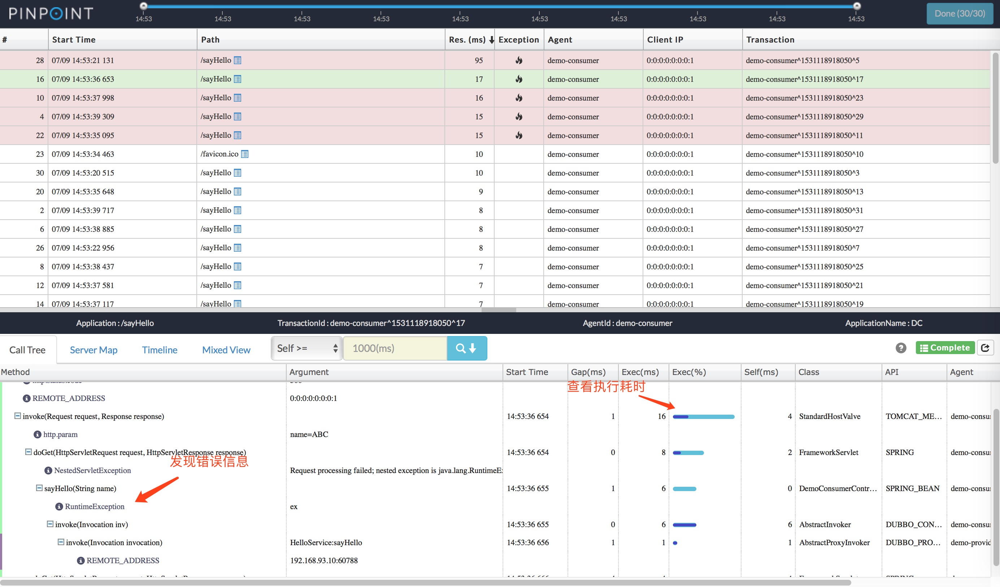
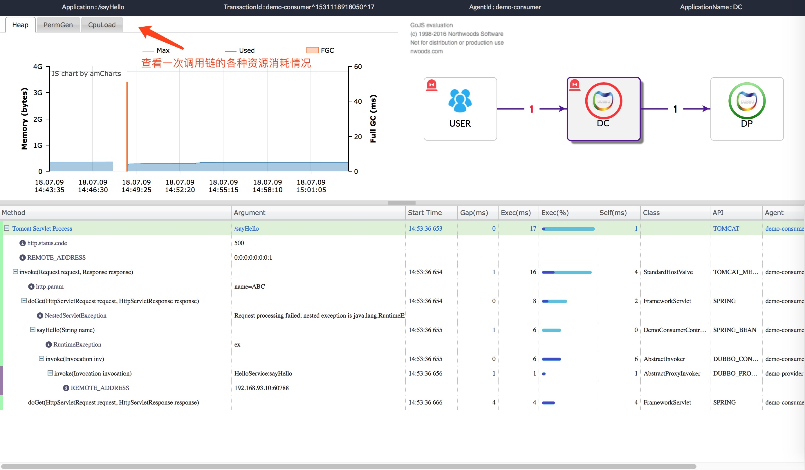

# 使用Pinpoint做分布式跟踪

在使用Dubbo进行服务化或者整合应用后，假设某个服务后台日志显示有异常，这个服务又被多个应用调用的情况下，我们通常很难判断是哪个应用调用的，问题的起因是什么，因此我们需要一套分布式跟踪系统来快速定位问题，Pinpoint可以帮助我们快速定位问题（当然，解决方案也不止这一种）。

## 什么是Pinpoint(摘自[Pinpoint学习笔记](https://skyao.gitbooks.io/learning-pinpoint/))

[Pinpoint](https://github.com/naver/pinpoint)是一个开源的 APM (Application Performance Management/应用性能管理)工具，用于基于java的大规模分布式系统。
仿照Google Dapper，Pinpoint通过跟踪分布式应用之间的调用来提供解决方案，以帮助分析系统的总体结构和内部模块之间如何相互联系。

> 注：对于各个模块之间的通讯英文原文中用的是transaction一词，但是我觉得如果翻译为"事务"容易引起误解，所以替换为"交互"或者"调用"这种比较直白的字眼。

在使用上力图简单高效：

* 安装agent，不需要修改哪怕一行代码
* 最小化性能损失

### 服务器地图(ServerMap)

通过可视化分布式系统的模块和他们之间的相互联系来理解系统拓扑。点击某个节点会展示这个模块的详情，比如它当前的状态和请求数量。

### 实时活动线程图表(Realtime Active Thread Chart)

实时监控应用内部的活动线程。

### 请求/应答分布图表(Request/Response Scatter Chart)

长期可视化请求数量和应答模式来定位潜在问题。通过在图表上拉拽可以选择请求查看更多的详细信息。

### 调用栈(CallStack)

在分布式环境中为每个调用生成代码级别的可视图，在单个视图中定位瓶颈和失败点。

### 巡查(Inspector)

查看应用上的其他详细信息，比如CPU使用率，内存/垃圾回收，TPS，和JVM参数。

### 支持模块

* JDK 6+
* Tomcat 6/7/8, Jetty 8/9, JBoss EAP 6, Resin 4, Websphere 6/7/8, Vertx 3.3/3.4/3.5
* Spring, Spring Boot (Embedded Tomcat, Jetty)
* Apache HTTP Client 3.x/4.x, JDK HttpConnector, GoogleHttpClient, OkHttpClient, NingAsyncHttpClient
* Thrift Client, Thrift Service, DUBBO PROVIDER, DUBBO CONSUMER
* ActiveMQ, RabbitMQ
* MySQL, Oracle, MSSQL, CUBRID,POSTGRESQL, MARIA
* Arcus, Memcached, Redis, CASSANDRA
* iBATIS, MyBatis
* DBCP, DBCP2, HIKARICP
* gson, Jackson, Json Lib
* log4j, Logback
* 自定义模块

## Pinpoint与Dubbo的结合

### 启动Pinpoint

参考Pinpoint的[Quick start](http://naver.github.io/pinpoint/quickstart.html)搭建环境（不需要启动TestApp）

### 准备Dubbo示例程序

#### 创建API包

pom.xml
```xml
<?xml version="1.0" encoding="UTF-8"?>
<project xmlns="http://maven.apache.org/POM/4.0.0"
         xmlns:xsi="http://www.w3.org/2001/XMLSchema-instance"
         xsi:schemaLocation="http://maven.apache.org/POM/4.0.0 http://maven.apache.org/xsd/maven-4.0.0.xsd">
    <modelVersion>4.0.0</modelVersion>

    <groupId>com.example</groupId>
    <artifactId>demo-api</artifactId>
    <version>0.0.1-SNAPSHOT</version>
</project>
```

新建API接口：
```
package com.example.demoapi;

public interface HelloService {
    String sayHello(String name);
}
```

#### 实现 Dubbo 服务提供方

pom.xml
```xml
<?xml version="1.0" encoding="UTF-8"?>
<project xmlns="http://maven.apache.org/POM/4.0.0" xmlns:xsi="http://www.w3.org/2001/XMLSchema-instance"
	xsi:schemaLocation="http://maven.apache.org/POM/4.0.0 http://maven.apache.org/xsd/maven-4.0.0.xsd">
	<modelVersion>4.0.0</modelVersion>

	<groupId>com.example</groupId>
	<artifactId>demo-provider</artifactId>
	<version>0.0.1-SNAPSHOT</version>
	<packaging>jar</packaging>

	<name>demo-provider</name>

	<parent>
		<groupId>org.springframework.boot</groupId>
		<artifactId>spring-boot-starter-parent</artifactId>
		<version>2.0.3.RELEASE</version>
		<relativePath/> <!-- lookup parent from repository -->
	</parent>

	<properties>
		<project.build.sourceEncoding>UTF-8</project.build.sourceEncoding>
		<project.reporting.outputEncoding>UTF-8</project.reporting.outputEncoding>
		<java.version>1.8</java.version>
	</properties>

	<repositories>
		<repository>
			<id>sonatype-nexus-snapshots</id>
			<url>https://oss.sonatype.org/content/repositories/snapshots</url>
			<releases>
				<enabled>false</enabled>
			</releases>
			<snapshots>
				<enabled>true</enabled>
			</snapshots>
		</repository>
	</repositories>

	<dependencies>
		<dependency>
			<groupId>org.springframework.boot</groupId>
			<artifactId>spring-boot-starter</artifactId>
		</dependency>
		<dependency>
			<groupId>com.alibaba.boot</groupId>
			<artifactId>dubbo-spring-boot-starter</artifactId>
			<version>0.2.0</version>
		</dependency>
		<dependency>
			<groupId>com.example</groupId>
			<artifactId>demo-api</artifactId>
			<version>0.0.1-SNAPSHOT</version>
		</dependency>

		<dependency>
			<groupId>org.springframework.boot</groupId>
			<artifactId>spring-boot-starter-test</artifactId>
			<scope>test</scope>
		</dependency>
	</dependencies>

	<build>
		<plugins>
			<plugin>
				<groupId>org.springframework.boot</groupId>
				<artifactId>spring-boot-maven-plugin</artifactId>
			</plugin>
		</plugins>
	</build>

</project>
```

1. 实现 `HelloService` 接口：
```java
package com.example.demoprovider.provider;

import com.alibaba.dubbo.config.annotation.Service;
import com.example.demoapi.HelloService;

@Service(version = "${demo.service.version}",
        application = "${dubbo.application.id}",
        protocol = "${dubbo.protocol.id}",
        registry = "${dubbo.registry.id}")
public class HelloServiceImpl implements HelloService {
    static int i = 0;
    @Override
    public String sayHello(String name) {
        i++;
        if (i % 3 == 0) {
            throw new RuntimeException("ex");
        }
        return "Hello " + name + "!";
    }
}
```

2. 编写 Spring Boot 引导程序：
```java
package com.example.demoprovider;

import org.springframework.boot.SpringApplication;
import org.springframework.boot.autoconfigure.SpringBootApplication;

@SpringBootApplication
public class DemoProviderApplication {

	public static void main(String[] args) {
		SpringApplication.run(DemoProviderApplication.class, args);
	}
}
```

3. 配置 `application.properties`：

```properties
# Spring boot application
spring.application.name = dubbo-provider-demo
server.port = 9090
management.port = 9091

# Service version
demo.service.version = 1.0.0

# Base packages to scan Dubbo Components (e.g @Service , @Reference)
dubbo.scan.basePackages  = com.example.demoprovider

# Dubbo Config properties
## ApplicationConfig Bean
dubbo.application.id = dubbo-provider-demo
dubbo.application.name = dubbo-provider-demo

## ProtocolConfig Bean
dubbo.protocol.id = dubbo
dubbo.protocol.name = dubbo
dubbo.protocol.port = 12345

## RegistryConfig Bean
dubbo.registry.id = my-registry
dubbo.registry.address = N/A
```

#### 实现 Dubbo 服务消费方

pom.xml
```xml
<?xml version="1.0" encoding="UTF-8"?>
<project xmlns="http://maven.apache.org/POM/4.0.0" xmlns:xsi="http://www.w3.org/2001/XMLSchema-instance"
	xsi:schemaLocation="http://maven.apache.org/POM/4.0.0 http://maven.apache.org/xsd/maven-4.0.0.xsd">
	<modelVersion>4.0.0</modelVersion>

	<groupId>com.example</groupId>
	<artifactId>demo-consumer</artifactId>
	<version>0.0.1-SNAPSHOT</version>
	<packaging>jar</packaging>

	<name>demo-consumer</name>

	<parent>
		<groupId>org.springframework.boot</groupId>
		<artifactId>spring-boot-starter-parent</artifactId>
		<version>2.0.3.RELEASE</version>
		<relativePath/> <!-- lookup parent from repository -->
	</parent>

	<properties>
		<project.build.sourceEncoding>UTF-8</project.build.sourceEncoding>
		<project.reporting.outputEncoding>UTF-8</project.reporting.outputEncoding>
		<java.version>1.8</java.version>
	</properties>

	<repositories>
		<repository>
			<id>sonatype-nexus-snapshots</id>
			<url>https://oss.sonatype.org/content/repositories/snapshots</url>
			<releases>
				<enabled>false</enabled>
			</releases>
			<snapshots>
				<enabled>true</enabled>
			</snapshots>
		</repository>
	</repositories>

	<dependencies>
		<dependency>
			<groupId>org.springframework.boot</groupId>
			<artifactId>spring-boot-starter-web</artifactId>
		</dependency>
		<dependency>
			<groupId>com.alibaba.boot</groupId>
			<artifactId>dubbo-spring-boot-starter</artifactId>
			<version>0.2.0</version>
		</dependency>
		<dependency>
			<groupId>com.example</groupId>
			<artifactId>demo-api</artifactId>
			<version>0.0.1-SNAPSHOT</version>
		</dependency>

		<dependency>
			<groupId>org.springframework.boot</groupId>
			<artifactId>spring-boot-starter-test</artifactId>
			<scope>test</scope>
		</dependency>
	</dependencies>

	<build>
		<plugins>
			<plugin>
				<groupId>org.springframework.boot</groupId>
				<artifactId>spring-boot-maven-plugin</artifactId>
				<configuration>
					<classifier>exec</classifier>
				</configuration>
			</plugin>
		</plugins>
	</build>

</project>
```

1. 通过 `@Reference` 注入 `HelloService`
```java
package com.example.democonsumer.controller;

import com.alibaba.dubbo.config.annotation.Reference;
import com.example.demoapi.HelloService;
import org.springframework.web.bind.annotation.RequestMapping;
import org.springframework.web.bind.annotation.RequestParam;
import org.springframework.web.bind.annotation.RestController;

@RestController
public class DemoConsumerController {
    @Reference(version = "${demo.service.version}",
            application = "${dubbo.application.id}",
            url = "dubbo://<注意，这里填写具体IP>:12345")
    private HelloService helloService;

    @RequestMapping("/sayHello")
    public String sayHello(@RequestParam String name) {
        return helloService.sayHello(name);
    }
}
```
> 直连提供者调用需要填写具体IP地址，如果写localhost也可以，但是会被Pinpoint额外识别为一个未知服务

2. 编写 Spring Boot 引导程序（Web 应用）：
```java
package com.example.democonsumer;

import org.springframework.boot.SpringApplication;
import org.springframework.boot.autoconfigure.SpringBootApplication;

@SpringBootApplication
public class DemoConsumerApplication {

	public static void main(String[] args) {
		SpringApplication.run(DemoConsumerApplication.class, args);
	}
}
```

3. 配置 `application.properties`：
```properties
# Spring boot application
spring.application.name=dubbo-consumer-demo
server.port=8080
management.port=8081

# Service Version
demo.service.version=1.0.0

# Dubbo Config properties
## ApplicationConfig Bean
dubbo.application.id=dubbo-consumer-demo
dubbo.application.name=dubbo-consumer-demo

## ProtocolConfig Bean
dubbo.protocol.id=dubbo
dubbo.protocol.name=dubbo
dubbo.protocol.port=12345
```

### 使用Pinpoint-agent启动服务提供方和服务消费方

#### 启动服务提供方

1. 编译打包
```
mvn clean package
```

2. 附加参数启动服务提供方
```
java -jar -javaagent:$AGENT_PATH/pinpoint-bootstrap-$VERSION.jar -Dpinpoint.agentId=demo-provider -Dpinpoint.applicationName=DP target/demo-provider-0.0.1-SNAPSHOT.jar
```

3. 附加参数启动服务消费方
```
java -jar -javaagent:$AGENT_PATH/pinpoint-bootstrap-$VERSION.jar -Dpinpoint.agentId=demo-consumer -Dpinpoint.applicationName=DC target/demo-comsumer-0.0.1-SNAPSHOT-exec.jar
```

4. 访问消费方地址模拟用户请求

`http://localhost:8080/sayHello?name=ABC`

## 使用Pinpoint快速定位问题

### 首页



> 这里的用户请求是请求DubboProvider数量的双倍，原因是记录了favicon.ico图标请求导致的

### 调用树



### 深入跟踪



### 其他

示例简单的模拟了Dubbo的提供和调用，并没有进行数据库等其他中间件的应用，详细使用请参照Pinpoint文档。
