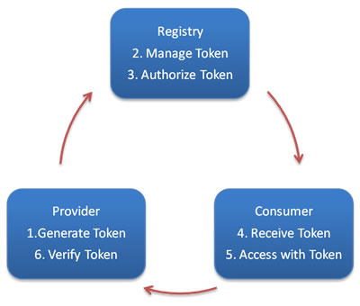

# 令牌验证

通过令牌验证在注册中心控制权限，以决定要不要下发令牌给消费者，可以防止消费者绕过注册中心访问提供者，另外通过注册中心可灵活改变授权方式，而不需修改或升级提供者



可以全局设置开启令牌验证：

```xml
<!--随机token令牌，使用UUID生成-->
<dubbo:provider interface="com.foo.BarService" token="true" />
```
或

```xml
<!--固定token令牌，相当于密码-->
<dubbo:provider interface="com.foo.BarService" token="123456" />
```

也可在服务级别设置：

```xml
<!--随机token令牌，使用UUID生成-->
<dubbo:service interface="com.foo.BarService" token="true" />
```
或

```xml
<!--固定token令牌，相当于密码-->
<dubbo:service interface="com.foo.BarService" token="123456" />
```

还可在协议级别设置：

```xml
<!--随机token令牌，使用UUID生成-->
<dubbo:protocol name="dubbo" token="true" />
```
或

```xml
<!--固定token令牌，相当于密码-->
<dubbo:protocol name="dubbo" token="123456" />
```
