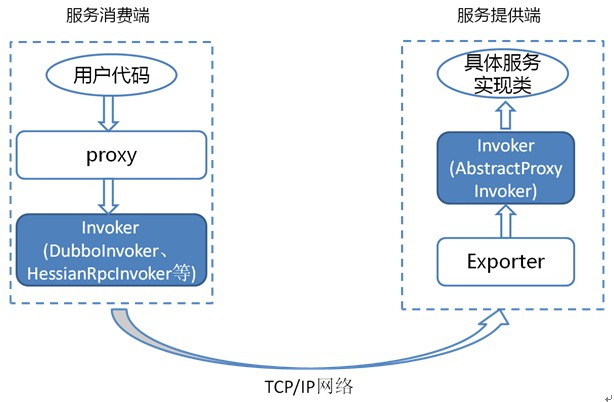

# 实现细节

## 初始化过程细节

### 解析服务

基于 dubbo.jar 内的 `META-INF/spring.handlers` 配置，Spring 在遇到 dubbo 名称空间时，会回调 `DubboNamespaceHandler`。

所有 dubbo 的标签，都统一用 `DubboBeanDefinitionParser` 进行解析，基于一对一属性映射，将 XML 标签解析为 Bean 对象。

在 `ServiceConfig.export()` 或 `ReferenceConfig.get()` 初始化时，将 Bean 对象转换 URL 格式，所有 Bean 属性转成 URL 的参数。

然后将 URL 传给 [协议扩展点](./impls/protocol.md)，基于扩展点的 [扩展点自适应机制](./SPI.md)，根据 URL 的协议头，进行不同协议的服务暴露或引用。

### 暴露服务

#### 1. 只暴露服务端口：

在没有注册中心，直接暴露提供者的情况下 [^1]，`ServiceConfig` 解析出的 URL 的格式为：
`dubbo://service-host/com.foo.FooService?version=1.0.0`。

基于扩展点自适应机制，通过 URL 的 `dubbo://` 协议头识别，直接调用 `DubboProtocol`的 `export()` 方法，打开服务端口。

#### 2. 向注册中心暴露服务：

在有注册中心，需要注册提供者地址的情况下 [^2]，`ServiceConfig` 解析出的 URL 的格式为: `registry://registry-host/com.alibaba.dubbo.registry.RegistryService?export=URL.encode("dubbo://service-host/com.foo.FooService?version=1.0.0")`，

基于扩展点自适应机制，通过 URL 的 `registry://` 协议头识别，就会调用  `RegistryProtocol` 的 `export()` 方法，将 `export` 参数中的提供者 URL，先注册到注册中心。

再重新传给 `Protocol` 扩展点进行暴露： `dubbo://service-host/com.foo.FooService?version=1.0.0`，然后基于扩展点自适应机制，通过提供者 URL 的 `dubbo://` 协议头识别，就会调用 `DubboProtocol` 的 `export()` 方法，打开服务端口。

### 引用服务

#### 1. 直连引用服务：

在没有注册中心，直连提供者的情况下 [^3]，`ReferenceConfig` 解析出的 URL 的格式为：`dubbo://service-host/com.foo.FooService?version=1.0.0`。

基于扩展点自适应机制，通过 URL 的 `dubbo://` 协议头识别，直接调用 `DubboProtocol` 的 `refer()` 方法，返回提供者引用。

#### 2. 从注册中心发现引用服务：

在有注册中心，通过注册中心发现提供者地址的情况下 [^4]，`ReferenceConfig` 解析出的 URL 的格式为：
`registry://registry-host/com.alibaba.dubbo.registry.RegistryService?refer=URL.encode("consumer://consumer-host/com.foo.FooService?version=1.0.0")`。

基于扩展点自适应机制，通过 URL 的 `registry://` 协议头识别，就会调用 `RegistryProtocol` 的 `refer()` 方法，基于 `refer` 参数中的条件，查询提供者 URL，如：
`dubbo://service-host/com.foo.FooService?version=1.0.0`。

基于扩展点自适应机制，通过提供者 URL 的 `dubbo://` 协议头识别，就会调用 `DubboProtocol` 的 `refer()` 方法，得到提供者引用。

然后 `RegistryProtocol` 将多个提供者引用，通过 `Cluster` 扩展点，伪装成单个提供者引用返回。

### 拦截服务

基于扩展点自适应机制，所有的 `Protocol` 扩展点都会自动套上 `Wrapper` 类。

基于 `ProtocolFilterWrapper` 类，将所有 `Filter` 组装成链，在链的最后一节调用真实的引用。

基于 `ProtocolListenerWrapper` 类，将所有 `InvokerListener` 和 `ExporterListener` 组装集合，在暴露和引用前后，进行回调。

包括监控在内，所有附加功能，全部通过 `Filter` 拦截实现。

## 远程调用细节

### 服务提供者暴露一个服务的详细过程


上图是服务提供者暴露服务的主过程：

首先 `ServiceConfig` 类拿到对外提供服务的实际类 ref(如：HelloWorldImpl),然后通过 `ProxyFactory` 类的 `getInvoker` 方法使用 ref 生成一个 `AbstractProxyInvoker` 实例，到这一步就完成具体服务到 `Invoker` 的转化。接下来就是 `Invoker` 转换到 `Exporter` 的过程。

Dubbo 处理服务暴露的关键就在 `Invoker` 转换到 `Exporter` 的过程，上图中的红色部分。下面我们以 Dubbo 和 RMI 这两种典型协议的实现来进行说明：

#### Dubbo 的实现

Dubbo 协议的 `Invoker` 转为 `Exporter` 发生在 `DubboProtocol` 类的 `export` 方法，它主要是打开 socket 侦听服务，并接收客户端发来的各种请求，通讯细节由 Dubbo 自己实现。

#### RMI 的实现

RMI 协议的 `Invoker` 转为 `Exporter` 发生在 `RmiProtocol`类的 `export` 方法，它通过 Spring 或 Dubbo 或 JDK 来实现 RMI 服务，通讯细节这一块由 JDK 底层来实现，这就省了不少工作量。

### 服务消费者消费一个服务的详细过程


上图是服务消费的主过程：

首先 `ReferenceConfig` 类的 `init` 方法调用 `Protocol` 的 `refer` 方法生成 `Invoker` 实例(如上图中的红色部分)，这是服务消费的关键。接下来把 `Invoker` 转换为客户端需要的接口(如：HelloWorld)。

关于每种协议如 RMI/Dubbo/Web service 等它们在调用 `refer` 方法生成 `Invoker` 实例的细节和上一章节所描述的类似。

### 满眼都是 Invoker

由于 `Invoker` 是 Dubbo 领域模型中非常重要的一个概念，很多设计思路都是向它靠拢。这就使得 `Invoker` 渗透在整个实现代码里，对于刚开始接触 Dubbo 的人，确实容易给搞混了。
下面我们用一个精简的图来说明最重要的两种 `Invoker`：服务提供 `Invoker` 和服务消费 `Invoker`：



为了更好的解释上面这张图，我们结合服务消费和提供者的代码示例来进行说明：

服务消费者代码：

```java
public class DemoClientAction {
 
    private DemoService demoService;
 
    public void setDemoService(DemoService demoService) {
        this.demoService = demoService;
    }
 
    public void start() {
        String hello = demoService.sayHello("world" + i);
    }
}
```

上面代码中的 `DemoService` 就是上图中服务消费端的 proxy，用户代码通过这个 proxy 调用其对应的 `Invoker` [^5]，而该 `Invoker` 实现了真正的远程服务调用。

服务提供者代码：

```java
public class DemoServiceImpl implements DemoService {
 
    public String sayHello(String name) throws RemoteException {
        return "Hello " + name;
    }
}
```

上面这个类会被封装成为一个 `AbstractProxyInvoker` 实例，并新生成一个 `Exporter` 实例。这样当网络通讯层收到一个请求后，会找到对应的 `Exporter` 实例，并调用它所对应的 `AbstractProxyInvoker` 实例，从而真正调用了服务提供者的代码。Dubbo 里还有一些其他的 `Invoker` 类，但上面两种是最重要的。

## 远程通讯细节

### 协议头约定


### 线程派发模型


* Dispather: `all`, `direct`, `message`, `execution`, `connection`
* ThreadPool: `fixed`, `cached`


[^1]: 即：`<dubbo:service regisrty="N/A" />` 或者 `<dubbo:registry address="N/A" />`
[^2]: 即: `<dubbo:registry address="zookeeper://10.20.153.10:2181" />`
[^3]: 即：`<dubbo:reference url="dubbo://service-host/com.foo.FooService?version=1.0.0" />`
[^4]: 即：`<dubbo:registry address="zookeeper://10.20.153.10:2181" />`
[^5]: `DubboInvoker`、 `HessianRpcInvoker`、 `InjvmInvoker`、 `RmiInvoker`、 `WebServiceInvoker` 中的任何一个


