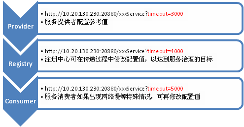

# 配置设计

> http://javatar.iteye.com/blog/949527

Dubbo 现在的设计是完全无侵入，也就是使用者只依赖于配置契约。经过多个版本的发展，为了满足各种需求场景，配置越来越多。为了保持兼容，配置只增不减，里面潜伏着各种风格，约定，规则。新版本也将配置做了一次调整，去掉了 dubbo.properties，改为全 spring 配置。将想到的一些记在这，备忘。 

## 配置分类 

首先，配置的用途是有多种的，大致可以分为： 

0. 环境配置，比如：连接数，超时等配置。 
0. 描述配置，比如：服务接口描述，服务版本等。 
0. 扩展配置，比如：协议扩展，策略扩展等。 

## 配置格式 

通常环境配置，用 properties 配置会比较方便，因为都是一些离散的简单值，用 key-value 配置可以减少配置的学习成本。 

而描述配置，通常信息比较多，甚至有层次关系，用 xml 配置会比较方便，因为树结构的配置表现力更强。如果非常复杂，也可以考自定义 DSL 做为配置。有时候这类配置也可以用 Annotation 代替， 因为这些配置和业务逻辑相关，放在代码里也是合理的。 

另外扩展配置，可能不尽相同。如果只是策略接口实现类替换，可以考虑 properties 等结构。如果有复杂的生命周期管理，可能需要 XML 等配置。有时候扩展会通过注册接口的方式提供。 

## 配置加载 

对于环境配置，在 java 世界里，比较常规的做法，是在 classpath 下约定一个以项目为名称的 properties 配置，比如：log4j.properties，velocity.properties等。产品在初始化时，自动从 classpath 下加载该配置。我们平台的很多项目也使用类似策略，如：dubbo.properties，comsat.xml 等。这样有它的优势，就是基于约定，简化了用户对配置加载过程的干预。但同样有它的缺点，当 classpath 存在同样的配置时，可能误加载，以及在 ClassLoader 隔离时，可能找不到配置，并且，当用户希望将配置放到统一的目录时，不太方便。 

Dubbo 新版本去掉了 dubbo.properties，因为该约定经常造成配置冲突。 

而对于描述配置，因为要参与业务逻辑，通常会嵌到应用的生命周期管理中。现在使用 spring 的项目越来越多，直接使用 spring 配置的比较普遍，而且 spring 允许自定义 schema，配置简化后很方便。当然，也有它的缺点，就是强依赖 spring，可以提编程接口做了配套方案。 

在 Dubbo 即存在描述配置，也有环境配置。一部分用 spring 的 schame 配置加载，一部分从 classpath 扫描 properties 配置加载。用户感觉非常不便，所以在新版本中进行了合并，统一放到 spring 的 schame 配置加载，也增加了配置的灵活性。 

扩展配置，通常对配置的聚合要求比较高。因为产品需要发现第三方实现，将其加入产品内部。在 java 世界里，通常是约定在每个 jar 包下放一个指定文件加载，比如：eclipse 的 plugin.xml，struts2 的 struts-plugin.xml 等，这类配置可以考虑 java 标准的服务发现机制，即在 jar 包的 META-INF/services 下放置接口类全名文件，内容为每行一个实现类类名，就像 jdk 中的加密算法扩展，脚本引擎扩展，新的 JDBC 驱动等，都是采用这种方式。参见：[ServiceProvider 规范](http://download.oracle.com/javase/1.4.2/docs/guide/jar/jar.html#Service%20Provider)。

Dubbo 旧版本通过约定在每个 jar 包下，放置名为 dubbo-context.xml 的 spring 配置进行扩展与集成，新版本改成用 jdk 自带的 META-INF/services 方式，去掉过多的 spring 依赖。 

## 可编程配置 

配置的可编程性是非常必要的，不管你以何种方式加载配置文件，都应该提供一个编程的配置方式，允许用户不使用配置文件，直接用代码完成配置过程。因为一个产品，尤其是组件类产品，通常需要和其它产品协作使用，当用户集成你的产品时，可能需要适配配置方式。 

Dubbo 新版本提供了与 xml 配置一对一的配置类，如：ServiceConfig 对应 `<dubbo:service />`，并且属性也一对一，这样有利于文件配置与编程配置的一致性理解，减少学习成本。 

## 配置缺省值 

配置的缺省值，通常是设置一个常规环境的合理值，这样可以减少用户的配置量。通常建议以线上环境为参考值，开发环境可以通过修改配置适应。缺省值的设置，最好在最外层的配置加载就做处理。程序底层如果发现配置不正确，就应该直接报错，容错在最外层做。如果在程序底层使用时，发现配置值不合理，就填一个缺省值，很容易掩盖表面问题，而引发更深层次的问题。并且配置的中间传递层，很可能并不知道底层使用了一个缺省值，一些中间的检测条件就可能失效。Dubbo 就出现过这样的问题，中间层用“地址”做为缓存 Key， 而底层，给“地址”加了一个缺省端口号，导致不加端口号的“地址”和加了缺省端口的“地址”并没有使用相同的缓存。 

## 配置一致性 

配置总会隐含一些风格或潜规则，应尽可能保持其一致性。比如：很多功能都有开关，然后有一个配置值： 

0. 是否使用注册中心，注册中心地址。 
0. 是否允许重试，重试次数。 

你可以约定：
 
0. 每个都是先配置一个 boolean 类型的开关，再配置一个值。 
0. 用一个无效值代表关闭，N/A地址，0重试次数等。 

不管选哪种方式，所有配置项，都应保持同一风格，Dubbo 选的是第二种。相似的还有，超时时间，重试时间，定时器间隔时间。如果一个单位是秒，另一个单位是毫秒(C3P0的配置项就是这样)，配置人员会疯掉。 

## 配置覆盖 

提供配置时，要同时考虑开发人员，测试人员，配管人员，系统管理员。测试人员是不能修改代码的，而测试的环境很可能较为复杂，需要为测试人员留一些“后门”，可以在外围修改配置项。就像 spring 的 PropertyPlaceholderConfigurer 配置，支持 `SYSTEM_PROPERTIES_MODE_OVERRIDE`，可以通过 JVM 的 -D 参数，或者像 hosts 一样约定一个覆盖配置文件，在程序外部，修改部分配置，便于测试。

 
Dubbo 支持通过 JVM 参数 `-Dcom.xxx.XxxService=dubbo://10.1.1.1:1234 
` 直接使远程服务调用绕过注册中心，进行点对点测试。还有一种情况，开发人员增加配置时，都会按线上的部署情况做配置，如：`<dubbo:registry address="${dubbo.registry.address}" />` 因为线上只有一个注册中心，这样的配置是没有问题的，而测试环境可能有两个注册中心，测试人员不可能去修改配置，改为： 
`<dubbo:registry address="${dubbo.registry.address1}" />`， 
`<dubbo:registry address="${dubbo.registry.address2}" />`，所以这个地方，Dubbo 支持在 ${dubbo.registry.address} 的值中，通过竖号分隔多个注册中心地址，用于表示多注册中心地址。 

## 配置继承 

配置也存在“重复代码”，也存在“泛化与精化”的问题。比如：Dubbo 的超时时间设置，每个服务，每个方法，都应该可以设置超时时间。但很多服务不关心超时，如果要求每个方法都配置，是不现实的。所以 Dubbo 采用了方法超时继承服务超时，服务超时再继承缺省超时，没配置时，一层层向上查找。 

另外，Dubbo 旧版本所有的超时时间，重试次数，负载均衡策略等都只能在服务消费方配置。但实际使用过程中发现，服务提供方比消费方更清楚，但这些配置项是在消费方执行时才用到的。新版本，就加入了在服务提供方也能配这些参数，通过注册中心传递到消费方， 
做为参考值，如果消费方没有配置，就以提供方的配置为准，相当于消费方继承了提供方的建议配置值。而注册中心在传递配置时，也可以在中途修改配置，这样就达到了治理的目的，继承关系相当于：服务消费者 --> 注册中心 --> 服务提供者 
 

## 配置向后兼容 

向前兼容很好办，你只要保证配置只增不减，就基本上能保证向前兼容。但向后兼容，也是要注意的，要为后续加入新的配置项做好准备。如果配置出现一个特殊配置，就应该为这个“特殊”情况约定一个兼容规则，因为这个特殊情况，很有可能在以后还会发生。比如：有一个配置文件是保存“服务=地址”映射关系的，其中有一行特殊，保存的是“注册中心=地址”。现在程序加载时，约定“注册中心”这个Key是特殊的，做特别处理，其它的都是“服务”。然而，新版本发现，要加一项“监控中心=地址”，这时，旧版本的程序会把“监控中心”做为“服务”处理，因为旧代码是不能改的，兼容性就很会很麻烦。如果先前约定“特殊标识+XXX”为特殊处理，后续就会方便很多。 

向后兼容性，可以多向HTML5学习，参见：[HTML5设计原理](http://javatar.iteye.com/blog/949390)
