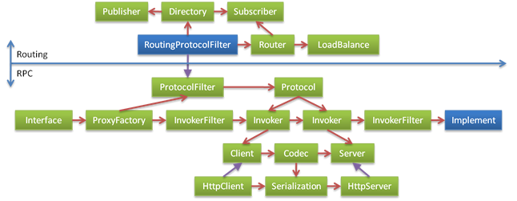

# 扩展点重构

> http://javatar.iteye.com/blog/1041832

随着服务化的推广，网站对Dubbo服务框架的需求逐渐增多，Dubbo 的现有开发人员能实现的需求有限，很多需求都被 delay，而网站的同学也希望参与进来，加上领域的推动，所以平台计划将部分项目对公司内部开放，让大家一起来实现，Dubbo 为试点项目之一。 

既然要开放，那 Dubbo 就要留一些扩展点，让参与者尽量黑盒扩展，而不是白盒的修改代码，否则分支，质量，合并，冲突都会很难管理。 

先看一下 Dubbo 现有的设计：


这里面虽然有部分扩展接口，但并不能很好的协作，而且扩展点的加载和配置都没有统一处理，所以下面对它进行重构。

## 第一步，微核心，插件式，平等对待第三方 

即然要扩展，扩展点的加载方式，首先要统一，微核心+插件式，是比较能达到 OCP 原则的思路。

由一个插件生命周期管理容器，构成微核心，核心不包括任何功能，这样可以确保所有功能都能被替换，并且，框架作者能做到的功能，扩展者也一定要能做到，以保证平等对待第三方，所以，框架自身的功能也要用插件的方式实现，不能有任何硬编码。 

通常微核心都会采用 Factory、IoC、OSGi 等方式管理插件生命周期。考虑 Dubbo 的适用面，不想强依赖 Spring 等 IoC 容器。自已造一个小的 IoC 容器，也觉得有点过度设计，所以打算采用最简单的 Factory 方式管理插件。 

最终决定采用的是 JDK 标准的 SPI 扩展机制，参见：`java.util.ServiceLoader `，也就是扩展者在 jar 包的 `META-INF/services/` 目录下放置与接口同名的文本文件，内容为接口实现类名，多个实现类名用换行符分隔。比如，需要扩展 Dubbo 的协议，只需在 xxx.jar 中放置文件：`META-INF/services/com.alibaba.dubbo.rpc.Protocol`，内容为 `com.alibaba.xxx.XxxProtocol`。Dubbo 通过 ServiceLoader 扫描到所有 Protocol 实现。 

并约定所有插件，都必须标注：`@Extension("name")`，作为加载后的标识性名称，用于配置选择。

## 第二步，每个扩展点只封装一个变化因子，最大化复用 

每个扩展点的实现者，往往都只是关心一件事，现在的扩展点，并没有完全分离。比如：Failover, Route, LoadBalance, Directory 没有完全分开，全由 RoutingInvokerGroup 写死了。 

再比如，协议扩展，扩展者可能只是想替换序列化方式，或者只替换传输方式，并且 Remoting 和 Http 也能复用序列化等实现。这样，需为传输方式，客户端实现，服务器端实现，协议头解析，数据序列化，都留出不同扩展点。 

拆分后，设计如下：


## 第三步，全管道式设计，框架自身逻辑，均使用截面拦截实现 

现在很多的逻辑，都是放在基类中实现，然后通过模板方法回调子类的实现，包括：local, mock, generic, echo, token, accesslog, monitor, count, limit 等等，可以全部拆分使用 Filter 实现，每个功能都是调用链上的一环。 比如：(基类模板方法) 

```java
public abstract AbstractInvoker implements Invoker {  
  
    public Result invoke(Invocation inv) throws RpcException {  
        // 伪代码  
        active ++;  
        if (active > max)  
            wait();  
          
        doInvoke(inv);  
          
        active --;  
        notify();  
    }  
      
    protected abstract Result doInvoke(Invocation inv) throws RpcException  
  
}  
```

改成：(链式过滤器)

```java
public abstract LimitFilter implements Filter {  
  
    public Result invoke(Invoker chain, Invocation inv) throws RpcException {  
         // 伪代码  
        active ++;  
        if (active > max)  
            wait();  
          
        chain.invoke(inv);  
          
        active --;  
        notify();  
    }  
  
}
```

## 第四步，最少概念，一致性概念模型

保持尽可能少的概念，有助于理解，对于开放的系统尤其重要。另外，各接口都使用一致的概念模型，能相互指引，并减少模型转换， 

比如，Invoker 的方法签名为: 

```java
Result invoke(Invocation invocation) throws RpcException;
```

而 Exporter 的方法签名为: 

```java
Object invoke(Method method, Object[] args) throws Throwable;  
```

但它们的作用是一样的，只是一个在客户端，一个在服务器端，却采用了不一样的模型类。

再比如，URL 以字符串传递，不停的解析和拼装，没有一个 URL 模型类， 而 URL 的参数，却时而 Map, 时而 Parameters 类包装，

```java
export(String url)  
createExporter(String host, int port, Parameters params);  
```

使用一致模型：

```java
export(URL url)  
createExporter(URL url);  
```

再比如，现有的：Invoker, Exporter, InvocationHandler, FilterChain 
 其实都是 invoke 行为的不同阶段，完全可以抽象掉，统一为 Invoker，减少概念。 

## 第五步，分层，组合式扩展，而不是泛化式扩展

原因参见：[谈谈扩充式扩展与增量式扩展](../principals/expansibility.md)。

泛化式扩展指：将扩展点逐渐抽象，取所有功能并集，新加功能总是套入并扩充旧功能的概念。 

组合式扩展指：将扩展点正交分解，取所有功能交集，新加功能总是基于旧功能之上实现。 

上面的设计，不自觉的就将 Dubbo 现有功能都当成了核心功能。上面的概念包含了 Dubbo 现有 RPC 的所有功能，包括：Proxy, Router, Failover, LoadBalance, Subscriber, Publisher, Invoker, Exporter, Filter 等， 
但这些都是核心吗？踢掉哪些，RPC 一样可以 Run？而哪些又是不能踢掉的？基于这样考虑，可以将 RPC 分解成两个层次，只是 Protocol 和 Invoker 才是 RPC 的核心。其它，包括 Router, Failover, Loadbalance, Subscriber, Publisher 都不核心，而是 Routing。所以，将 Routing 作为 Rpc 核心的一个扩展，设计如下：



## 第六步，整理，梳理关系

整理后，设计如下：


