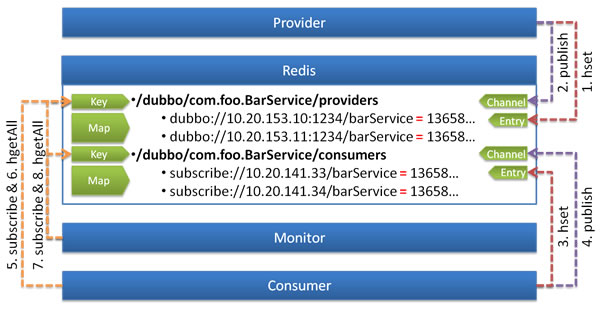

# Redis 注册中心

基于 Redis [^1] 实现的注册中心 [^2]。



使用 Redis 的 Key/Map 结构存储数据结构：

* 主 Key 为服务名和类型
* Map 中的 Key 为 URL 地址
* Map 中的 Value 为过期时间，用于判断脏数据，脏数据由监控中心删除 [^3]

使用 Redis 的 Publish/Subscribe 事件通知数据变更：

* 通过事件的值区分事件类型：`register`, `unregister`, `subscribe`, `unsubscribe`
* 普通消费者直接订阅指定服务提供者的 Key，只会收到指定服务的 `register`, `unregister` 事件
* 监控中心通过 `psubscribe` 功能订阅 `/dubbo/*`，会收到所有服务的所有变更事件

调用过程：

0. 服务提供方启动时，向 `Key:/dubbo/com.foo.BarService/providers` 下，添加当前提供者的地址
1. 并向 `Channel:/dubbo/com.foo.BarService/providers` 发送 `register` 事件
2. 服务消费方启动时，从 `Channel:/dubbo/com.foo.BarService/providers` 订阅 `register` 和 `unregister` 事件
3. 并向 `Key:/dubbo/com.foo.BarService/providers` 下，添加当前消费者的地址
4. 服务消费方收到 `register` 和 `unregister` 事件后，从 `Key:/dubbo/com.foo.BarService/providers` 下获取提供者地址列表
5. 服务监控中心启动时，从 `Channel:/dubbo/*` 订阅 `register` 和 `unregister`，以及 `subscribe` 和`unsubsribe `事件
6. 服务监控中心收到 `register` 和 `unregister` 事件后，从 `Key:/dubbo/com.foo.BarService/providers` 下获取提供者地址列表
7. 服务监控中心收到 `subscribe` 和 `unsubsribe` 事件后，从 `Key:/dubbo/com.foo.BarService/consumers` 下获取消费者地址列表


## 配置

```xml
<dubbo:registry address="redis://10.20.153.10:6379" />
```

或

```xml
<dubbo:registry address="redis://10.20.153.10:6379?backup=10.20.153.11:6379,10.20.153.12:6379" />
```

或

```xml
<dubbo:registry protocol="redis" address="10.20.153.10:6379" />
```

或

```xml
<dubbo:registry protocol="redis" address="10.20.153.10:6379,10.20.153.11:6379,10.20.153.12:6379" />
```

## 选项

* 可通过 `<dubbo:registry group="dubbo" />` 设置 redis 中 key 的前缀，缺省为 `dubbo`。
* 可通过 `<dubbo:registry cluster="replicate" />` 设置 redis 集群策略，缺省为 `failover`：
    * `failover`: 只写入和读取任意一台，失败时重试另一台，需要服务器端自行配置数据同步
    * `replicate`: 在客户端同时写入所有服务器，只读取单台，服务器端不需要同步，注册中心集群增大，性能压力也会更大


## 可靠性声明

阿里内部并没有采用 Redis 做为注册中心，而是使用自己实现的基于数据库的注册中心，即：Redis 注册中心并没有在阿里内部长时间运行的可靠性保障，此 Redis 桥接实现只为开源版本提供，其可靠性依赖于 Redis 本身的可靠性。


## 安装

安装方式参见: [Redis安装手册](http://dubbo.apache.org/books/dubbo-admin-book/install/redis.html)，只需搭一个原生的 Redis 服务器，并将 [Quick Start](../../preface/usage.md) 中 Provider 和 Consumer 里的 `conf/dubbo.properties` 中的 `dubbo.registry.addrss` 的值改为 `redis://127.0.0.1:6379` 即可使用。

[^1]: [Redis](http://redis.io) 是一个高效的 KV 存储服务器
[^2]: 从 `2.1.0` 版本开始支持
[^3]: Redis 过期数据通过心跳的方式检测脏数据，服务器时间必须同步，并且对服务器有一定压力，否则过期检测会不准确
