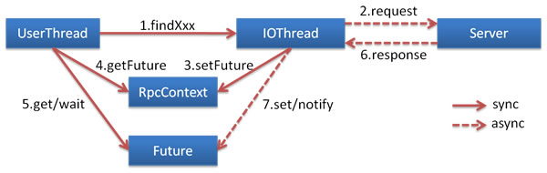

# 异步调用

基于 NIO 的非阻塞实现并行调用，客户端不需要启动多线程即可完成并行调用多个远程服务，相对多线程开销较小。 [^1]



在 consumer.xml 中配置：

```xml
<dubbo:reference id="fooService" interface="com.alibaba.foo.FooService">
      <dubbo:method name="findFoo" async="true" />
</dubbo:reference>
<dubbo:reference id="barService" interface="com.alibaba.bar.BarService">
      <dubbo:method name="findBar" async="true" />
</dubbo:reference>
```

调用代码:

```java
// 此调用会立即返回null
fooService.findFoo(fooId);
// 拿到调用的Future引用，当结果返回后，会被通知和设置到此Future
Future<Foo> fooFuture = RpcContext.getContext().getFuture(); 
 
// 此调用会立即返回null
barService.findBar(barId);
// 拿到调用的Future引用，当结果返回后，会被通知和设置到此Future
Future<Bar> barFuture = RpcContext.getContext().getFuture(); 
 
// 此时findFoo和findBar的请求同时在执行，客户端不需要启动多线程来支持并行，而是借助NIO的非阻塞完成
 
// 如果foo已返回，直接拿到返回值，否则线程wait住，等待foo返回后，线程会被notify唤醒
Foo foo = fooFuture.get(); 
// 同理等待bar返回
Bar bar = barFuture.get(); 
 
// 如果foo需要5秒返回，bar需要6秒返回，实际只需等6秒，即可获取到foo和bar，进行接下来的处理。
```

你也可以设置是否等待消息发出： [^2]

* `sent="true"` 等待消息发出，消息发送失败将抛出异常。
* `sent="false"` 不等待消息发出，将消息放入 IO 队列，即刻返回。

```xml
<dubbo:method name="findFoo" async="true" sent="true" />
```

如果你只是想异步，完全忽略返回值，可以配置 `return="false"`，以减少 Future 对象的创建和管理成本：

```xml
<dubbo:method name="findFoo" async="true" return="false" />
```

[^1]: `2.0.6` 及其以上版本支持
[^2]: 异步总是不等待返回