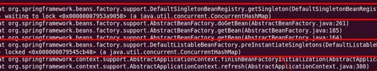

# 延迟暴露

如果你的服务需要预热时间，比如初始化缓存，等待相关资源就位等，可以使用 delay 进行延迟暴露。

## 延迟 5 秒暴露服务

```xml
<dubbo:service delay="5000" />
```

## 延迟到 Spring 初始化完成后，再暴露服务 [^1]

```xml
<dubbo:service delay="-1" />
```

### Spring 2.x 初始化死锁问题

#### 触发条件

在 Spring 解析到 `<dubbo:service />` 时，就已经向外暴露了服务，而 Spring 还在接着初始化其它 Bean。如果这时有请求进来，并且服务的实现类里有调用 `applicationContext.getBean()` 的用法。

1. 请求线程的 applicationContext.getBean() 调用，先同步 singletonObjects 判断 Bean 是否存在，不存在就同步 beanDefinitionMap 进行初始化，并再次同步 singletonObjects 写入 Bean 实例缓存。 
 
      

2. 而 Spring 初始化线程，因不需要判断 Bean 的存在，直接同步 beanDefinitionMap 进行初始化，并同步 singletonObjects 写入 Bean 实例缓存。
  
      
 
    这样就导致 getBean 线程，先锁 singletonObjects，再锁 beanDefinitionMap，再次锁 singletonObjects。  
而 Spring 初始化线程，先锁 beanDefinitionMap，再锁 singletonObjects。反向锁导致线程死锁，不能提供服务，启动不了。  

#### 规避办法

1. 强烈建议不要在服务的实现类中有 applicationContext.getBean() 的调用，全部采用 IoC 注入的方式使用 Spring的Bean。
2. 如果实在要调 getBean()，可以将 Dubbo 的配置放在 Spring 的最后加载。
3. 如果不想依赖配置顺序，可以使用 `<dubbo:provider delay=”-1” />`，使 Dubbo 在 Spring 容器初始化完后，再暴露服务。
4. 如果大量使用 getBean()，相当于已经把 Spring 退化为工厂模式在用，可以将 Dubbo 的服务隔离单独的 Spring 容器。

[^1]: 基于 Spring 的 ContextRefreshedEvent 事件触发暴露
