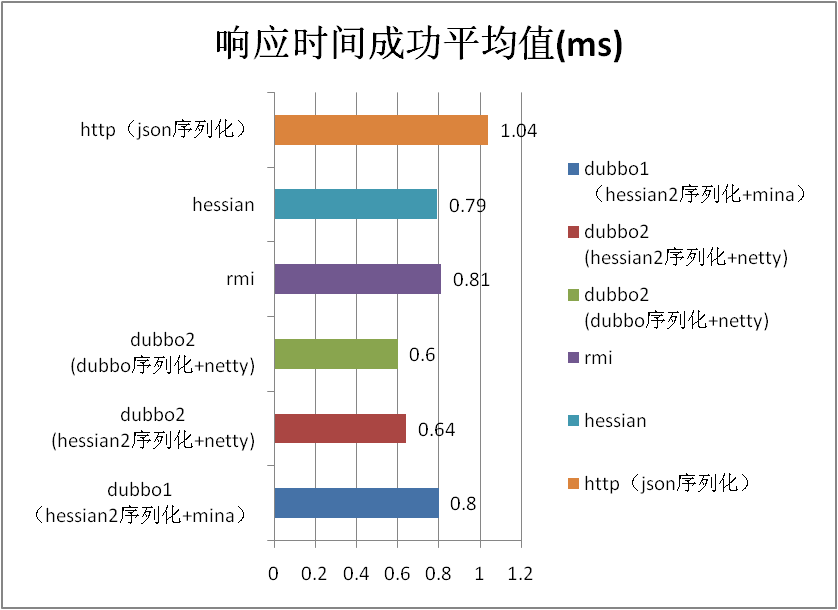
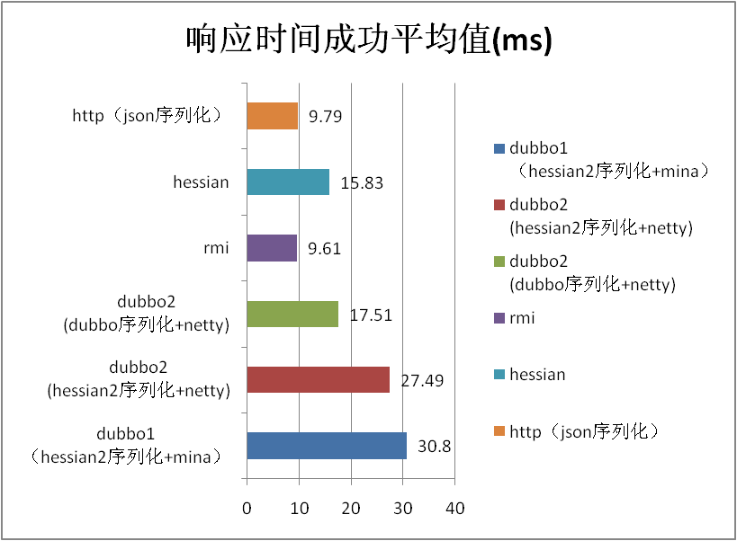

# 性能测试报告

## 测试说明

0. 本次性能测试，测试了 dubbo 2.0 所有支持的协议在不同大小和数据类型下的表现，并与 dubbo 1.0 进行了对比。
1. 整体性能相比 1.0 有了提升，平均提升 10%，使用 dubbo 2.0 新增的 dubbo 序列化还能获得 10%~50% 的性能提升，详见下面的性能数据。
2. 稳定性测试中由于将底层通信框架从 mina 换成 netty，old 区对象的增长大大减少，50 小时运行，增长不到 200m，无 fullgc。
3. 存在的问题：在 50k 数据的时候 2.0 性能不如 1.0，怀疑可能是缓冲区设置的问题，下版本会进一步确认。 

## 测试环境

### 硬件部署与参数调整

机型  | CPU | 内存 | 网络 | 磁盘 | 内核
------------- | ------------- | ------------- | ------------- | ------------- | -------------
Tecal BH620  | model name : Intel(R) Xeon(R) CPU           E5520  @ 2.27GHz cache size : 8192 KB processor_count : 16 | Total System Memory: 6G Hardware Memory Info:  Size: 4096MB | eth0: Link is up at 1000 Mbps, full duplex. peth0: Link is up at 1000 Mbps, full duplex. | /dev/sda: 597.9 GB | 2.6.18-128.el5xen x86_64

### 软件架构

软件名称及版本 | 关键参数
------------- | -------------
java version "1.6.0_18" Java(TM) SE Runtime Environment (build 1.6.0_18-b07) Java HotSpot(TM) 64-Bit Server VM (build 16.0-b13, mixed mode) | -server -Xmx2g -Xms2g -Xmn256m -XX:PermSize=128m -Xss256k -XX:+DisableExplicitGC -XX:+UseConcMarkSweepGC -XX:+CMSParallelRemarkEnabled -XX:+UseCMSCompactAtFullCollection -XX:LargePageSizeInBytes=128m -XX:+UseFastAccessorMethods -XX:+UseCMSInitiatingOccupancyOnly -XX:CMSInitiatingOccupancyFraction=70
jboss-4.0.5.GA | 
httpd-2.0.61 | KeepAlive On MaxKeepAliveRequests 100000 KeepAliveTimeout 180 MaxRequestsPerChild 1000000 <IfModule worker.c>         StartServers 5         MaxClients 1024         MinSpareThreads 25         MaxSpareThreads 75         ThreadsPerChild 64         ThreadLimit 128         ServerLimit 16 </IfModule>

## 测试目的

### 期望性能指标(量化)

场景名称 | 对应指标名称 | 期望值范围 | 实际值 | 是否满足期望(是/否)
------------- | ------------- | ------------- | ------------- | ------------- 
1k数据 | 响应时间 | 0.9ms | 0.79ms | 是 
1k数据 | TPS | 10000 | 11994 | 是

### 期望运行状况(非量化，可选)

* 2.0 性能不低于 1.0, 2.0 和 1.0 互调用的性能无明显下降。 除了 50k string 其余皆通过
* JVM 内存运行稳定，无 OOM，堆内存中无不合理的大对象的占用。通过
* CPU、内存、网络、磁盘、文件句柄占用平稳。通过
* 无频繁线程锁，线程数平稳。通过
* 业务线程负载均衡。通过

## 测试脚本

0. 性能测试场景（10 并发）
    * 传入 1k String，不做任何处理，原样返回
    * 传入 50k String，不做任何处理，原样返回
    * 传入 200k String，不做任何处理，原样返回
    * 传入 1k POJO（嵌套的复杂 person 对象），不做任何处理，原样返回
    
    上述场景在 dubbo 1.0, dubbo 2.0(hessian2序列化), dubbo 2.0(dubbo序列化), rmi, hessian 3.2.0, http(json序列化) 进行 10 分钟的性能测试。主要考察序列化和网络 IO 的性能，因此服务端无任何业务逻辑。取 10 并发是考虑到 http 协议在高并发下对 CPU 的使用率较高可能会先打到瓶颈。 
0. 并发场景（20 并发）
    传入 1k String，在服务器段循环 1w 次，每次重新生成一个随机数然后进行拼装。考察业务线程是否能够分配到每个 CPU 上。 
0. 稳定性场景（20 并发）
    同时调用 1 个参数为 String（5k）方法，1 个参数为 person 对象的方法，1 个参数为 map（值为 3 个 person）的方法，持续运行 50 小时。 
0. 高压力场景（20 并发）
    在稳定性场景的基础上，将提供者和消费者布置成均为 2 台（一台机器 2 个实例），且 String 的参数从 20byte 到 200k，每隔 10 分钟随机变换。 
    
## 测试结果

### 场景名称：POJO 场景

 | TPS成功平均值 | 响应时间成功平均值(ms) 
 ------------- | ------------- | ------------- 
 dubbo1 (hessian2序列化+mina)| 10813.5 | 0.9 
 dubbo2 (hessian2序列化+netty) | 11994 | 0.79 
 dubbo2 (dubbo序列化+netty) | 13620 | 0.67 
 rmi | 2461.79 | 4 
 hessian | 2417.7 | 4.1 
 http（json序列化）| 8179.08 | 1.15 
 2.0和1.0默认对比百分比 | 10.92 | -12.22 
 dubbo序列化相比hessian2序列化百分比 | 13.56 | -15.19 
 
POJO TPS

POJO Response

 
### 场景名称：1k string 场景
 
| TPS成功平均值 | 响应时间成功平均值(ms) 
------------- | ------------- | ------------- 
dubbo1（hessian2序列化+mina）| 11940 | 0.8 
dubbo2 (hessian2序列化+netty) | 14402 | 0.64 
dubbo2 (dubbo序列化+netty) | 15096 | 0.6 
rmi | 11136.02 | 0.81 
hessian | 11426.83 | 0.79 
http（json序列化）| 8919.27 | 1.04 
2.0和1.0默认对比百分比 | 20.62 | -20.00 
dubbo序列化相比hessian2序列化百分比 | 4.82 | -6.25 

1k TPS

1k Response

### 场景名称：50k string 场景

| TPS成功平均值 | 响应时间成功平均值(ms) 
------------- | ------------- | ------------- 
 dubbo1（hessian2序列化+mina | 1962.7 | 5.1 
 dubbo2 (hessian2序列化+netty) | 1293 | 5.03 
 dubbo2 (dubbo序列化+netty) | 1966 | 7.68 
 rmi | 3349.88 | 2.9 
 hessian | 1925.33 | 5.13 
 http（json序列化）| 3247.1 | 3 
 2.0和1.0默认对比百分比 | -34.12 | -1.37 
 dubbo序列化相比hessian2序列化百分比 | 52.05 | 52.68 
 
50K TPS

50K Response

 
 
### 场景名称：200k string 场景
 
| TPS成功平均值 | 响应时间成功平均值(ms) 
------------- | ------------- | ------------- 
 dubbo1（hessian2序列化+mina）| 324.2 | 30.8 
 dubbo2 (hessian2序列化+netty) | 362.92 | 27.49 
 dubbo2 (dubbo序列化+netty) | 569.5 | 17.51 
 rmi | 1031.28 | 9.61
 hessian | 628.06 | 15.83 
 http（json序列化）| 1011.97 | 9.79 
 2.0和1.0默认对比百分比 | 11.94 | -10.75 
 dubbo序列化相比hessian2序列化百分比 | 56.92 | -36.30 
 
200K TPS
 

**200K Response**

## 测试分析

### 性能分析评估

Dubbo 2.0 的性能测试结论为通过，从性能、内存占用和稳定性上都有了提高和改进。由其是内存管理由于将 mina 换成netty，大大减少了 1.0 版本在高并发大数据下的内存大锯齿。

### 性能对比分析(新旧环境、不同数据量级等)

Dubbo 2.0 相比较Dubbo 1.0（默认使用的都是 hessian2 序列化）性能均有提升（除了50k String），详见第五章的性能数据。

出于兼容性考虑默认的序列化方式和 1.0 保持一致使用 hessian2，如对性能有更高要求可以使用 dubbo 序列化，由其是在处理复杂对象时，在大数据量下能获得 50% 的提升（但此时已不建议使用 Dubbo 协议）。

Dubbo 的设计目的是为了满足高并发小数据量的 rpc 调用，在大数据量下的性能表现并不好，建议使用 rmi 或 http 协议。

### 测试局限性分析（可选）

本次性能测试考察的是 dubbo 本身的性能，实际使用过程中的性能有待应用来验证。

由于 dubbo 本身的性能占用都在毫秒级，占的基数很小，性能提升可能对应用整体的性能变化不大。

由于邮件篇幅所限没有列出所有的监控图，如需获得可在大力神平台上查询。