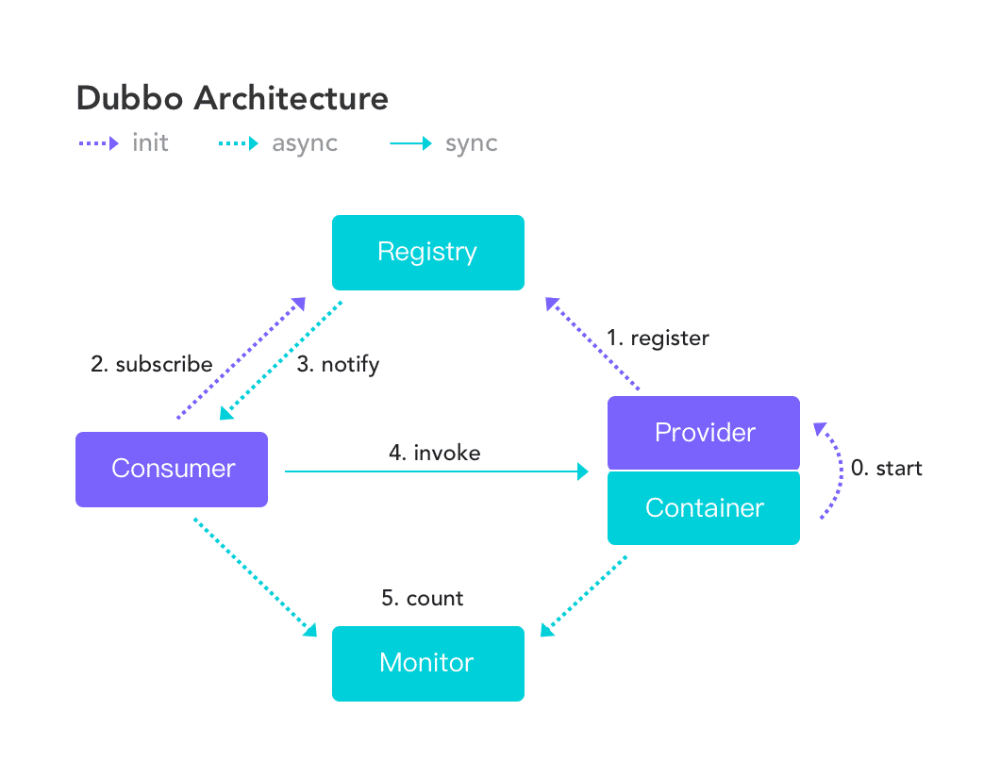

# Dubbo Overview
Apache Dubbo is a high-performance, open source RPC framework. 

[Dubbo 3.0](/documentations/3.0/zh-cn/site/), the Cloud Native version of Dubbo, is under development. If you have any ideas or suggestions on Dubbo 3.0, please join us on Github.

## Basic Architecture

## Features
* Transparent interface based RPC
* Intelligent load balancing
* Automatic service registration and discovery
* High extensibility
* Runtime traffic routing
* Visualized service governance