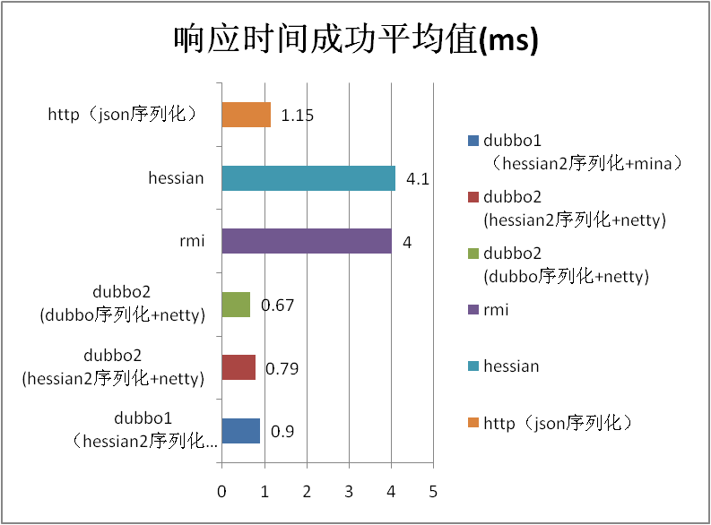

# Performance test report

## Test instructions

0. In this performance test, the performance of all Dubbo 2.0 supported protocols in different sizes and data types is tested and compared with the Dubbo 1.0.
1. The overall performance is increased by 1.0 compared with 10%, and the average increase is 10%. The performance improvement of 10%~50% can also be achieved by using the new Dubbo serialization of Dubbo 2.0 .
2. In the stability test, because the underlying communication framework is changed from Mina to netty, the growth of objects in old area is greatly reduced, and the 50 hour operation increases less than 200m and no fullgc.
3. There is a problem: performance of 2.0 is less than 1.0 in 50K data, and it is doubted that it may be a buffer setting problem, and the next version will be further confirmed.

## Test environment

### Hardware deployment and parameter adjustment

| Model       | CPU                                      | Memory                                   | Network                                  | Disk               | Kernel                   |
| ----------- | ---------------------------------------- | ---------------------------------------- | ---------------------------------------- | ------------------ | ------------------------ |
| Tecal BH620 | model name : Intel(R) Xeon(R) CPU           E5520  @ 2.27GHz cache size : 8192 KB processor_count : 16 | Total System Memory: 6G Hardware Memory Info:  Size: 4096MB | eth0: Link is up at 1000 Mbps, full duplex. peth0: Link is up at 1000 Mbps, full duplex. | /dev/sda: 597.9 GB | 2.6.18-128.el5xen x86_64 |

### Software architecture

| Software name and version                | key parameter                            |
| ---------------------------------------- | ---------------------------------------- |
| java version "1.6.0_18" Java(TM) SE Runtime Environment (build 1.6.0_18-b07) Java HotSpot(TM) 64-Bit Server VM (build 16.0-b13, mixed mode) | -server -Xmx2g -Xms2g -Xmn256m -XX:PermSize=128m -Xss256k -XX:+DisableExplicitGC -XX:+UseConcMarkSweepGC -XX:+CMSParallelRemarkEnabled -XX:+UseCMSCompactAtFullCollection -XX:LargePageSizeInBytes=128m -XX:+UseFastAccessorMethods -XX:+UseCMSInitiatingOccupancyOnly -XX:CMSInitiatingOccupancyFraction=70 |
| jboss-4.0.5.GA                           |                                          |
| httpd-2.0.61                             | KeepAlive On MaxKeepAliveRequests 100000 KeepAliveTimeout 180 MaxRequestsPerChild 1000000 <IfModule worker.c>         StartServers 5         MaxClients 1024         MinSpareThreads 25         MaxSpareThreads 75         ThreadsPerChild 64         ThreadLimit 128         ServerLimit 16 </IfModule> |

## Test purpose

### Expected performance indicators (quantized)

| Scene name | Corresponding index name | Range of expected values | Actual value | Whether or not to meet expectations (yes / no) |
| ---------- | ------------------------ | ------------------------ | ------------ | ---------------------------------------- |
| 1k data    | Response time            | 0.9ms                    | 0.79ms       | Yes                                      |
| 1k data    | TPS                      | 10000                    | 11994        | Yes                                      |

### Expected operating conditions (non quantified, optional)

* The performance of 2.0 is not less than 1, and the performance of the intermodulation of 2.0 and 1.0 is not significantly reduced. In addition to 50K string, the rest are passed
* JVM memory is running stable, no OOM, and there is no reasonable large object in the heap memory. Passed
* CPU, memory, network, disk, file handle are occupied smoothly. Passed
* There is no frequent thread lock, and the number of threads is stable. Passed
* Business thread load balance. Passed

## Test script

0. Performance test scence (10 concurrency)
      * Pass in 1K String, do not do anything, return the original
      * Pass in 50K String, do not do anything, return the original
      * Pass in 200K String, do not do anything, return the original
      * Incoming 1K POJO (nested complex person objects) without any processing, return to the original

      The above scenario is tested for 10 minutes in Dubbo 1.0, Dubbo 2.0 (hessian2 serialization), Dubbo 2.0 (Dubbo serialization), RMI, Hessian 3.2.0, HTTP (JSON serialization). It mainly examines the performance of serialization and network IO, so the server has no business logic. 10 is to consider the concurrent HTTP protocol in high with the use of CPU high rate may hit the bottleneck.
1. Concurrent scene (20 concurrency)
    1K String is introduced into the server segment for 1W times, and a random number is regenerated each time and then assembled. Examine whether business threads can be assigned to each CPU.

2. Stability scence (20 concurrency)
    At the same time, we call the 1 parameter String (5K) method, the 1 parameter is the person object method, the 1 parameter is map (the value is 3 person), and it runs for 50 hours continuously.

3. High pressure scene (20 concurrency)
    On the basis of the stability scenario, the providers and consumers are arranged into 2 sets (one machine and 2 instances), and the parameters of String are 20byte to 200K, and are randomly transformed every 10 minutes.

## Test result

### Scene name: scence POJO

|                                          | TPS success avg value | Response time avg value(ms) |
| ---------------------------------------- | --------------------- | --------------------------- |
| dubbo1 (hessian2 serialization+mina)     | 10813.5               | 0.9                         |
| dubbo2 (hessian2 serialization+netty)    | 11994                 | 0.79                        |
| dubbo2 (dubbo serialization+netty)       | 13620                 | 0.67                        |
| rmi                                      | 2461.79               | 4                           |
| hessian                                  | 2417.7                | 4.1                         |
| http（json serialization）                 | 8179.08               | 1.15                        |
| The default percentage of 2.0 and 1.0    | 10.92                 | -12.22                      |
| Dubbo serialization compared to the percentage of hessian2 serialization | 13.56                 | -15.19                      |

POJO TPS

POJO Response

### Scene name: scence 1k string

|                                          | TPS success avg value | Response time avg value(ms) |
| ---------------------------------------- | --------------------- | --------------------------- |
| dubbo1（hessian2 serialization+mina）      | 11940                 | 0.8                         |
| dubbo2 (hessian2 serialization+netty)    | 14402                 | 0.64                        |
| dubbo2 (dubbo serialization+netty)       | 15096                 | 0.6                         |
| rmi                                      | 11136.02              | 0.81                        |
| hessian                                  | 11426.83              | 0.79                        |
| http（json serialization）                 | 8919.27               | 1.04                        |
| The default percentage of 2.0 and 1.0    | 20.62                 | -20.00                      |
| Dubbo serialization compared to the percentage of hessian2 serialization | 4.82                  | -6.25                       |

1k TPS

1k Response

### Scene name: scence 50k string

| TPS success avg value                    | Response time avg value(ms) |
| ---------------------------------------- | --------------------------- |
| dubbo1（hessian2 serialization+mina       | 1962.7                      |
| dubbo2 (hessian2 serialization+netty)    | 1293                        |
| dubbo2 (dubbo serialization+netty)       | 1966                        |
| rmi                                      | 3349.88                     |
| hessian                                  | 1925.33                     |
| http（json serialization）                 | 3247.1                      |
| The default percentage of 2.0 and 1.0    | -34.12                      |
| Dubbo serialization compared to the percentage of hessian2 serialization | 52.05                       |

50K TPS

50K Response

### Scene name: scence 200k string

| TPS success avg value                    | Response time avg value(ms) |
| ---------------------------------------- | --------------------------- |
| dubbo1（hessian2 serialization+mina）      | 324.2                       |
| dubbo2 (hessian2 serialization+netty)    | 362.92                      |
| dubbo2 (dubbo serialization+netty)       | 569.5                       |
| rmi                                      | 1031.28                     |
| hessian                                  | 628.06                      |
| http（json serialization）                 | 1011.97                     |
| The default percentage of 2.0 and 1.0    | 11.94                       |
| Dubbo serialization compared to the percentage of hessian2 serialization | 56.92                       |

200K TPS

**200K Response**

## Test analysis

### Performance analysis and evaluation

The performance test conclusion of Dubbo 2 has been improved and improved from performance, memory footprint and stability. Because of its memory management, the change of Mina into netty greatly reduces the 1 version of the large memory sawtooth in high concurrency and large data.

### Performance comparison analysis (new and old environment, different data magnitude, etc.)

The performance of Dubbo 2 is compared with that of Dubbo 1, which is all hessian2 serialization. The performance is improved (except for 50K String). See the performance data of the fifth chapter in detail.

For compatibility default serialization and 1 consistent with hessian2, such as have higher requirements on the performance of Dubbo serialization can be used, which is in the process of complicated object, can be obtained in 50% large data upgrade (but it is not recommended for use Dubbo protocol).

The purpose of Dubbo is to meet the RPC calls with high concurrent and small data volume. The performance is not good under large data volume. It is recommended to use RMI or HTTP protocol.

### Test limitation analysis (optional)

This performance test examines the performance of the Dubbo itself, and the performance of the actual use needs to be verified.

Because the performance of Dubbo itself is in millisecond and the base number is small, performance improvement may not change the performance of the application as a whole.

All the monitoring charts are not listed because of the limit of length.