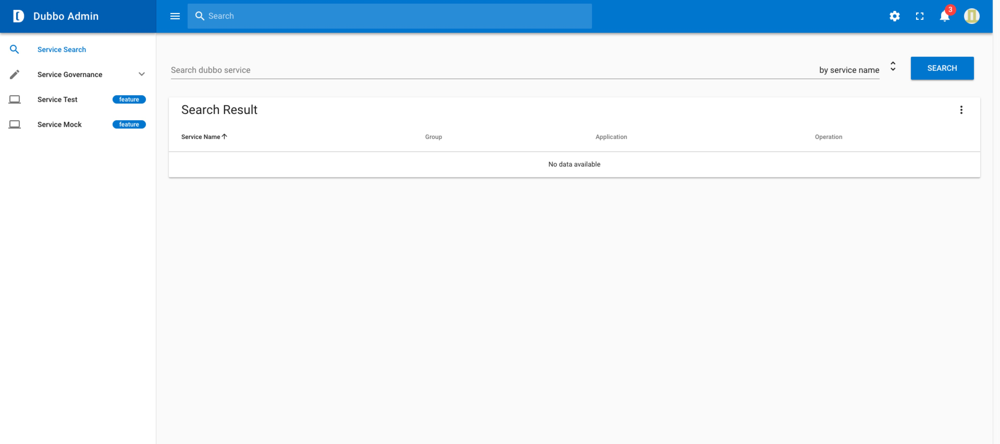
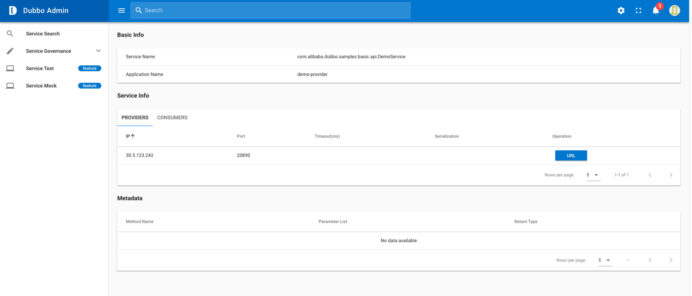
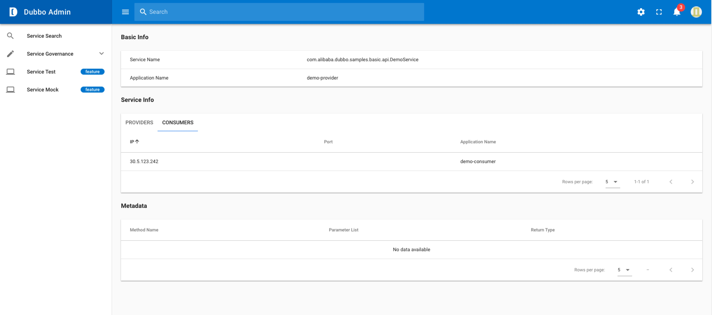
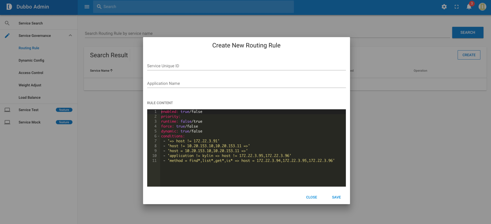
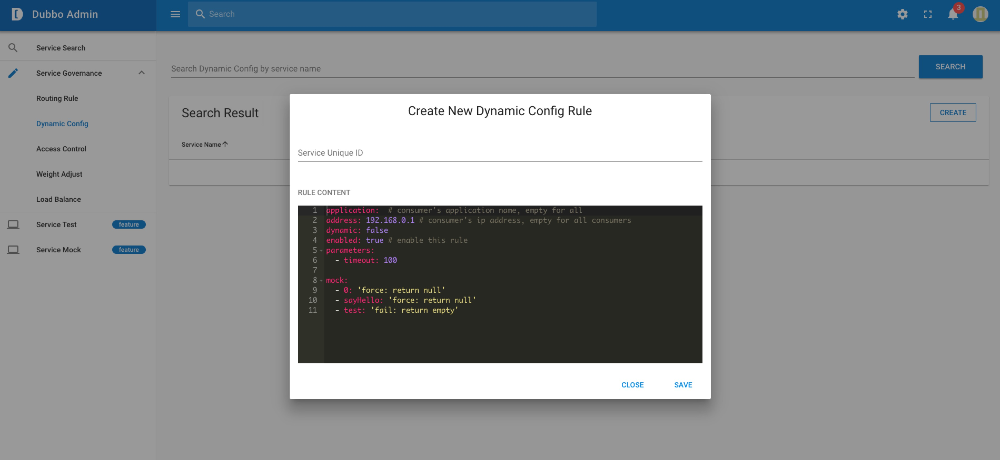

# Ops console management

## Page search

If you need to manage a Dubbo service, you need to search it first and open it's management page

## Service provider page

## Service consumer page

## Add route rule page

## Add dynamic configuration page

