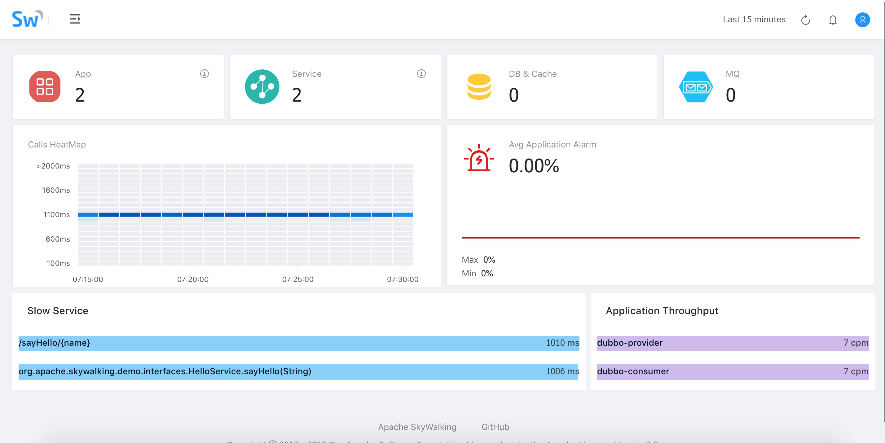
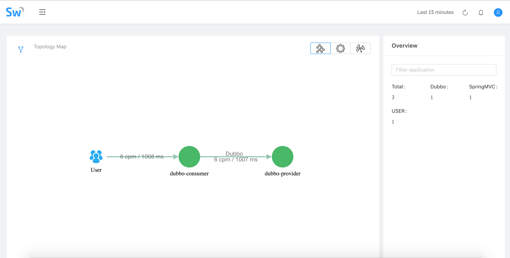
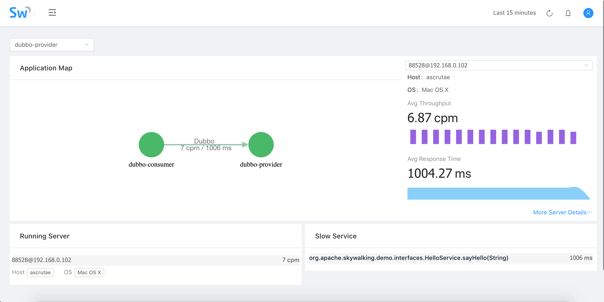
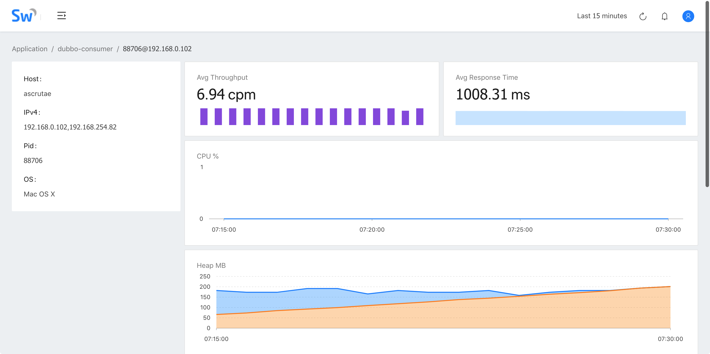
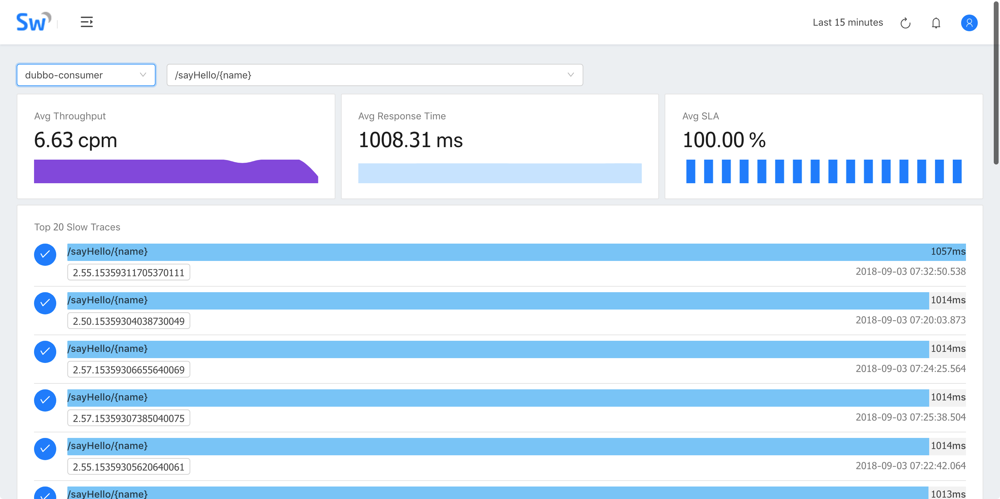
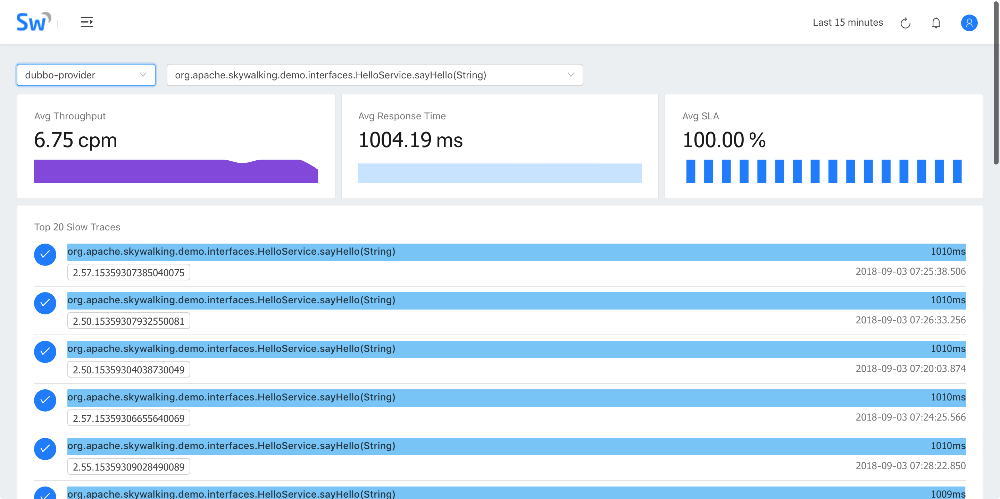
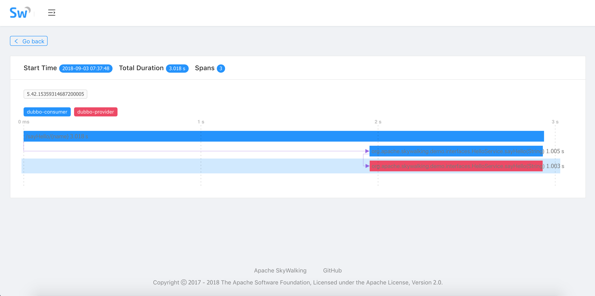
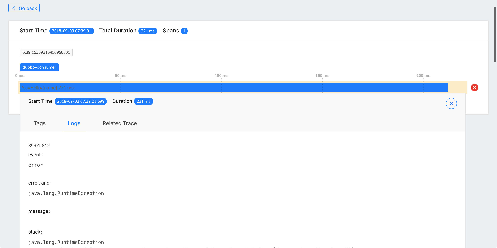
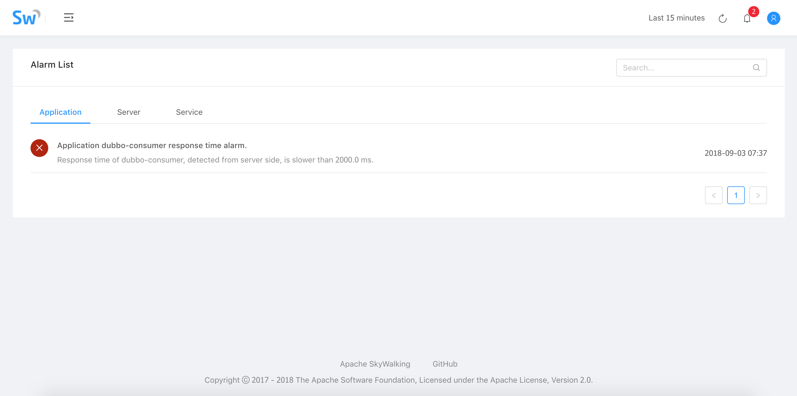

# Tracing Dubbo service with Apache Skywalking(incubator)
## Introduction to Apache Skywalking(Incubator)
[Apache Skywalking(Incubator)](https://github.com/apache/incubator-skywalking)  is the APM system that it designed for micro-services architectures and cloud native architecture systems and supports distribute tracking. [Apache skywalking (incubator)](https://github.com/apache/incubator-skywalking) collects and analyzes the trace data and generates the relationship between the application and the service metric, Apache skywalking  supports multiple languages agent, for example [Java](https://github.com/apache/incubator-skywalking),[.net core](https://github.com/OpenSkywalking/skywalking-netcore),[Node.js](https://github.com/OpenSkywalking/skywalking-nodejs) and [Go](https://github.com/OpenSkywalking/skywalking-go).

Currently, Skywalking has supported analysis the operation of distributed systems from 6 visual dimensions. The overview view is a global view of your applications and components, including the number of components and applications, application alarm fluctuations, slow service lists, and application throughput; The topology shows the topological relationship of the whole application; The application view represents the upstream and downstream relationship of the application from single application, TOP N services and servers, JVM, host and process info. The service view focuses on the operation of a single service portal and the upstream and downstream dependencies of this service and it helps the user to optimize and monitor a single service; the trace graph shows all the buried points of the invocation and the execution time of each burial point, and the alarm view is based on the configuration threshold for the application, server, service for real-time alarms

## Dubbo and Apache Skywalking(Incubator)
### Build the Dubbo demo  project
The Dubbo demo has been uploaded to the [GitHub repository](https://github.com/SkywalkingTest/dubbo-trace-example). 
#### API project
Service interface definition:
package org.apache.skywalking.demo.interfaces;

public interface HelloService {
	String sayHello(String name);
}
#### Service provider project
package org.apache.skywalking.demo.provider;

@Service(version = "${demo.service.version}",
	application = "${dubbo.application.id}",
	protocol = "${dubbo.protocol.id}",
	registry = "${dubbo.registry.id}", timeout = 60000)
public class HelloServiceImpl implements HelloService {

	public String sayHello(String name) {
		LockSupport.parkNanos(TimeUnit.SECONDS.toNanos(1));
		return "Hello, " + name;
	}

}
#### Service consumer project
package org.apache.skywalking.demo.consumer;

@RestController
public class ConsumerController {

	private static int COUNT = 0;

	@Reference(version = "${demo.service.version}",
		application = "${dubbo.application.id}",
		url = "dubbo://localhost:20880", timeout = 60000)
	private HelloService helloService;

	@GetMapping("/sayHello/{name}")
	public String sayHello(@PathVariable(name = "name") String name) {
		if ((COUNT++) % 3 == 0){
			throw new RuntimeException();
		}
		LockSupport.parkNanos(TimeUnit.SECONDS.toNanos(2));
		return helloService.sayHello(name);
	}
}
### Deploy Apache Skywalking(incubator)
[Apache skywalking (Incubator)](https://github.com/apache/incubator-skywalking) offers  two deployment modes: single-node mode and cluster mode,Here is  the single-node mode deployment step, and more about how to deploy skywalking with cluster mode, please reference [document](https://github.com/apache/incubator-skywalking/blob/master/docs/en/Deploy-backend-in-cluster-mode.md).
#### Third-party components
1. JDK 8+
2. Elasticsearch 5.x
#### Deployment step
1. Download [Apache Skywalking Collector](http://skywalking.apache.org/downloads/)
2. Deploy Elasticsearch service
   * Set `cluster.name` to `CollectorDBCluster`
   * Set `network.host` to `0.0.0.0`
   * Start elasticsearch service
3. Unzip and start the Skywalking Collector. Run the ' bin/startup.sh ' command to start skywalking Collector 

#### Deploy the demo
Before you deploy the demo service, please run the following command:

```
./mvnw clean package
```

#### Deploy the provider service

```
java -jar -javaagent:$AGENT_PATH/skywalking-agent.jar -Dskywalking.agent.application_code=dubbo-provider -Dskywalking.collector.servers=localhost:10800 dubbo-provider/target/dubbo-provider.jar
```

#### Deploy the consumer service

```
java -jar -javaagent:$AGENT_PATH/skywalking-agent.jar -Dskywalking.agent.application_code=dubbo-consumer -Dskywalking.collector.servers=localhost:10800 dubbo-consumer/target/dubbo-consumer.jar 
```

#### visit demo service

```
curl http://localhost:8080/sayHello/test
```

## Skywalking scren snapshot

### Dashboard


### Topology


### Application view


JVM Information


### Service view

Consumer side


provider side


### Trace


Span info


### Alarm view

