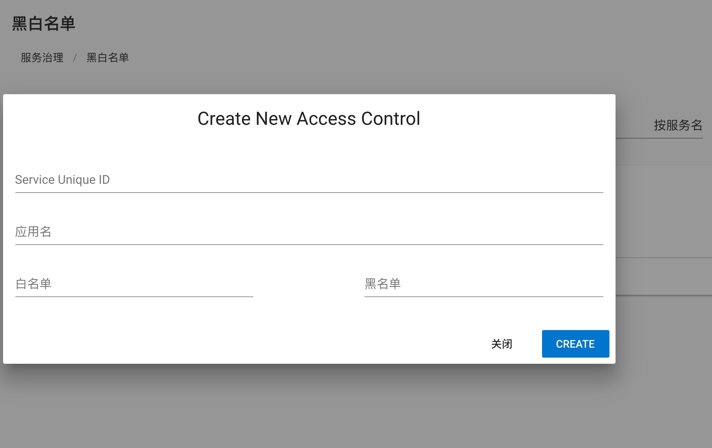
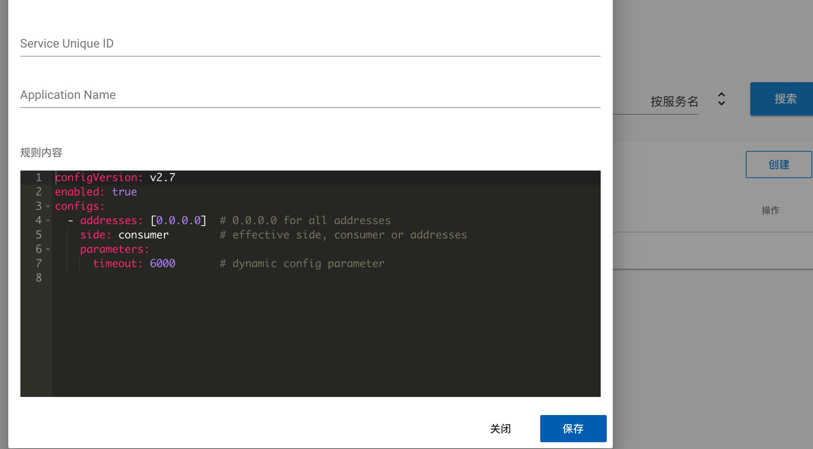
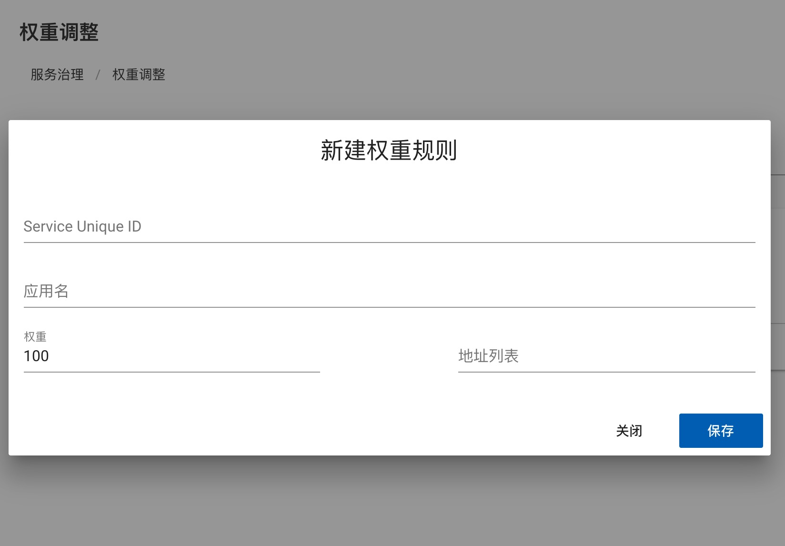

# Service governance and configuration management
## Service governance
服务治理主要作用是改变运行时服务的行为和选址逻辑，达到限流，权重配置等目的，主要有以下几个功能：  
the basic function of service governance is changing the runtime behaviour and routing logic, to do weight configuration and current limiting: 

### 应用级别的服务治理
### application level service governance
在Dubbo2.6及更早版本中，所有的服务治理规则都只针对服务粒度，如果要把某条规则作用到应用粒度上，需要为应用下的所有服务配合相同的规则，变更，删除的时候也需要对应的操作，这样的操作很不友好，因此Dubbo2.7版本中增加了应用粒度的服务治理操作，对于条件路由(包括黑白名单)，动态配置(包括权重，负载均衡)都可以做应用级别的配置：  
In Dubbo 2.6 or earlier version, all service governance rule are in service scope, if you need to make application scope rule, you need to set the same rule for all services under an application, modify and delete need the same operation, this is very unfriendly. In Dubbo 2.7, application scope service governance is supported, condition route(including black white list) and dynamic configuration(including weight, load balance) all support application scope config.
   
picture above is condition route configuration, can create and search by both application name and service name.

### tag route  
标签路由是Dubbo2.7引入的新功能，配置以应用作为维度，给不同的服务器打上不同名字的标签，配置如下图所示：
tag route is a new feature in Dubbo2.7, in application scope, to set different tag on different server, the screenshot is shown as below: 

the client can use `setAttachment` to specify different tag, is the above case, `setAttachment(tag1)`, the client will choose from the three servers in the picture above. In this way, you can implement features such as traffic isolation and gray release. 

### condition route
condition route is a traditional function in Dubbo, now you can create it in either service scope or application scope. Condition route is in `yaml` format, you can read [here](../user/demo/routing-rule.md) to find more.

### black white list
black white list is a part of condition route and store with condition route together, you can set black list or white list, in either service scope or application scope:
 

### dynamic configuration
dynamic configuration has the same level with routing rule, it can change the RPC behaviour dynamically without restart service. It supports application scope since Dubbo 2,7, in Dubbo format, the screen shot shows in below:

to read more, please refer [here](../user/demos/config-rule.md)

### weight adjust  
weigth adjuest is part of dynamic configuration, change the weight of server side to do traffic control dynamically: 

### load balancing
load balancing is also poart of dynamic configuration, to specify the route strategy in client side. now we have three strategies: random, least active and round robin, to read more, please refer [here](../user/demos/loadbalance.md)

## configuration management
configuration management is also a new feaature for Dubbo 2.7. In Dubbo 2.7, we can specify configurations in global scope and application scope(including services in application), you can view, modify and create new configurations in Dubbo Admin.
* global configuration: 
  
you can set registry center, metadata center, timeout for provider and consumer in global configurations. If the implementation of registry center and metadata center is zookeeper, you can also check the location of configuration file. 
* application and service scope configuration: 
  
application configuration can also set service configuration in this application. you need to specify consumer and provider in service scope: `dubbo.reference.{serviceName}`stands for configuration as consumer side，`dubbo.provider.{servcieName}`stands for configuration as provider side. the address of registry address and metadata center address can only be configured in global configuration, which is also the recommendation way in Dubbo 2.7
* priority service configuration > application configuration > global configuration
