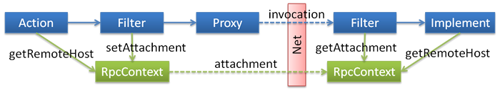

# Implicit parameters

You can implicitly pass parameters between service consumers and providers via `setAttachment` and` getAttachment` on `RpcContext`.


## Set the implicit parameters at service consumer side

Via `setAttachment` on `RpcContext` set key/value pair for implicitly pass parameters.When finished once remote invoke,will be clear,so multi-invoke must set multi-times.


```java
RpcContext.getContext().setAttachment("index", "1"); // implicitly pass parameters,behind the remote call will implicitly send these parameters to the server side, similar to the cookie, for the framework of integration, not recommended for regular business use
xxxService.xxx(); // remote call
// ...
```

## Fetch the implicit parameters at service provider side

```java
public class XxxServiceImpl implements XxxService {

    public void xxx() {
        // get parameters which passed by the consumer side,for the framework of integration, not recommended for regular business use
        String index = RpcContext.getContext().getAttachment("index");
    }
}
```
