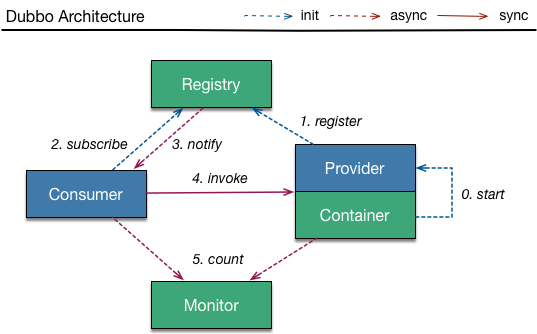

## [](#introduction)Overview

Dubbo _\|ˈdʌbəʊ\|_ is a high-performance, java based [RPC](https://en.wikipedia.org/wiki/Remote_procedure_call) framework open-sourced by Alibaba. As in many RPC systems, dubbo is based around the idea of defining a service, specifying the methods that can be called remotely with their parameters and return types. On the server side, the server implements this interface and runs a dubbo server to handle client calls. On the client side, the client has a stub that provides the same methods as the server.



Dubbo offers three key functionalities, which include interface based remote call, fault tolerance & load balancing, and automatic service registration & discovery. Dubbo framework is widely adopted inside Alibaba and outside by other companies including [jingdong](http://www.jd.com), [dangdang](http://www.dangdang.com), [qunar](https://www.qunar.com), [kaola](https://www.kaola.com), and many others.

## [](#quick-start)Quick start

This guide gets you started with dubbo in Java with a simple working example. You could find the complete working samples from directory 'dubbo-demo' in [dubbo project](https://github.com/alibaba/dubbo) on github.

#### Prerequisites

* JDK: version 6 or higher
* Maven: version 3 or higher

#### Maven dependency 

You may need to use the latest release  to build your dubbo application.

```xml
<dependency>
    <groupId>com.alibaba</groupId>
    <artifactId>dubbo</artifactId>
    <version>${dubbo.version}</version>
</dependency>
```

#### Define service interface

Since both service provider and service consumer rely on the same interface, it is strongly recommended to put the interface definition below in one separated module which could be shared by both provider module and consumer module.

```java
package com.alibaba.dubbo.demo;

public interface DemoService {
    String sayHello(String name);
}
```

#### Implement service provider

```java
package com.alibaba.dubbo.demo.provider;
import com.alibaba.dubbo.demo.DemoService;

public class DemoServiceImpl implements DemoService {
    public String sayHello(String name) {
        return "Hello " + name;
    }
}
```

#### Configure service provider

The code snippet below shows how a dubbo service provider is configured with spring framework, which is recommended, however you could also use [API configuration](http://dubbo.io/books/dubbo-user-book-en/configuration/api.html) if it's preferred.

```xml
<?xml version="1.0" encoding="UTF-8"?>
<beans xmlns="http://www.springframework.org/schema/beans"
       xmlns:xsi="http://www.w3.org/2001/XMLSchema-instance"
       xmlns:dubbo="http://code.alibabatech.com/schema/dubbo"
       xsi:schemaLocation="http://www.springframework.org/schema/beans http://www.springframework.org/schema/beans/spring-beans.xsd http://code.alibabatech.com/schema/dubbo http://code.alibabatech.com/schema/dubbo/dubbo.xsd">
    <dubbo:application name="demo-provider"/>
    <dubbo:registry address="multicast://224.5.6.7:1234"/>
    <dubbo:protocol name="dubbo" port="20880"/>
    <dubbo:service interface="com.alibaba.dubbo.demo.DemoService" ref="demoService"/>
    <bean id="demoService" class="com.alibaba.dubbo.demo.provider.DemoServiceImpl"/>
</beans>
```

#### Start service provider

```java
import org.springframework.context.support.ClassPathXmlApplicationContext;

public class Provider {
    public static void main(String[] args) throws Exception {
        ClassPathXmlApplicationContext context = new ClassPathXmlApplicationContext(
                new String[] {"META-INF/spring/dubbo-demo-provider.xml"});
        context.start();
        // press any key to exit
        System.in.read();
    }
}
```

#### Configure service consumer

Again, the code below demonstrates spring integration

```xml
<?xml version="1.0" encoding="UTF-8"?>
<beans xmlns="http://www.springframework.org/schema/beans"
       xmlns:xsi="http://www.w3.org/2001/XMLSchema-instance"
       xmlns:dubbo="http://code.alibabatech.com/schema/dubbo"
       xsi:schemaLocation="http://www.springframework.org/schema/beans http://www.springframework.org/schema/beans/spring-beans.xsd http://code.alibabatech.com/schema/dubbo http://code.alibabatech.com/schema/dubbo/dubbo.xsd">
    <dubbo:application name="demo-consumer"/>
    <dubbo:registry address="multicast://224.5.6.7:1234"/>
    <dubbo:reference id="demoService" interface="com.alibaba.dubbo.demo.DemoService"/>
</beans>
```

#### Run service consumer

```java
import com.alibaba.dubbo.demo.DemoService;
import org.springframework.context.support.ClassPathXmlApplicationContext;

public class Consumer {
    public static void main(String[] args) throws Exception {
        ClassPathXmlApplicationContext context = new ClassPathXmlApplicationContext(
                new String[]{"META-INF/spring/dubbo-demo-consumer.xml"});
        context.start();
        // obtain proxy object for remote invocation
        DemoService demoService = (DemoService) context.getBean("demoService");
        // execute remote invocation
        String hello = demoService.sayHello("world");
        // show the result
        System.out.println(hello);
    }
}
```

## What's next

* Read this excellent article [Introduction to Dubbo](http://www.baeldung.com/dubbo) to learn more on dubbo's basic features.
* Dive deep into dubbo user guide ([English]({{ site.github.gitbook_url }}/dubbo-user-book-en/), [Chinese]({{ site.github.gitbook_url }}/dubbo-user-book/)) to find more details.
* Read dubbo admin guide ([English]({{ site.github.gitbook_url }}/dubbo-admin-book-en/), [Chinese]({{ site.github.gitbook_url }}/dubbo-admin-book/)) for dubbo application administration topics.
* Interested in how dubbo is designed, or want to contribute? Read dubbo developer guide ([English]({{ site.github.gitbook_url }}/dubbo-dev-book-en/), [Chinese]({{ site.github.gitbook_url }}/dubbo-dev-book/)), and start to [hack the code](https://github.com/alibaba/dubbo).
* Explore more side projects you may interested from [github dubbo group](https://github.com/dubbo).

## Post questions

* Developer mailing list. Any questions or suggestions? Subscribe to [developer mailing list](https://github.com/alibaba/dubbo/issues/1393) to discuss with developers.
* Gitter channel. Join <a href="https://gitter.im/alibaba/dubbo"></a> to discuss with users and developers in real time.
* Contribute on Github. As dubbo is hosted at [Github](https://github.com/alibaba/dubbo). Feel free to fork it, issue a pull request or report a bug, and join the discussion. 
* Reporting security vulnerability. If you find a security vulnerability, please send an email to security@dubbo.apache.org, which is a private mailing list and nothing will go public unless we announce it.

## We need your help

We are now collecting dubbo user info in order to help us to improve dubbo better, pls. kindly help us by providing yours on [issue#1012: Wanted: who's using dubbo](https://github.com/alibaba/dubbo/issues/1012), thanks :)
